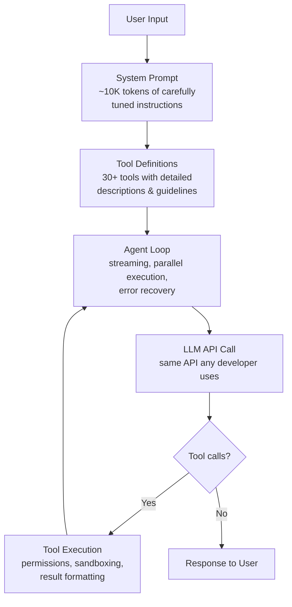

# 🤔 Why Claude Code Works — Same API, Same Model, Better Results

## The Surprising Truth

Claude Code uses the **exact same API and model** that any developer can access:

```
POST https://api.anthropic.com/v1/messages
```

Same endpoint. Same `claude-sonnet` / `claude-opus` models. No secret
internal API, no special model weights, no hidden parameters.

So why does it feel so much better than a naive API call?

## 🏗️ It's All Engineering

The difference is **everything around the API call** — not the call itself.



The API call (box E) is identical to what any developer would write.
The value is in everything else.

## 🔑 The Six Pillars

### 1. System Prompt (~10K tokens)

Not just "you are a helpful assistant." Claude Code's system prompt is
thousands of tokens of battle-tested instructions:

- When to use each tool (Read not `cat`, Edit not `sed`)
- How to handle risky actions (ask before deleting, measure twice)
- Code style rules (no premature abstractions, no unnecessary comments)
- Security awareness (OWASP top 10, no command injection)
- Output style (concise, no emojis unless asked, no filler)

This is prompt engineering at scale — every rule was added because the
model got it wrong without it.

### 2. Tool Design (30+ tools)

Each tool has:
- A **schema** the model sees (name, description, parameters)
- A **prompt** with detailed usage guidelines
- A **handler** that executes the action

The tool descriptions are carefully written to guide the model's
behavior. For example, the Edit tool's prompt tells the model to read
the file first, ensure unique match strings, and prefer editing over
full rewrites.

> 📝 A tool with a vague description = a model that uses it wrong.
> A tool with a precise description = a model that uses it right.

### 3. Agent Loop

The core loop is simple, but the surrounding infrastructure handles:

| Feature | What it does |
|---------|-------------|
| Streaming execution | Tools start executing before full response arrives |
| Parallel batching | Read-only tools run concurrently |
| Serial ordering | Write tools run one at a time to avoid conflicts |
| Error recovery | Retries on transient failures, graceful degradation |
| Max turns | Prevents infinite loops |
| Abort handling | Clean cancellation mid-execution |

### 4. Permission System

The model can work autonomously for safe operations:

```
✅ Auto-allowed:  Read, Glob, Grep (read-only, no side effects)
⚠️  Ask user:     Bash, Write, Edit (can modify files)
🔒 Pattern rules:  Bash(git add:*) → auto-allow git add commands
```

This eliminates the "approve every action" friction while keeping
dangerous operations gated.

### 5. Prompt Caching

Static/dynamic system prompt split keeps costs low:

```
[static sections — cached across all turns]  → 90% cost reduction
[dynamic sections — recomputed each turn]    → small, changes ok
```

A 100-turn conversation costs roughly the same per turn as a 5-turn
conversation. See [05-prompt-caching.md](05-prompt-caching.md) for details.

### 6. Context Management

Long conversations are handled gracefully:

- **Function result clearing** — old tool results replaced with summaries
- **Message compaction** — when approaching context limit, compress history
- **Deferred tool loading** — tools loaded on-demand to save prompt space

## 💡 The Key Insight

> An AI agent is not magic. It's a **loop + tools + a well-written prompt**.

```python
while True:
    response = call_llm(messages, system_prompt, tools)
    
    if no tool calls:
        return response
    
    results = execute_tools(response.tool_calls)
    messages += [response, results]
```

This is the entire core of Claude Code. The 512K lines of source code
are infrastructure, UI, permissions, error handling, and edge cases
built around this 8-line loop.

Any developer can build something equivalent using the same API.
The quality comes from **iteration on the prompt and tool design**,
not from privileged access to the model.

## 🔗 What This Means for vibe-flow

Our `src/agent.py` already has the core loop and 3 tools. The path to
Claude Code-level quality is:

- [x] Core agent loop
- [x] Basic tools (bash, read, write)
- [ ] Better system prompt (task guidance, code style rules)
- [ ] More tools (edit, grep, glob)
- [ ] Per-tool prompts (usage guidelines in tool descriptions)
- [ ] Permission system
- [ ] Context management (compaction, function result clearing)
- [ ] Streaming and parallel tool execution

Each of these is an incremental improvement — no single one requires
understanding the entire 512K line codebase.
