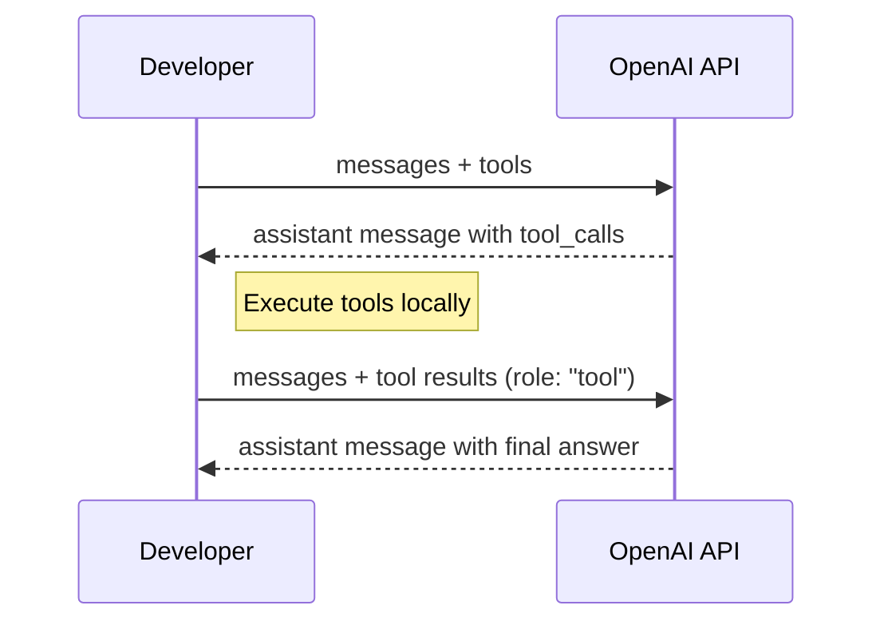
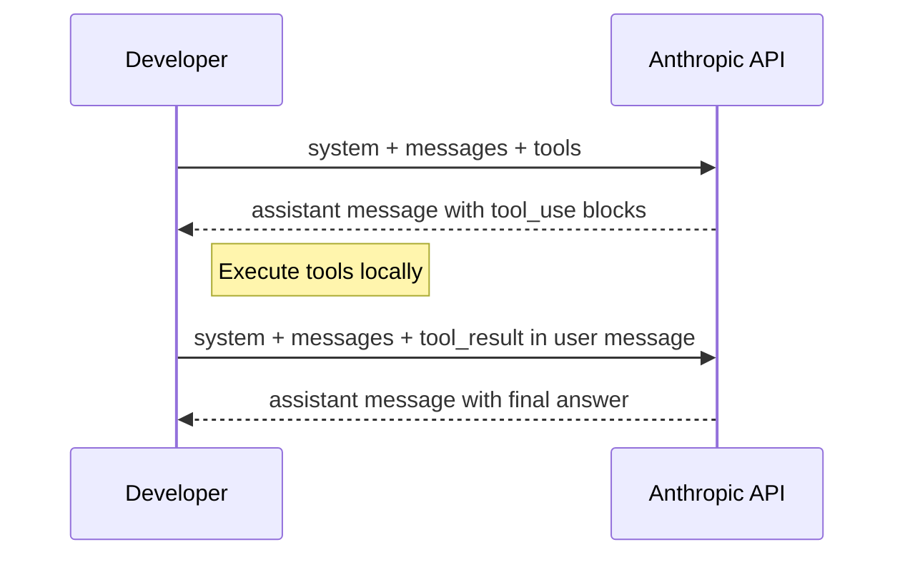

# 🔍 LLM API Deep Dive — OpenAI vs Anthropic

A detailed comparison of the two major LLM APIs, covering message format,
tool use, streaming, and key differences.

## 📡 API Endpoints

| | OpenAI | Anthropic |
|---|---|---|
| Endpoint | `POST /v1/chat/completions` | `POST /v1/messages` |
| Auth header | `Authorization: Bearer sk-...` | `x-api-key: sk-ant-...` |
| SDK | `openai` (Python/JS) | `anthropic` (Python/JS) |

## 💬 Basic Chat — No Tools

### OpenAI

```python
from openai import OpenAI
client = OpenAI()

response = client.chat.completions.create(
    model="gpt-4o",
    messages=[
        {"role": "system", "content": "You are a helpful assistant."},
        {"role": "user", "content": "Hello!"},
    ],
    max_tokens=1024,
)

print(response.choices[0].message.content)
# → "Hi! How can I help you today?"
```

**Key details:**
- System prompt is a message with `role: "system"`
- `content` is a plain string
- Response is in `choices[0].message.content`
- Can have multiple choices (n > 1)

### Anthropic

```python
import anthropic
client = anthropic.Anthropic()

response = client.messages.create(
    model="claude-sonnet-4-20250514",
    system="You are a helpful assistant.",
    messages=[
        {"role": "user", "content": "Hello!"},
    ],
    max_tokens=1024,
)

print(response.content[0].text)
# → "Hi! How can I help you today?"
```

**Key details:**
- System prompt is a **separate parameter**, not a message
- `content` can be a string or an **array of typed blocks**
- Response is in `content[0].text` (array of content blocks)
- Always returns exactly one response (no `choices` array)

## 🔧 Tool Definitions

### OpenAI

```python
tools = [
    {
        "type": "function",
        "function": {
            "name": "get_weather",
            "description": "Get the current weather for a location.",
            "parameters": {                        # ← "parameters"
                "type": "object",
                "properties": {
                    "location": {
                        "type": "string",
                        "description": "City name",
                    }
                },
                "required": ["location"],
            },
        },
    }
]
```

### Anthropic

```python
tools = [
    {
        "name": "get_weather",
        "description": "Get the current weather for a location.",
        "input_schema": {                          # ← "input_schema"
            "type": "object",
            "properties": {
                "location": {
                    "type": "string",
                    "description": "City name",
                }
            },
            "required": ["location"],
        },
    }
]
```

> 📝 **Difference:** OpenAI wraps in `{"type": "function", "function": {...}}`
> and uses `parameters`. Anthropic uses a flat structure with `input_schema`.

## 🔄 Tool Use Flow

This is where the APIs differ most. The overall pattern is the same, but
the message format is different.

### OpenAI Tool Use Flow



**Step 1 — Send request:**

```python
response = client.chat.completions.create(
    model="gpt-4o",
    tools=tools,
    messages=[
        {"role": "system", "content": "You are helpful."},
        {"role": "user", "content": "What's the weather in Tokyo?"},
    ],
)
```

**Step 2 — Receive tool call:**

```python
message = response.choices[0].message
# message.tool_calls = [
#     {
#         "id": "call_abc123",
#         "type": "function",
#         "function": {
#             "name": "get_weather",
#             "arguments": "{\"location\": \"Tokyo\"}"  ← JSON string!
#         }
#     }
# ]
```

> ⚠️ `arguments` is a **JSON string**, not a dict. Must `json.loads()` it.

**Step 3 — Send tool result:**

```python
messages.append(message)  # append assistant message with tool_calls
messages.append({
    "role": "tool",                    # ← dedicated "tool" role
    "tool_call_id": "call_abc123",     # ← matches the tool call ID
    "content": "Sunny, 24°C",         # ← result as string
})
```

**Step 4 — Get final response:**

```python
response = client.chat.completions.create(
    model="gpt-4o",
    tools=tools,
    messages=messages,
)
# → "The weather in Tokyo is sunny and 24°C!"
```

### Anthropic Tool Use Flow



**Step 1 — Send request:**

```python
response = client.messages.create(
    model="claude-sonnet-4-20250514",
    system="You are helpful.",
    tools=tools,
    messages=[
        {"role": "user", "content": "What's the weather in Tokyo?"},
    ],
    max_tokens=1024,
)
```

**Step 2 — Receive tool call:**

```python
# response.content = [
#     TextBlock(type="text", text="Let me check the weather."),
#     ToolUseBlock(
#         type="tool_use",
#         id="toolu_abc123",
#         name="get_weather",
#         input={"location": "Tokyo"}      ← already a dict!
#     )
# ]
# response.stop_reason = "tool_use"
```

> ✅ `input` is already a **dict**, not a JSON string. No parsing needed.

**Step 3 — Send tool result:**

```python
messages.append({"role": "assistant", "content": response.content})
messages.append({
    "role": "user",                          # ← tool results go in "user" role!
    "content": [
        {
            "type": "tool_result",           # ← typed content block
            "tool_use_id": "toolu_abc123",
            "content": "Sunny, 24°C",
        }
    ],
})
```

**Step 4 — Get final response:**

```python
response = client.messages.create(
    model="claude-sonnet-4-20250514",
    system="You are helpful.",
    tools=tools,
    messages=messages,
    max_tokens=1024,
)
# response.content[0].text → "The weather in Tokyo is sunny and 24°C!"
```

## 🆚 Side-by-Side Comparison

### Message Structure

| Aspect | OpenAI | Anthropic |
|--------|--------|-----------|
| System prompt | `{"role": "system"}` message | Separate `system` parameter |
| Content type | String | String or array of typed blocks |
| Multiple content types | Not in one message | ✅ Text + tool_use in same message |
| Response wrapper | `choices[0].message` | Direct `response.content` |

### Tool Use

| Aspect | OpenAI | Anthropic |
|--------|--------|-----------|
| Tool schema key | `parameters` | `input_schema` |
| Tool schema wrapper | `{"type": "function", "function": {...}}` | Flat `{"name": ..., "input_schema": ...}` |
| Tool call arguments | JSON string (need `json.loads`) | Dict (ready to use) |
| Tool result role | `"tool"` (dedicated role) | `"user"` with `tool_result` block |
| Stop reason | `finish_reason: "tool_calls"` | `stop_reason: "tool_use"` |
| Tool call ID prefix | `call_` | `toolu_` |

### Streaming

| Aspect | OpenAI | Anthropic |
|--------|--------|-----------|
| Enable | `stream=True` | `stream=True` or `client.messages.stream()` |
| Chunk format | `choices[0].delta` | Event-based (`message_start`, `content_block_delta`, etc.) |
| Tool streaming | Arguments arrive as string fragments | Input arrives as JSON fragments |

### Prompt Caching

| Aspect | OpenAI | Anthropic |
|--------|--------|-----------|
| How to enable | Automatic (prefix match) | Explicit `cache_control` markers |
| Cache read cost | 50% off | 90% off |
| Cache write cost | Free | 25% surcharge |
| Min prefix | 1,024 tokens | 1,024 tokens |
| Control | None (automatic) | Fine-grained (per-block markers) |

### Other Features

| Feature | OpenAI | Anthropic |
|---------|--------|-----------|
| Vision | Images in `content` array | Images in `content` array (similar) |
| Extended thinking | ❌ | ✅ `thinking` blocks in response |
| JSON mode | `response_format: {"type": "json_object"}` | ❌ (use tool_use for structured output) |
| Multiple choices | ✅ `n` parameter | ❌ Always 1 response |
| Logprobs | ✅ | ❌ |
| Token counting | In response metadata | In response `usage` field |

## 🧩 Content Block Model — Anthropic's Key Difference

The biggest architectural difference is Anthropic's **typed content blocks**.

OpenAI messages have a flat `content` string:

```python
# OpenAI — content is a string, tool_calls is a separate field
{
    "role": "assistant",
    "content": "Let me check that.",       # text here
    "tool_calls": [...]                    # tools here (separate)
}
```

Anthropic messages have an array of typed blocks:

```python
# Anthropic — everything is a content block
{
    "role": "assistant",
    "content": [
        {"type": "text", "text": "Let me check that."},     # text block
        {"type": "tool_use", "id": "...", "name": "...", "input": {...}},  # tool block
        {"type": "thinking", "thinking": "..."},             # thinking block
    ]
}
```

This model is more flexible — text, tool calls, thinking, and images all
live in the same `content` array. It also means tool results are content
blocks inside user messages, not a separate message role.

## 🔀 Switching Between APIs in an Agent

The agent loop logic is identical for both APIs. Only the message
formatting differs:

```python
# Agent loop — same for both
while True:
    response = call_llm(messages, tools)
    
    if has_tool_calls(response):
        results = execute_tools(response)
        append_results(messages, results)
    else:
        return get_text(response)
```

The functions `call_llm`, `has_tool_calls`, `execute_tools`,
`append_results`, and `get_text` are the only things that change
between providers. The loop itself is universal.

## 📦 OpenAI-Compatible Providers

Many providers offer OpenAI-compatible endpoints — same request format,
same SDK, just a different `base_url`:

| Provider | What it offers |
|----------|---------------|
| Groq | Fast inference (Llama, Mixtral) |
| Together AI | Open-source models |
| Mistral | Mistral models |
| Fireworks | Open-source models, fast |
| OpenRouter | Multi-provider routing |
| Azure OpenAI | OpenAI models on Azure |
| Ollama | Local models |

```python
# Switch provider — just change base_url
client = OpenAI(
    base_url="https://api.groq.com/openai/v1",
    api_key="gsk_...",
)
# Everything else stays the same!
```

This is why our vibe-flow uses the OpenAI format — it works with the
most providers out of the box.

## 💡 What This Means for vibe-flow

Our `src/agent.py` currently uses OpenAI's API format. The design choices:

| Decision | Reason |
|----------|--------|
| OpenAI format | Widest compatibility (Groq, Together, Ollama, etc.) |
| `json.loads(arguments)` | OpenAI returns args as JSON string |
| `role: "tool"` for results | OpenAI's dedicated tool result role |
| Single `content` string | OpenAI's simpler content model |

If we wanted to support Anthropic too, we'd add an adapter layer that
translates between our internal message format and each provider's API.
The agent loop itself wouldn't change.
