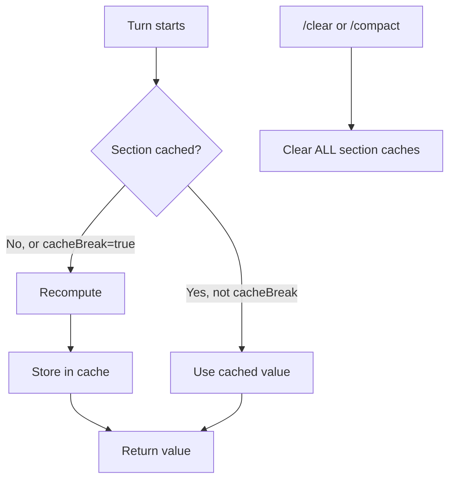
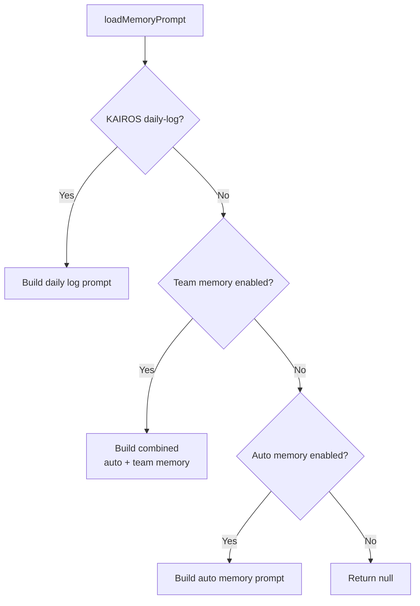
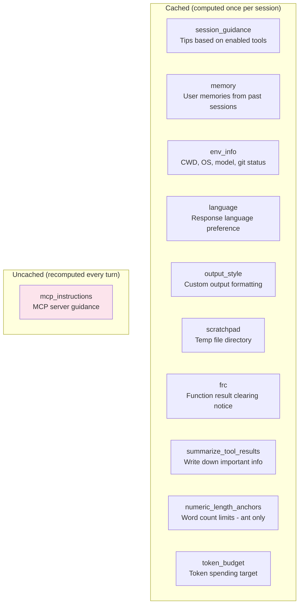

# 🔬 Dynamic System Prompt — Deep Analysis

The dynamic sections are appended **after** the static sections and the
`SYSTEM_PROMPT_DYNAMIC_BOUNDARY` marker. Unlike the static sections
which are identical every turn, dynamic sections can change between
turns within a session.

```
[Static sections — cached, never changes]
[BOUNDARY MARKER]
[Dynamic sections — recomputed, may change per turn]  ← this doc
```

---

## The Caching Mechanism

Before analyzing each section, it's important to understand **how**
dynamic sections are cached.

📍 **Source:** `src/constants/systemPromptSections.ts`

```typescript
// Computed once, cached until /clear or /compact
function systemPromptSection(name, compute)
  → { name, compute, cacheBreak: false }

// Recomputed every turn — breaks prompt cache when value changes
function DANGEROUS_uncachedSystemPromptSection(name, compute, reason)
  → { name, compute, cacheBreak: true }
```

Two types of dynamic sections:

| Type | Behavior | Cache impact |
|------|----------|-------------|
| `systemPromptSection` | Computed once, cached for the session | ✅ Cache-friendly |
| `DANGEROUS_uncachedSystemPromptSection` | Recomputed every turn | ⚠️ Breaks cache when value changes |

Most dynamic sections use `systemPromptSection` — they're computed once
at the start and cached. Only `mcp_instructions` uses the `DANGEROUS`
variant because MCP servers can connect/disconnect mid-session.



> 💡 **Lesson:** Even "dynamic" sections should be cached when possible.
> Only mark sections as uncached when they genuinely change mid-session.
> Every cache miss increases cost and latency.

---

## Section 1: Session Guidance (`session_guidance`)

📍 **Source:** `src/constants/prompts.ts`, lines 352–400

**Type:** `systemPromptSection` (cached)

### What It Contains

Conditional guidance based on which tools and features are enabled:

```
# Session-specific guidance
 - If you do not understand why the user has denied a tool call, use
   the AskUserQuestion to ask them.
 - If you need the user to run a shell command themselves (e.g., an
   interactive login like `gcloud auth login`), suggest they type
   `! <command>` in the prompt.
 - [Agent tool guidance if enabled]
 - [Explore agent guidance if enabled]
 - [Skill tool guidance if enabled]
 - [Verification agent guidance if enabled]
```

### Analysis

This section is a **grab bag** of session-variant guidance. Each bullet
is gated by a different condition:

| Bullet | Condition | Why dynamic |
|--------|-----------|-------------|
| AskUserQuestion tip | Tool is enabled | Not all sessions have this tool |
| `!` command tip | Interactive session | Non-interactive sessions can't do this |
| Agent tool guidance | Agent tool enabled | Some modes disable agents |
| Explore agent guidance | Explore/plan agents enabled | Feature-gated |
| Skill tool guidance | Skills available | Only shown if skills exist |
| Verification agent | Feature flag + flag | Experimental feature |

Returns `null` if no items qualify — section is omitted entirely.

> 💡 **Lesson:** Group session-variant tips into one section rather than
> scattering them. Makes it easy to add/remove guidance per feature
> without touching other sections.

---

## Section 2: Memory (`memory`)

📍 **Source:** `src/memdir/memdir.ts`, lines 419–507

**Type:** `systemPromptSection` (cached)

### What It Contains

Loads user memories from the memory directory and injects them into the
prompt. The memory system stores things like user preferences, project
context, and feedback from past sessions.

### How It Works



Four modes:
1. **KAIROS daily-log** — autonomous agent's daily log format
2. **Team + auto memory** — combines personal and team memories
3. **Auto memory only** — personal memories from `~/.claude/projects/`
4. **Disabled** — returns null, logs telemetry

Memory can be disabled via:
- Environment variable: `CLAUDE_CODE_DISABLE_AUTO_MEMORY`
- Setting: `autoMemoryEnabled: false`

> 💡 **Lesson:** Memory gives the model context from past sessions —
> user preferences, project details, feedback. Without it, every
> session starts cold. This is one of the most impactful dynamic
> sections for user experience.

---

## Section 3: Environment Info (`env_info_simple`)

📍 **Source:** `src/constants/prompts.ts`, lines 651–710

**Type:** `systemPromptSection` (cached)

### The Actual Prompt

```
# Environment
You have been invoked in the following environment:
 - Primary working directory: /home/user/project
 - Is a git repository: true
 - Platform: linux
 - Shell: bash
 - OS Version: Linux 6.8.0-90-generic
 - You are powered by the model named Opus 4.6. The exact model ID is
   claude-opus-4-6.
 - Assistant knowledge cutoff is May 2025.
 - The most recent Claude model family is Claude 4.5/4.6. Model IDs —
   Opus 4.6: 'claude-opus-4-6', Sonnet 4.6: 'claude-sonnet-4-6',
   Haiku 4.5: 'claude-haiku-4-5-20251001'.
 - Claude Code is available as a CLI in the terminal, desktop app
   (Mac/Windows), web app (claude.ai/code), and IDE extensions
   (VS Code, JetBrains).
 - Fast mode for Claude Code uses the same Claude Opus 4.6 model with
   faster output. It does NOT switch to a different model.
```

### Analysis

This section tells the model about its **runtime environment**:

| Info | Why the model needs it |
|------|----------------------|
| Working directory | Knows where to look for files |
| Git status | Knows if git commands will work |
| Platform/OS | Adjusts commands (e.g., `ls` vs `dir`) |
| Shell | Uses correct shell syntax |
| Model name/ID | Self-awareness, can reference itself correctly |
| Knowledge cutoff | Knows what it might not know about recent events |
| Model family | Can suggest appropriate models when building apps |
| Available platforms | Can answer "how do I use Claude Code in VS Code?" |

**Conditional logic:**
- Worktree warning added if in a git worktree
- Additional working directories listed if present
- Model info suppressed in "undercover" mode (ant-only testing)
- Knowledge cutoff varies by model version

> 💡 **Lesson:** Tell the model about its environment. A model that
> knows it's on Linux won't suggest Windows commands. A model that knows
> its CWD won't ask "what directory are you in?"

---

## Section 4: Language (`language`)

📍 **Source:** `src/constants/prompts.ts`, lines 142–149

**Type:** `systemPromptSection` (cached)

### The Actual Prompt

```
# Language
Always respond in Japanese. Use Japanese for all explanations, comments,
and communications with the user. Technical terms and code identifiers
should remain in their original form.
```

(Example with Japanese — actual language depends on user setting.)

### Analysis

Simple but important:
- Returns `null` if no language preference set (most users)
- "Technical terms and code identifiers should remain in their original
  form" — prevents translating variable names or API terms

> 💡 **Lesson:** Language preference is a good example of a section
> that's null for most users. Dynamic sections can be omitted entirely
> when not needed — keeping the prompt shorter.

---

## Section 5: Output Style (`output_style`)

📍 **Source:** `src/constants/prompts.ts`, lines 151–158

**Type:** `systemPromptSection` (cached)

### The Actual Prompt

```
# Output Style: Concise Technical
<custom prompt defining how to format responses>
```

### Analysis

- Returns `null` if no custom output style configured
- When set, overrides default communication style with a named style
  and its associated prompt
- The intro section (Section 1 of static prompt) changes to reference
  this when it's present

---

## Section 6: MCP Instructions (`mcp_instructions`)

📍 **Source:** `src/constants/prompts.ts`, lines 160–165, 579+

**Type:** `DANGEROUS_uncachedSystemPromptSection` ⚠️

### Why DANGEROUS?

This is the only `DANGEROUS_uncachedSystemPromptSection` — it recomputes
**every turn** because MCP servers can connect or disconnect mid-session.

```typescript
DANGEROUS_uncachedSystemPromptSection(
  'mcp_instructions',
  () => isMcpInstructionsDeltaEnabled()
    ? null
    : getMcpInstructionsSection(mcpClients),
  'MCP servers connect/disconnect between turns',  // ← reason required
)
```

### What It Contains

Instructions from connected MCP servers — each server can provide its
own guidance text that gets injected into the system prompt.

### Analysis

The `DANGEROUS` prefix is a code convention — it forces the developer to
provide a **reason** why cache-breaking is necessary. This prevents
accidental cache-busting.

There's also an optimization: when `isMcpInstructionsDeltaEnabled()`,
MCP instructions are delivered via a different mechanism (persisted
attachments) instead of this section, avoiding the cache-breaking
penalty.

> 💡 **Lesson:** Cache-breaking sections are expensive. If you must
> have one, look for alternative delivery mechanisms (like attachments)
> that don't break the cache. The `DANGEROUS` naming convention makes
> the cost visible in code reviews.

---

## Section 7: Scratchpad (`scratchpad`)

📍 **Source:** `src/constants/prompts.ts`, lines 797–819

**Type:** `systemPromptSection` (cached)

### The Actual Prompt

```
# Scratchpad Directory

IMPORTANT: Always use this scratchpad directory for temporary files
instead of /tmp or other system temp directories:
`/home/user/.claude/scratchpad/session-abc`

Use this directory for ALL temporary file needs:
- Storing intermediate results or data during multi-step tasks
- Writing temporary scripts or configuration files
- Saving outputs that don't belong in the user's project
- Creating working files during analysis or processing
- Any file that would otherwise go to /tmp

Only use /tmp if the user explicitly requests it.

The scratchpad directory is session-specific, isolated from the user's
project, and can be used freely without permission prompts.
```

### Analysis

Returns `null` if scratchpad is not enabled.

The scratchpad solves a practical problem: the model needs somewhere to
put temporary files without cluttering the user's project. Without this,
the model writes temp files in the CWD or `/tmp` (which may need
permission).

> 💡 **Lesson:** If your agent creates temporary files, give it a
> designated location. Otherwise it will put files wherever is
> convenient — usually the user's project directory.

---

## Section 8: Function Result Clearing (`frc`)

📍 **Source:** `src/constants/prompts.ts`, lines 821–839

**Type:** `systemPromptSection` (cached)

### The Actual Prompt

```
# Function Result Clearing

Old tool results will be automatically cleared from context to free up
space. The <N> most recent results are always kept.
```

### Analysis

This section tells the model about **context compaction** — the system
may replace old tool results with summaries to free up context window
space.

Returns `null` unless:
- Feature flag `CACHED_MICROCOMPACT` is enabled
- Config exists and is enabled
- `systemPromptSuggestSummaries` is true
- Current model matches supported model patterns

> 💡 **Lesson:** If your agent does any context management (dropping old
> messages, summarizing results), tell the model. This connects to the
> `SUMMARIZE_TOOL_RESULTS_SECTION` — the model knows to write down
> important info because results may be cleared later.

---

## Section 9: Summarize Tool Results (`summarize_tool_results`)

📍 **Source:** `src/constants/prompts.ts`, line 841

**Type:** `systemPromptSection` (cached — constant value)

### The Actual Prompt

```
When working with tool results, write down any important information you
might need later in your response, as the original tool result may be
cleared later.
```

### Analysis

A constant string — always the same, always included. This is the
companion to the FRC section above. Together they create a two-part
contract:

1. **FRC tells the model:** "Old results will be cleared"
2. **This section tells the model:** "So write down what you need"

Without this, the model would reference old tool results that no longer
exist in context, leading to hallucination.

> 💡 **Lesson:** When your system modifies the conversation history,
> tell the model how to prepare. The model can't anticipate system
> behaviors it doesn't know about.

---

## Section 10: Numeric Length Anchors (ant-only)

**Type:** `systemPromptSection` (cached)

### The Actual Prompt

```
Length limits: keep text between tool calls to ≤25 words. Keep final
responses to ≤100 words unless the task requires more detail.
```

### Analysis

Only for ant users. The source comment reveals research data:

```typescript
// Numeric length anchors — research shows ~1.2% output token reduction
// vs qualitative "be concise". Ant-only to measure quality impact first.
```

Concrete numbers ("≤25 words", "≤100 words") work better than vague
instructions ("be concise") — 1.2% measured reduction. Currently
ant-only while quality impact is assessed.

> 💡 **Lesson:** Quantitative instructions beat qualitative ones.
> "Be concise" is vague. "≤25 words between tool calls" is measurable
> and the model can follow it precisely.

---

## Section 11: Token Budget (`token_budget`)

**Type:** `systemPromptSection` (cached) — feature-gated

### The Actual Prompt

```
When the user specifies a token target (e.g., "+500k", "spend 2M
tokens", "use 1B tokens"), your output token count will be shown each
turn. Keep working until you approach the target — plan your work to
fill it productively. The target is a hard minimum, not a suggestion.
If you stop early, the system will automatically continue you.
```

### Analysis

Feature-gated behind `TOKEN_BUDGET`. Enables users to say "spend 500k
tokens on this" and have the model work autonomously until the budget
is reached.

Interesting design choice: the section is cached unconditionally even
though it's only relevant when a budget is active. The comment explains:

```typescript
// Cached unconditionally — the "When the user specifies..." phrasing
// makes it a no-op with no budget active. Was DANGEROUS_uncached
// (toggled on getCurrentTurnTokenBudget()), busting ~20K tokens per
// budget flip.
```

The prompt text is phrased as conditional ("When the user specifies...")
so it does nothing when no budget is set — avoiding the need for a
cache-breaking toggle.

> 💡 **Lesson:** You can avoid cache-breaking by phrasing instructions
> conditionally. "When X happens, do Y" is always safe to include — it
> self-activates only when relevant.

---

## 📊 Summary: All Dynamic Sections



### Key Design Takeaways

1. **Most "dynamic" sections are actually cached** — computed once,
   reused every turn. Only MCP instructions truly change mid-session.

2. **Sections return null when not applicable** — language is null for
   English users, scratchpad is null when disabled, output style is null
   when not configured. This keeps the prompt minimal.

3. **Cache-breaking is expensive and explicit** — the `DANGEROUS_`
   prefix makes cost visible. Developers are incentivized to find
   alternatives (conditional phrasing, attachments).

4. **Sections are companions** — FRC + summarize work as a pair.
   Neither makes full sense without the other.

5. **Quantitative > qualitative** — "≤25 words" beats "be concise"
   by a measurable 1.2%.

6. **Conditional phrasing avoids cache breaks** — "When the user
   specifies a token target..." is always safe to include.

### For vibe-flow

The most impactful dynamic sections to implement:

```python
import os
from datetime import date

def build_dynamic_prompt():
    sections = []

    # Environment info — most impactful
    sections.append(f"""# Environment
 - Working directory: {os.getcwd()}
 - Platform: {os.uname().sysname.lower()}
 - Date: {date.today()}
""")

    # Add more sections as we build features:
    # - Memory (when we add persistence)
    # - Language (when we add i18n)
    # - Tool results warning (when we add context compaction)

    return "\n".join(sections)
```

Start with env info — the model needs to know where it's working.
Add others as the features they describe are built.