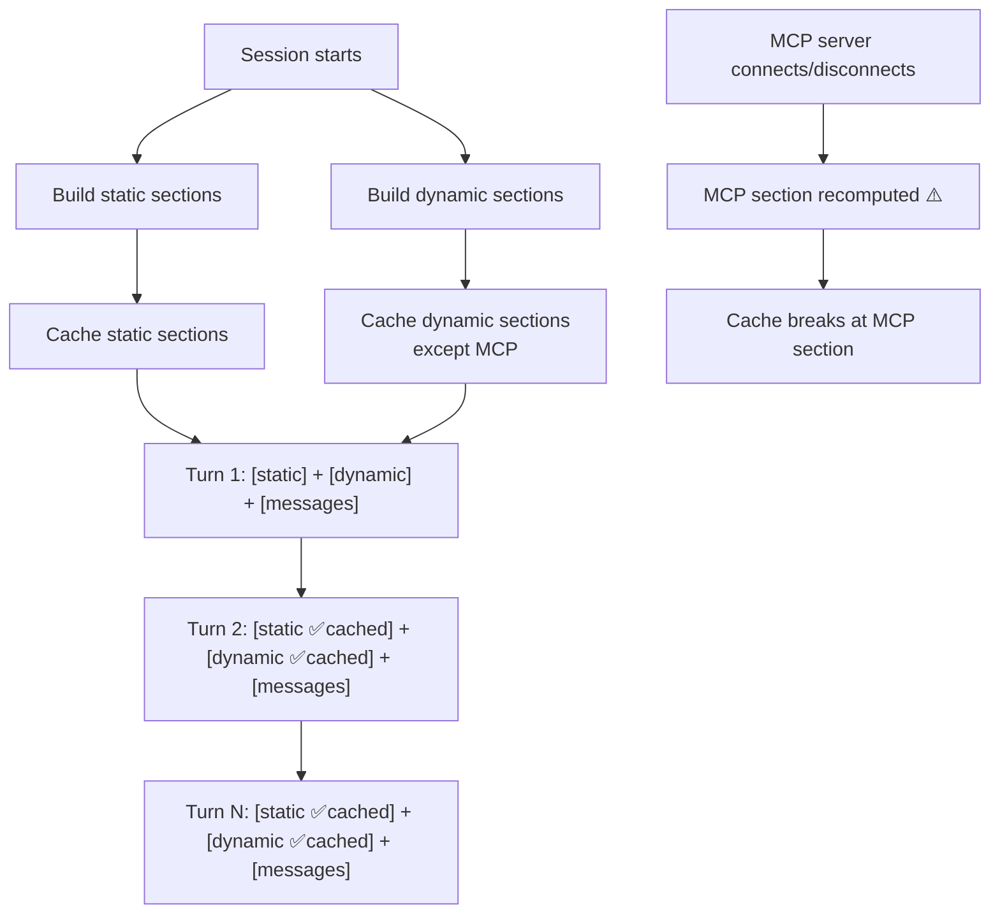
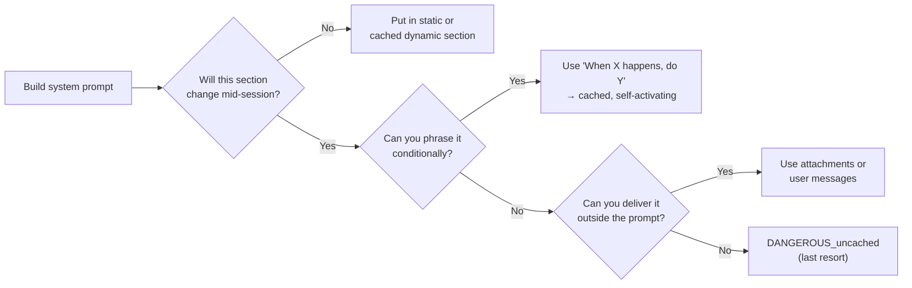

# 📋 System Prompt Summary — How Claude Code Builds Its Prompt

A concise summary of how Claude Code's system prompt is constructed,
cached, and optimized. Read the detailed analysis in
[08-system-prompt-static-analysis.md](08-system-prompt-static-analysis.md) and
[09-system-prompt-dynamic-analysis.md](09-system-prompt-dynamic-analysis.md).

## The Big Picture



## Two Parts: Static + Dynamic

| Part | When built | Changes during session? | Cache behavior |
|------|-----------|----------------------|----------------|
| **Static** (7 sections) | After session start, before first API call | ❌ Never | Always cached, always hits |
| **Dynamic** (11 sections) | After session start, before first API call | ❌ Never (except MCP) | Cached after first computation |
| **MCP instructions** (1 section) | Every turn | ✅ When MCP servers change | ⚠️ Breaks cache when it changes |

### Static Sections (never change)

1. **Intro** — identity, security guardrails, URL safety
2. **System** — output visibility, permissions, prompt injection defense
3. **Doing Tasks** — task approach, YAGNI code philosophy, integrity
4. **Actions** — risk framework, "measure twice cut once"
5. **Using Your Tools** — dedicated tools over Bash, parallel execution
6. **Tone and Style** — no emojis, concise, code references
7. **Output Efficiency** — terse (external) or detailed (internal)

### Dynamic Sections (computed once, cached)

1. **Session guidance** — tips based on enabled tools and features
2. **Memory** — user preferences and project context from past sessions
3. **Environment info** — CWD, OS, platform, model, git status
4. **Language** — response language preference (null if English)
5. **Output style** — custom formatting (null if not configured)
6. **Scratchpad** — temp file directory (null if disabled)
7. **Function result clearing** — notice about context compaction
8. **Summarize tool results** — "write down important info"
9. **Numeric length anchors** — "≤25 words" (ant-only)
10. **Token budget** — spending target (feature-gated)

### The Exception: MCP Instructions (recomputed every turn)

The only section that can change mid-session. Marked as
`DANGEROUS_uncachedSystemPromptSection` in the code — the naming
convention makes the cache-breaking cost visible to developers.

## The Prompt Cache Lifecycle

```
Session start
    │
    ├── Build all sections (static + dynamic)
    ├── Cache everything
    │
    ▼
Turn 1:  [all sections] → cache MISS (first turn, nothing cached yet)
Turn 2:  [all sections] → cache HIT on entire prefix ✅
Turn 3:  [all sections] → cache HIT on entire prefix ✅
    ...
Turn N:  MCP server disconnects → MCP section changes
         → cache HIT up to MCP section
         → cache MISS from MCP section onward ⚠️
    ...
Turn N+1: [all sections with new MCP state] → cache HIT again ✅
```

**Key insight:** In a typical session without MCP changes, **every turn
after the first is a full cache hit** on the system prompt. The cost of
the system prompt is essentially paid once.

## MCP and Cache: Best Practices

| MCP scenario | Cache impact | Recommendation |
|---|---|---|
| No MCP servers | ✅ No cost — section is null | Best for cost |
| MCP connected at start, stays stable | ✅ Fine — cached after first turn | Good — no extra cost |
| MCP connects mid-session | ⚠️ Cache breaks once | Acceptable — one-time cost |
| MCP connects/disconnects repeatedly | ❌ Cache breaks every time | Avoid — costs add up |
| Multiple unstable MCP servers | ❌ Frequent cache breaks | Worst case |

**The real enemy is instability, not MCP itself.** A stable MCP server
connected at session start has zero cache impact after the first turn.
An unstable server that flickers on/off breaks the cache repeatedly.

Claude Code even has an optimization for this:
`isMcpInstructionsDeltaEnabled()` delivers MCP instructions via
**attachments** instead of the system prompt, avoiding cache-breaking
entirely.

### Guidelines for AI Agent Builders

1. **Don't use MCP if you don't need it** — simplest path, zero cost
2. **If you need MCP, choose stable servers** — connect at start, keep
   connected
3. **Avoid MCP servers that frequently reconnect** — each reconnection
   breaks the cache
4. **Consider alternative delivery** — if MCP instructions change often,
   deliver them outside the system prompt (e.g., as message attachments)

## Token Cost Model

For a typical session (no MCP changes):

```
Turn 1:  system_prompt_tokens × full_price      (cache miss)
Turn 2:  system_prompt_tokens × cache_price      (cache hit, 90% off)
Turn 3:  system_prompt_tokens × cache_price      (cache hit, 90% off)
...
Turn 100: system_prompt_tokens × cache_price     (cache hit, 90% off)
```

With a ~10K token system prompt over 100 turns:

```
Without caching: 10K × 100 = 1,000K tokens at full price
With caching:    10K × 1 (miss) + 10K × 99 × 0.1 (hits) = 109K equivalent
                                                          = ~89% savings
```

## Design Rules for Your Own Agent



1. **Keep the prompt prefix stable** — static sections first, dynamic
   last
2. **Cache everything you can** — most "dynamic" sections only change
   at session start
3. **Use conditional phrasing** — "When the user specifies a token
   target..." avoids cache breaks
4. **Make cache-breaking visible** — naming convention
   (`DANGEROUS_uncached`) forces developers to justify the cost
5. **Look for alternatives** — attachments, user messages, or
   conditional phrasing before resorting to uncached sections
6. **Sections can be null** — omit sections that don't apply, keeping
   the prompt minimal

## What This Means for vibe-flow

Our current `agent.py` has a single static string — already
cache-friendly. As we add features, follow this priority:

| Feature | Section type | Cache impact |
|---------|-------------|-------------|
| System prompt text | Static | ✅ Always cached |
| Environment info (CWD, OS) | Cached dynamic | ✅ Computed once |
| Memory system | Cached dynamic | ✅ Computed once |
| Language preference | Cached dynamic (null if unset) | ✅ No cost when unused |
| MCP-like extensions | ⚠️ Consider carefully | Design for stability |

The system prompt is the **foundation** of an AI agent. Get the caching
right, and long conversations stay affordable. Get it wrong, and costs
scale linearly with conversation length.
