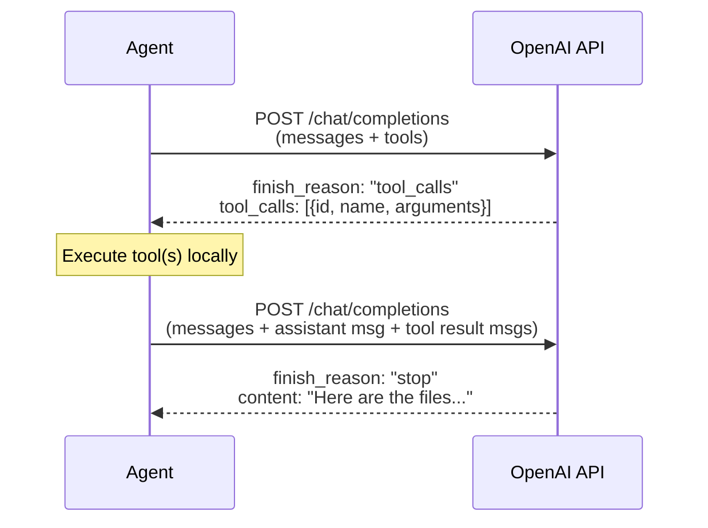

# OpenAI API Data Structures: Messages, Tools & Responses

A reference for the exact JSON structures sent to and received from the OpenAI Chat Completions API — with emphasis on the **tool/function calling** flow.

---

## 📤 Request Structure

```json
POST https://api.openai.com/v1/chat/completions

{
  "model": "gpt-4o",
  "messages": [ ... ],        // conversation history
  "tools": [ ... ],           // tool definitions (optional)
  "tool_choice": "auto",      // how to pick tools (optional)
  "temperature": 1.0,
  "max_tokens": 8192,
  "stream": false
}
```

---

## 💬 Message Types

The `messages` array is the full conversation history. Each turn is one message object. There are **four roles**:

### 1. System Message

```json
{
  "role": "system",
  "content": "You are a helpful assistant. Today is 2026-04-09."
}
```

> Sets behavior/persona. Usually the first message. Only one is typical but multiple are allowed.

---

### 2. User Message

**Plain text:**

```json
{
  "role": "user",
  "content": "What files are in the current directory?"
}
```

**Multi-part (text + image):**

```json
{
  "role": "user",
  "content": [
    { "type": "text", "text": "What's in this screenshot?" },
    {
      "type": "image_url",
      "image_url": {
        "url": "data:image/png;base64,iVBORw0KGgo..."
      }
    }
  ]
}
```

---

### 3. Assistant Message

**Plain text response (no tools):**

```json
{
  "role": "assistant",
  "content": "The current directory contains: README.md, src/, docs/"
}
```

**Tool call response (model wants to use a tool):**

```json
{
  "role": "assistant",
  "content": null,
  "tool_calls": [
    {
      "id": "call_abc123",
      "type": "function",
      "function": {
        "name": "bash",
        "arguments": "{\"command\": \"ls -la\"}"
      }
    }
  ]
}
```

> `arguments` is a **JSON string** (not an object). You must `json.loads()` it.
>
> Multiple tool calls can appear in a single assistant message — the model may batch them.

---

### 4. Tool Message

After executing a tool, you append the result as a `tool` role message:

```json
{
  "role": "tool",
  "tool_call_id": "call_abc123",
  "content": "total 48\ndrwxr-xr-x  8 user user 4096 Apr  9 12:00 .\n..."
}
```

> `tool_call_id` must match the `id` from the assistant's `tool_calls` entry.
>
> If the model called multiple tools, you append **one `tool` message per call**, in the same order.

---

## 🔧 Tool Definitions

The `tools` array tells the model what functions are available. Each entry is:

```json
{
  "type": "function",
  "function": {
    "name": "bash",
    "description": "Execute a shell command and return its output.",
    "parameters": {
      "type": "object",
      "properties": {
        "command": {
          "type": "string",
          "description": "The shell command to run"
        },
        "timeout": {
          "type": "integer",
          "description": "Max seconds to wait (default: 30)"
        }
      },
      "required": ["command"]
    }
  }
}
```

### Parameters Schema

The `parameters` object is a [JSON Schema](https://json-schema.org/) definition:

| Field | Purpose |
|-------|---------|
| `type` | Always `"object"` at top level |
| `properties` | Map of parameter name → schema |
| `required` | List of required parameter names |

**Supported property types:**

| Type | Example |
|------|---------|
| `"string"` | `{"type": "string"}` |
| `"integer"` | `{"type": "integer"}` |
| `"number"` | `{"type": "number"}` |
| `"boolean"` | `{"type": "boolean"}` |
| `"array"` | `{"type": "array", "items": {"type": "string"}}` |
| `"object"` | `{"type": "object", "properties": {...}}` |

You can also use `"enum"` to restrict values:

```json
{
  "type": "string",
  "enum": ["read", "write", "append"],
  "description": "File open mode"
}
```

---

## 🎯 `tool_choice` Options

Controls whether/how the model picks a tool:

| Value | Behavior |
|-------|----------|
| `"auto"` | Model decides (default) |
| `"none"` | Never use tools, always text |
| `"required"` | Must call at least one tool |
| `{"type": "function", "function": {"name": "bash"}}` | Force a specific tool |

---

## 📥 Response Structure

```json
{
  "id": "chatcmpl-xyz789",
  "object": "chat.completion",
  "created": 1744200000,
  "model": "gpt-4o-2024-11-20",
  "choices": [
    {
      "index": 0,
      "message": {
        "role": "assistant",
        "content": null,
        "tool_calls": [
          {
            "id": "call_abc123",
            "type": "function",
            "function": {
              "name": "bash",
              "arguments": "{\"command\": \"ls -la\"}"
            }
          }
        ]
      },
      "finish_reason": "tool_calls"
    }
  ],
  "usage": {
    "prompt_tokens": 312,
    "completion_tokens": 28,
    "total_tokens": 340
  }
}
```

### `finish_reason` Values

| Value | Meaning |
|-------|---------|
| `"stop"` | Natural end — no more tool calls |
| `"tool_calls"` | Model wants to call one or more tools |
| `"length"` | Hit `max_tokens` limit |
| `"content_filter"` | Filtered by safety system |

---

## 🔄 Full Tool Calling Flow



### Message Array After One Tool Round-Trip

```
messages = [
  { role: "system",    content: "..." },
  { role: "user",      content: "list files" },
  { role: "assistant", content: null, tool_calls: [{id: "call_1", ...}] },
  { role: "tool",      tool_call_id: "call_1", content: "file1.txt\nfile2.py" },
  // model's final reply goes here after second request
]
```

---

## 🧰 Multiple Tool Calls (Parallel)

The model can request several tools in one response:

```json
{
  "role": "assistant",
  "content": null,
  "tool_calls": [
    {
      "id": "call_001",
      "type": "function",
      "function": { "name": "read_file", "arguments": "{\"path\": \"README.md\"}" }
    },
    {
      "id": "call_002",
      "type": "function",
      "function": { "name": "bash", "arguments": "{\"command\": \"git log --oneline -5\"}" }
    }
  ]
}
```

You must append **one `tool` message per call** before the next request:

```json
{ "role": "tool", "tool_call_id": "call_001", "content": "# My Project\n..." },
{ "role": "tool", "tool_call_id": "call_002", "content": "3b0217d Add VS Code...\n..." }
```

---

## 🐍 Python Reference (OpenAI SDK)

```python
from openai import OpenAI
import json

client = OpenAI()  # reads OPENAI_API_KEY from env

# --- Define tools ---
tools = [
    {
        "type": "function",
        "function": {
            "name": "bash",
            "description": "Run a shell command",
            "parameters": {
                "type": "object",
                "properties": {
                    "command": {"type": "string", "description": "Shell command"}
                },
                "required": ["command"]
            }
        }
    }
]

# --- Agent loop ---
messages = [
    {"role": "system", "content": "You are a helpful coding assistant."},
    {"role": "user",   "content": "How many Python files are in src/?"}
]

while True:
    response = client.chat.completions.create(
        model="gpt-4o",
        messages=messages,
        tools=tools,
        tool_choice="auto"
    )

    choice = response.choices[0]
    messages.append(choice.message)  # append assistant turn

    if choice.finish_reason == "stop":
        print(choice.message.content)
        break

    # Execute each tool call
    for tool_call in choice.message.tool_calls:
        name = tool_call.function.name
        args = json.loads(tool_call.function.arguments)

        # dispatch to actual function
        result = execute_tool(name, args)

        messages.append({
            "role": "tool",
            "tool_call_id": tool_call.id,
            "content": str(result)
        })
    # loop: send updated messages back to model
```

> **Note:** `choice.message` is a `ChatCompletionMessage` object. Appending it directly works
> because the SDK serializes it correctly when sending the next request.

---

## 🧪 End-to-End Example: "Count Python files"

This walks through a complete interaction — user asks a question, model calls a tool, gets the result, then replies. Every exact JSON body is shown.

### Scenario

> **User:** "How many Python files are in the src/ directory?"
>
> The model decides to run `find src/ -name "*.py" | wc -l` to answer.

---

### Step 1 — Agent sends Request #1

```json
POST https://api.openai.com/v1/chat/completions
{
  "model": "gpt-4o",
  "tool_choice": "auto",
  "tools": [
    {
      "type": "function",
      "function": {
        "name": "bash",
        "description": "Execute a shell command and return stdout + stderr.",
        "parameters": {
          "type": "object",
          "properties": {
            "command": {
              "type": "string",
              "description": "The shell command to run"
            }
          },
          "required": ["command"]
        }
      }
    },
    {
      "type": "function",
      "function": {
        "name": "read_file",
        "description": "Read the contents of a file at the given path.",
        "parameters": {
          "type": "object",
          "properties": {
            "path": {
              "type": "string",
              "description": "Absolute or relative path to the file"
            }
          },
          "required": ["path"]
        }
      }
    }
  ],
  "messages": [
    {
      "role": "system",
      "content": "You are a coding assistant. Use tools to answer questions about the codebase."
    },
    {
      "role": "user",
      "content": "How many Python files are in the src/ directory?"
    }
  ]
}
```

Key points:
- `tools` lists every available function with its full schema — sent on **every** request
- `messages` at this point is just system + user — no history yet
- `tool_choice: "auto"` lets the model decide whether to call a tool

---

### Step 2 — API Response #1 (model calls a tool)

```json
{
  "id": "chatcmpl-A1b2c3",
  "object": "chat.completion",
  "model": "gpt-4o-2024-11-20",
  "choices": [
    {
      "index": 0,
      "finish_reason": "tool_calls",
      "message": {
        "role": "assistant",
        "content": null,
        "tool_calls": [
          {
            "id": "call_7Xk9mN",
            "type": "function",
            "function": {
              "name": "bash",
              "arguments": "{\"command\": \"find src/ -name '*.py' | wc -l\"}"
            }
          }
        ]
      }
    }
  ],
  "usage": { "prompt_tokens": 189, "completion_tokens": 23, "total_tokens": 212 }
}
```

Key points:
- `finish_reason: "tool_calls"` — this is the signal to execute tools, not return to user
- `content: null` — no text reply when the model uses tools
- `arguments` is a **JSON-encoded string** — you must parse it: `json.loads(arguments)`
- `id: "call_7Xk9mN"` — you must echo this back in the tool result message

---

### Step 3 — Agent executes the tool locally

```python
import subprocess, json

tool_call = response.choices[0].message.tool_calls[0]
args = json.loads(tool_call.function.arguments)
# args == {"command": "find src/ -name '*.py' | wc -l"}

result = subprocess.run(
    args["command"], shell=True, capture_output=True, text=True
)
tool_output = result.stdout.strip()
# tool_output == "7"
```

This runs entirely on the agent's machine — the API never sees the execution, only the result.

---

### Step 4 — Agent sends Request #2 (with tool result)

The agent appends the assistant message from step 2 **and** a `tool` message, then re-sends:

```json
POST https://api.openai.com/v1/chat/completions
{
  "model": "gpt-4o",
  "tool_choice": "auto",
  "tools": [ /* same tools array as before */ ],
  "messages": [
    {
      "role": "system",
      "content": "You are a coding assistant. Use tools to answer questions about the codebase."
    },
    {
      "role": "user",
      "content": "How many Python files are in the src/ directory?"
    },
    {
      "role": "assistant",
      "content": null,
      "tool_calls": [
        {
          "id": "call_7Xk9mN",
          "type": "function",
          "function": {
            "name": "bash",
            "arguments": "{\"command\": \"find src/ -name '*.py' | wc -l\"}"
          }
        }
      ]
    },
    {
      "role": "tool",
      "tool_call_id": "call_7Xk9mN",
      "content": "7"
    }
  ]
}
```

Key points:
- The assistant's tool-call message is appended verbatim — the model needs to see what it requested
- The `tool` message `tool_call_id` **must match** the `id` from the assistant's `tool_calls` entry
- `content` of the tool message is always a plain string — serialize objects/numbers to string if needed
- The full `tools` array is re-sent every request (OpenAI is stateless)

---

### Step 5 — API Response #2 (final answer)

```json
{
  "id": "chatcmpl-D4e5f6",
  "object": "chat.completion",
  "model": "gpt-4o-2024-11-20",
  "choices": [
    {
      "index": 0,
      "finish_reason": "stop",
      "message": {
        "role": "assistant",
        "content": "There are **7** Python files in the `src/` directory."
      }
    }
  ],
  "usage": { "prompt_tokens": 231, "completion_tokens": 17, "total_tokens": 248 }
}
```

Key points:
- `finish_reason: "stop"` — done, no more tool calls
- `content` is the final text reply shown to the user
- `tool_calls` is absent (or `null`) when the model replies with text

---

### Full Message History After Both Turns

```
┌─────────────────────────────────────────────────────────────┐
│ Request #1                                                  │
│   [0] system    "You are a coding assistant..."             │
│   [1] user      "How many Python files..."                  │
└─────────────────────────────────────────────────────────────┘
                        ↓ response: tool_calls
┌─────────────────────────────────────────────────────────────┐
│ Request #2  (history grows by 2 messages)                   │
│   [0] system    "You are a coding assistant..."             │
│   [1] user      "How many Python files..."                  │
│   [2] assistant  content:null, tool_calls:[{id:call_7Xk9mN}]│  ← appended
│   [3] tool       tool_call_id:call_7Xk9mN, content:"7"     │  ← appended
└─────────────────────────────────────────────────────────────┘
                        ↓ response: stop
   Final reply: "There are 7 Python files in src/"
```

Each request sends the **full history** — OpenAI is completely stateless. The history is the state.

---

## ⚠️ Common Gotchas

| Gotcha | Detail |
|--------|--------|
| `arguments` is a string | Always `json.loads(tool_call.function.arguments)` |
| Missing tool result → error | Every `tool_call` id must have a matching `tool` message |
| Order matters | Tool messages must follow the assistant message that requested them |
| `content: null` | Assistant messages with tool calls have `null` content — that's normal |
| Token count grows | Full history is re-sent each turn; compact old turns for long sessions |
