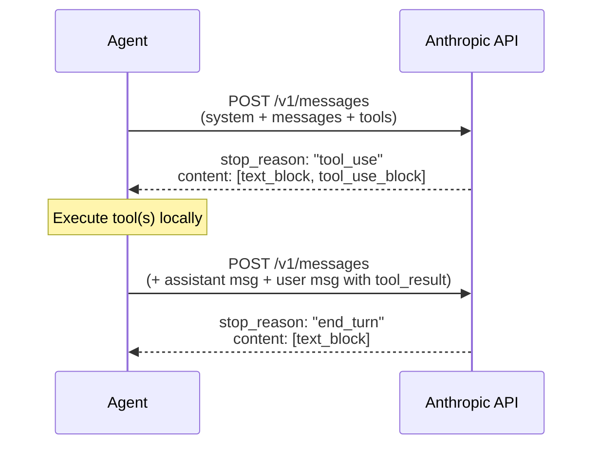

# Anthropic API Data Structures: Messages, Tools & Responses

A reference for the exact JSON structures sent to and received from the Anthropic Messages API — with emphasis on the **tool use** flow. Uses the same format as [doc 12](./12-openai-api-data-structures.md) for easy comparison.

---

## 📤 Request Structure

```json
POST https://api.anthropic.com/v1/messages

Headers:
  x-api-key: YOUR_API_KEY
  anthropic-version: 2023-06-01
  content-type: application/json

{
  "model": "claude-sonnet-4-6",
  "max_tokens": 8192,
  "system": "...",              // system prompt (top-level string, NOT in messages)
  "messages": [ ... ],          // conversation history (no system role here)
  "tools": [ ... ],             // tool definitions (optional)
  "tool_choice": {"type": "auto"}
}
```

> **Key difference from OpenAI:** `system` is a **top-level field**, not a message with `role: "system"`. The `messages` array only contains `user` and `assistant` turns.

---

## 💬 Message Types

The `messages` array contains alternating `user` and `assistant` turns. There are only **two roles** in messages (system lives outside).

### 1. System Prompt (top-level field)

```json
{
  "system": "You are a coding assistant. Use tools to answer questions about the codebase."
}
```

**Multi-part system prompt** (used for prompt caching):

```json
{
  "system": [
    {
      "type": "text",
      "text": "You are a coding assistant...",
      "cache_control": {"type": "ephemeral"}
    },
    {
      "type": "text",
      "text": "Today's date is 2026-04-09. Current directory: /home/user/project."
    }
  ]
}
```

> Split into an array to apply `cache_control` to expensive static sections independently.

---

### 2. User Message

**Plain text:**

```json
{
  "role": "user",
  "content": "How many Python files are in the src/ directory?"
}
```

**Multi-part (text + image):**

```json
{
  "role": "user",
  "content": [
    { "type": "text", "text": "What's in this screenshot?" },
    {
      "type": "image",
      "source": {
        "type": "base64",
        "media_type": "image/png",
        "data": "iVBORw0KGgo..."
      }
    }
  ]
}
```

**Tool results** (appended by the agent after executing tools):

```json
{
  "role": "user",
  "content": [
    {
      "type": "tool_result",
      "tool_use_id": "toolu_01Abc123",
      "content": "7"
    }
  ]
}
```

> **Key difference from OpenAI:** Tool results go inside a **`user` message** as `tool_result` blocks — there is no separate `tool` role.

---

### 3. Assistant Message

**Plain text response (no tools):**

```json
{
  "role": "assistant",
  "content": "There are **7** Python files in the `src/` directory."
}
```

**Tool use response (model wants to call a tool):**

```json
{
  "role": "assistant",
  "content": [
    {
      "type": "text",
      "text": "I'll check the directory for you."
    },
    {
      "type": "tool_use",
      "id": "toolu_01Abc123",
      "name": "bash",
      "input": {
        "command": "find src/ -name '*.py' | wc -l"
      }
    }
  ]
}
```

> **Key differences from OpenAI:**
> - `content` is an **array of blocks**, not a single string
> - The model can include both a `text` block *and* `tool_use` blocks in the same response
> - Tool arguments are in `input` (an **object**, not a JSON string) — no `json.loads()` needed
> - The id prefix is `toolu_` not `call_`

---

## 🔧 Tool Definitions

The `tools` array tells the model what functions are available:

```json
{
  "name": "bash",
  "description": "Execute a shell command and return stdout + stderr.",
  "input_schema": {
    "type": "object",
    "properties": {
      "command": {
        "type": "string",
        "description": "The shell command to run"
      },
      "timeout": {
        "type": "integer",
        "description": "Max seconds to wait (default: 30)"
      }
    },
    "required": ["command"]
  }
}
```

> **Key difference from OpenAI:** The schema field is `input_schema`, not `function.parameters`. There is also no `"type": "function"` wrapper — each tool is defined directly.

### OpenAI vs Anthropic Tool Definition Side-by-Side

| Field | OpenAI | Anthropic |
|-------|--------|-----------|
| Wrapper | `{"type": "function", "function": {...}}` | `{...}` (flat, no wrapper) |
| Schema field | `parameters` | `input_schema` |
| Arguments in response | `arguments` (JSON string) | `input` (plain object) |
| Tool result role | `"tool"` (separate role) | `"user"` (with `tool_result` block) |

---

## 🎯 `tool_choice` Options

Controls whether/how the model picks a tool:

| Value | Behavior |
|-------|----------|
| `{"type": "auto"}` | Model decides (default) |
| `{"type": "any"}` | Must call at least one tool |
| `{"type": "tool", "name": "bash"}` | Force a specific tool |

> Note: Anthropic uses an **object** for `tool_choice`, not a plain string like OpenAI.

---

## 📥 Response Structure

```json
{
  "id": "msg_01XyZ789",
  "type": "message",
  "role": "assistant",
  "model": "claude-sonnet-4-6",
  "content": [
    {
      "type": "text",
      "text": "I'll check the directory for you."
    },
    {
      "type": "tool_use",
      "id": "toolu_01Abc123",
      "name": "bash",
      "input": {
        "command": "find src/ -name '*.py' | wc -l"
      }
    }
  ],
  "stop_reason": "tool_use",
  "stop_sequence": null,
  "usage": {
    "input_tokens": 189,
    "output_tokens": 45,
    "cache_creation_input_tokens": 0,
    "cache_read_input_tokens": 0
  }
}
```

### `stop_reason` Values

| Value | Meaning |
|-------|---------|
| `"end_turn"` | Natural end — no more tool calls |
| `"tool_use"` | Model wants to call one or more tools |
| `"max_tokens"` | Hit `max_tokens` limit |
| `"stop_sequence"` | Hit a custom stop sequence |

> OpenAI equivalent: `stop_reason` ↔ `finish_reason`, `"end_turn"` ↔ `"stop"`, `"tool_use"` ↔ `"tool_calls"`

---

## 🔄 Full Tool Use Flow



### Message Array After One Tool Round-Trip

```
messages = [
  { role: "user",      content: "How many Python files..." },
  { role: "assistant", content: [{type:"text",...}, {type:"tool_use", id:"toolu_01Abc123"}] },
  { role: "user",      content: [{type:"tool_result", tool_use_id:"toolu_01Abc123", content:"7"}] },
  // model's final reply goes here after second request
]
```

> Notice the tool result goes back as a `user` message — the conversation always alternates `user` / `assistant`.

---

## 🧪 End-to-End Example: "Count Python files"

Same scenario as [doc 12](./12-openai-api-data-structures.md): user asks "How many Python files are in src/?", model runs a shell command, then replies.

---

### Step 1 — Agent sends Request #1

```json
POST https://api.anthropic.com/v1/messages
{
  "model": "claude-sonnet-4-6",
  "max_tokens": 8192,
  "system": "You are a coding assistant. Use tools to answer questions about the codebase.",
  "tool_choice": {"type": "auto"},
  "tools": [
    {
      "name": "bash",
      "description": "Execute a shell command and return stdout + stderr.",
      "input_schema": {
        "type": "object",
        "properties": {
          "command": {
            "type": "string",
            "description": "The shell command to run"
          }
        },
        "required": ["command"]
      }
    },
    {
      "name": "read_file",
      "description": "Read the contents of a file at the given path.",
      "input_schema": {
        "type": "object",
        "properties": {
          "path": {
            "type": "string",
            "description": "Absolute or relative path to the file"
          }
        },
        "required": ["path"]
      }
    }
  ],
  "messages": [
    {
      "role": "user",
      "content": "How many Python files are in the src/ directory?"
    }
  ]
}
```

Key points:
- `system` is top-level, not inside `messages`
- `messages` only has the `user` turn — no system role in this array
- Tool schema uses `input_schema`, not `parameters`

---

### Step 2 — API Response #1 (model calls a tool)

```json
{
  "id": "msg_01XyZ789",
  "type": "message",
  "role": "assistant",
  "model": "claude-sonnet-4-6",
  "content": [
    {
      "type": "text",
      "text": "I'll check the src/ directory for Python files."
    },
    {
      "type": "tool_use",
      "id": "toolu_01Abc123",
      "name": "bash",
      "input": {
        "command": "find src/ -name '*.py' | wc -l"
      }
    }
  ],
  "stop_reason": "tool_use",
  "stop_sequence": null,
  "usage": {
    "input_tokens": 189,
    "output_tokens": 45,
    "cache_creation_input_tokens": 0,
    "cache_read_input_tokens": 0
  }
}
```

Key points:
- `stop_reason: "tool_use"` — signal to execute tools
- `content` is an array: one `text` block + one `tool_use` block in the same response
- `input` is already a **parsed object** — no `json.loads()` needed
- `id: "toolu_01Abc123"` — must be echoed back in the `tool_result` block

---

### Step 3 — Agent executes the tool locally

```python
import subprocess

# find the tool_use block in the response content
tool_use_block = next(b for b in response.content if b.type == "tool_use")

tool_id   = tool_use_block.id        # "toolu_01Abc123"
tool_name = tool_use_block.name      # "bash"
tool_args = tool_use_block.input     # {"command": "find src/ -name '*.py' | wc -l"}
                                     # already a dict — no json.loads() needed

result = subprocess.run(
    tool_args["command"], shell=True, capture_output=True, text=True
)
tool_output = result.stdout.strip()
# tool_output == "7"
```

---

### Step 4 — Agent sends Request #2 (with tool result)

The agent appends the assistant message and a new `user` message containing the `tool_result`:

```json
POST https://api.anthropic.com/v1/messages
{
  "model": "claude-sonnet-4-6",
  "max_tokens": 8192,
  "system": "You are a coding assistant. Use tools to answer questions about the codebase.",
  "tool_choice": {"type": "auto"},
  "tools": [ /* same tools array as before */ ],
  "messages": [
    {
      "role": "user",
      "content": "How many Python files are in the src/ directory?"
    },
    {
      "role": "assistant",
      "content": [
        {
          "type": "text",
          "text": "I'll check the src/ directory for Python files."
        },
        {
          "type": "tool_use",
          "id": "toolu_01Abc123",
          "name": "bash",
          "input": {
            "command": "find src/ -name '*.py' | wc -l"
          }
        }
      ]
    },
    {
      "role": "user",
      "content": [
        {
          "type": "tool_result",
          "tool_use_id": "toolu_01Abc123",
          "content": "7"
        }
      ]
    }
  ]
}
```

Key points:
- The assistant message is appended verbatim (both its `text` and `tool_use` blocks)
- Tool result goes inside a **new `user` message** as a `tool_result` block — not a separate role
- `tool_use_id` must match `toolu_01Abc123` from the assistant's `tool_use` block
- The conversation must always end with a `user` turn before sending to the API
- `system` and `tools` are re-sent on every request (API is stateless)

---

### Step 5 — API Response #2 (final answer)

```json
{
  "id": "msg_02AbC456",
  "type": "message",
  "role": "assistant",
  "model": "claude-sonnet-4-6",
  "content": [
    {
      "type": "text",
      "text": "There are **7** Python files in the `src/` directory."
    }
  ],
  "stop_reason": "end_turn",
  "stop_sequence": null,
  "usage": {
    "input_tokens": 231,
    "output_tokens": 17,
    "cache_creation_input_tokens": 0,
    "cache_read_input_tokens": 0
  }
}
```

Key points:
- `stop_reason: "end_turn"` — done, no more tool calls
- `content` is a single `text` block array
- `usage` shows token counts for both prompt and completion (plus cache fields)

---

### Full Message History After Both Turns

```
┌─────────────────────────────────────────────────────────────────────┐
│ Request #1                                                          │
│   system (top-level): "You are a coding assistant..."               │
│   messages:                                                         │
│     [0] user  "How many Python files..."                            │
└─────────────────────────────────────────────────────────────────────┘
                        ↓ response: stop_reason="tool_use"
┌─────────────────────────────────────────────────────────────────────┐
│ Request #2  (history grows by 2 messages)                           │
│   system (top-level): "You are a coding assistant..."               │
│   messages:                                                         │
│     [0] user       "How many Python files..."                       │
│     [1] assistant  [{type:text,...}, {type:tool_use, id:toolu_...}] │  ← appended
│     [2] user       [{type:tool_result, tool_use_id:toolu_...}]      │  ← appended
└─────────────────────────────────────────────────────────────────────┘
                        ↓ response: stop_reason="end_turn"
   Final reply: "There are 7 Python files in src/"
```

Two things always grow together: one `assistant` message + one `user` (tool_result) message per tool round-trip.

---

## 🐍 Python Reference (Anthropic SDK)

```python
import anthropic

client = anthropic.Anthropic()  # reads ANTHROPIC_API_KEY from env

# --- Define tools ---
tools = [
    {
        "name": "bash",
        "description": "Run a shell command",
        "input_schema": {
            "type": "object",
            "properties": {
                "command": {"type": "string", "description": "Shell command"}
            },
            "required": ["command"]
        }
    }
]

# --- Agent loop ---
messages = [
    {"role": "user", "content": "How many Python files are in src/?"}
]

while True:
    response = client.messages.create(
        model="claude-sonnet-4-6",
        max_tokens=8192,
        system="You are a helpful coding assistant.",
        tools=tools,
        tool_choice={"type": "auto"},
        messages=messages
    )

    # append assistant turn
    messages.append({"role": "assistant", "content": response.content})

    if response.stop_reason == "end_turn":
        text = next(b.text for b in response.content if b.type == "text")
        print(text)
        break

    # collect all tool results into one user message
    tool_results = []
    for block in response.content:
        if block.type != "tool_use":
            continue

        result = execute_tool(block.name, block.input)  # block.input is already a dict

        tool_results.append({
            "type": "tool_result",
            "tool_use_id": block.id,
            "content": str(result)
        })

    messages.append({"role": "user", "content": tool_results})
    # loop: send updated messages back to model
```

> **Note:** All `tool_result` blocks from a single round go into **one `user` message** as a list — not separate messages per tool call.

---

## 🆚 OpenAI vs Anthropic Quick Reference

| Concept | OpenAI | Anthropic |
|---------|--------|-----------|
| System prompt location | `messages[0]` with `role: "system"` | Top-level `system` field |
| Roles in `messages` | `system`, `user`, `assistant`, `tool` | `user`, `assistant` only |
| Tool definition wrapper | `{"type":"function","function":{...}}` | `{name, description, input_schema}` |
| Schema field name | `parameters` | `input_schema` |
| Tool args in response | `arguments` — JSON string, parse with `json.loads()` | `input` — already a dict |
| Tool result role | Separate `"tool"` role message | `"user"` message with `tool_result` block |
| Multiple tool results | One `tool` message per result | All results in **one** `user` message |
| Done signal | `finish_reason: "stop"` | `stop_reason: "end_turn"` |
| Tool call signal | `finish_reason: "tool_calls"` | `stop_reason: "tool_use"` |
| `tool_choice` format | String: `"auto"` / `"none"` / `"required"` | Object: `{"type": "auto"}` |

---

## ⚠️ Common Gotchas

| Gotcha | Detail |
|--------|--------|
| System in messages → error | `system` must be top-level, never `{"role":"system",...}` in messages |
| `input` is already a dict | Don't `json.loads()` it — it's already parsed unlike OpenAI's `arguments` |
| Tool results go in `user` | Wrap in `{"role":"user","content":[{"type":"tool_result",...}]}` |
| All results in one message | Batch all `tool_result` blocks from a single round into one `user` message |
| Messages must alternate | The array must strictly alternate `user` / `assistant`; back-to-back same role → error |
| Last message must be `user` | The API requires the final message to be a `user` turn |
| Content is always an array | In the response, `content` is `[{type, ...}]` — iterate it, don't treat as string |
