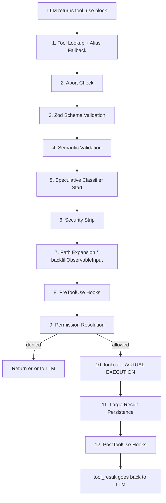

# 16. Tool Execution Deep Dive 🔧

> A comprehensive analysis of how Claude Code executes tools — from the moment the LLM returns a `tool_use` block to the moment the `tool_result` goes back. This doc covers every layer, every edge case, and every production hardening pattern.

## Table of Contents

- [1. The Big Picture: Our Version vs Claude Code](#1-the-big-picture-our-version-vs-claude-code)
- [2. Tool Definition Structure (Tool.ts)](#2-tool-definition-structure-toolts)
- [3. The Full Execution Pipeline](#3-the-full-execution-pipeline)
- [4. Step 1: Tool Lookup with Alias Fallback](#4-step-1-tool-lookup-with-alias-fallback)
- [5. Step 2: Abort Check](#5-step-2-abort-check)
- [6. Step 3: Zod Schema Validation](#6-step-3-zod-schema-validation)
- [7. Step 4: Semantic Validation (validateInput)](#7-step-4-semantic-validation-validateinput)
- [8. Step 5: Speculative Classifier Start](#8-step-5-speculative-classifier-start)
- [9. Step 6: Security Strip (Defense-in-Depth)](#9-step-6-security-strip-defense-in-depth)
- [10. Step 7: Path Expansion (backfillObservableInput)](#10-step-7-path-expansion-backfillobservableinput)
- [11. Step 8: PreToolUse Hooks](#11-step-8-pretooluse-hooks)
- [12. Step 9: Permission Resolution](#12-step-9-permission-resolution)
- [13. Step 10: The Actual tool.call()](#13-step-10-the-actual-toolcall)
- [14. Step 11: Large Result Persistence](#14-step-11-large-result-persistence)
- [15. Step 12: PostToolUse Hooks](#15-step-12-posttooluse-hooks)
- [16. Tool Orchestration: Serial vs Concurrent](#16-tool-orchestration-serial-vs-concurrent)
- [17. Streaming Tool Execution](#17-streaming-tool-execution)
- [18. Error Handling at Every Layer](#18-error-handling-at-every-layer)
- [19. The Permission System in Detail](#19-the-permission-system-in-detail)
- [20. The Hooks System in Detail](#20-the-hooks-system-in-detail)
- [21. Tool Result Storage and Budget](#21-tool-result-storage-and-budget)
- [22. Case Study: FileEditTool](#22-case-study-fileedittool)
- [23. Case Study: BashTool](#23-case-study-bashtool)
- [24. Telemetry and Observability](#24-telemetry-and-observability)
- [25. Why All This Complexity?](#25-why-all-this-complexity)
- [26. Key Source Files Reference](#26-key-source-files-reference)

---

## 1. The Big Picture: Our Version vs Claude Code

### Our version (18 lines)

```python
# src/tools/__init__.py
def execute(name: str, arguments: dict) -> str:
    for t in ALL_TOOLS:
        if t["name"] == name:
            return t["call"](arguments)
    return f"Unknown tool: {name}"
```

```python
# src/agent.py — the tool execution part
for tool_call in message.tool_calls:
    name = tool_call.function.name
    arguments = json.loads(tool_call.function.arguments)
    try:
        result = execute(name, arguments)
    except Exception as e:
        result = f"Error: {e}"
    messages.append({"role": "tool", "tool_call_id": tool_call.id, "content": result})
```

That's it. Lookup → call → append result. Simple, works, but fragile.

### Claude Code's version (~1,500+ lines across multiple files)

Between "LLM returns tool_use" and "tool_result goes back", Claude Code runs **12 distinct steps** with error handling, telemetry, and escape hatches at every layer:



---

## 2. Tool Definition Structure (Tool.ts)

📁 **Source:** `src/Tool.ts` — lines 362–695

Every tool in Claude Code is NOT just a function. It's a rich object with **~35 methods/properties**. Understanding this structure is key to understanding the entire system.

### The Tool type definition

```typescript
// src/Tool.ts:362-695
export type Tool<Input, Output, P> = {
  // === Identity ===
  readonly name: string
  aliases?: string[]           // deprecated names for backward compat
  searchHint?: string          // keyword hint for ToolSearch (3-10 words)
  
  // === Schema & Validation ===
  readonly inputSchema: Input  // Zod schema for runtime type checking
  readonly inputJSONSchema?: ToolInputJSONSchema  // for MCP tools
  outputSchema?: z.ZodType<unknown>
  inputsEquivalent?(a, b): boolean  // dedup/change detection
  
  // === The actual function ===
  call(args, context, canUseTool, parentMessage, onProgress?): Promise<ToolResult<Output>>
  
  // === Permission & Security ===
  validateInput?(input, context): Promise<ValidationResult>
  checkPermissions(input, context): Promise<PermissionResult>
  preparePermissionMatcher?(input): Promise<(pattern: string) => boolean>
  backfillObservableInput?(input: Record<string, unknown>): void
  
  // === Classification ===
  isConcurrencySafe(input): boolean   // can run in parallel?
  isEnabled(): boolean
  isReadOnly(input): boolean
  isDestructive?(input): boolean      // delete, overwrite, send
  interruptBehavior?(): 'cancel' | 'block'
  isSearchOrReadCommand?(input): { isSearch, isRead, isList? }
  isOpenWorld?(input): boolean
  requiresUserInteraction?(): boolean
  
  // === MCP & Deferred Loading ===
  isMcp?: boolean
  isLsp?: boolean
  readonly shouldDefer?: boolean       // deferred = needs ToolSearch first
  readonly alwaysLoad?: boolean        // never deferred
  mcpInfo?: { serverName, toolName }
  
  // === Result Handling ===
  maxResultSizeChars: number           // when to persist to disk
  readonly strict?: boolean            // stricter API adherence
  mapToolResultToToolResultBlockParam(content, toolUseID): ToolResultBlockParam
  
  // === UI Rendering (React) ===
  prompt(options): Promise<string>
  description(input, options): Promise<string>
  userFacingName(input): string
  userFacingNameBackgroundColor?(input): keyof Theme | undefined
  getToolUseSummary?(input): string | null
  getActivityDescription?(input): string | null   // spinner text
  renderToolUseMessage(input, options): React.ReactNode
  renderToolResultMessage?(content, progressMessages, options): React.ReactNode
  renderToolUseRejectedMessage?(input, options): React.ReactNode
  renderToolUseErrorMessage?(result, options): React.ReactNode
  renderToolUseProgressMessage?(progressMessages, options): React.ReactNode
  renderToolUseQueuedMessage?(): React.ReactNode
  renderGroupedToolUse?(toolUses, options): React.ReactNode | null
  renderToolUseTag?(input): React.ReactNode
  isResultTruncated?(output): boolean
  isTransparentWrapper?(): boolean
  extractSearchText?(out): string      // for transcript search indexing
  
  // === Telemetry ===
  toAutoClassifierInput(input): unknown   // compact for AI safety classifier
  getPath?(input): string                 // for file-related tools
}
```

### The buildTool() factory

📁 **Source:** `src/Tool.ts` — lines 757–792

All tools are constructed via `buildTool(def)` which fills in safe defaults:

```typescript
// src/Tool.ts:757-768
const TOOL_DEFAULTS = {
  isEnabled: () => true,
  isConcurrencySafe: (_input?) => false,    // FAIL CLOSED: assume not safe
  isReadOnly: (_input?) => false,            // FAIL CLOSED: assume writes
  isDestructive: (_input?) => false,
  checkPermissions: (input, _ctx?) =>        // defer to general system
    Promise.resolve({ behavior: 'allow', updatedInput: input }),
  toAutoClassifierInput: (_input?) => '',    // skip classifier by default
  userFacingName: (_input?) => '',
}

// src/Tool.ts:783-792
export function buildTool<D extends AnyToolDef>(def: D): BuiltTool<D> {
  return {
    ...TOOL_DEFAULTS,
    userFacingName: () => def.name,
    ...def,
  } as BuiltTool<D>
}
```

> 💡 **Design lesson:** Defaults are *fail-closed* for security — `isConcurrencySafe: false`, `isReadOnly: false`. A new tool that forgets to set these properties will be treated as a write tool that runs exclusively. This is much safer than the reverse.

### ToolUseContext — the execution environment

📁 **Source:** `src/Tool.ts` — lines 158–299

Every tool call receives a massive `ToolUseContext` object. This is the tool's window into the entire application state:

```typescript
// src/Tool.ts:158-299 (abbreviated — actual has 50+ fields)
export type ToolUseContext = {
  options: {
    commands: Command[]
    debug: boolean
    mainLoopModel: string
    tools: Tools
    verbose: boolean
    thinkingConfig: ThinkingConfig
    mcpClients: MCPServerConnection[]
    mcpResources: Record<string, ServerResource[]>
    isNonInteractiveSession: boolean
    agentDefinitions: AgentDefinitionsResult
    maxBudgetUsd?: number
    customSystemPrompt?: string
    appendSystemPrompt?: string
    refreshTools?: () => Tools           // for MCP tools connecting mid-query
  }
  
  // State management
  abortController: AbortController       // for cancellation
  readFileState: FileStateCache           // tracks which files have been read
  getAppState(): AppState
  setAppState(f: (prev: AppState) => AppState): void
  
  // UI callbacks
  setToolJSX?: SetToolJSXFn
  addNotification?: (notif: Notification) => void
  appendSystemMessage?: (...) => void
  sendOSNotification?: (...) => void
  
  // Progress tracking
  setInProgressToolUseIDs: (f: (prev: Set<string>) => Set<string>) => void
  setHasInterruptibleToolInProgress?: (v: boolean) => void
  setResponseLength: (f: (prev: number) => number) => void
  setStreamMode?: (mode: SpinnerMode) => void
  
  // File tracking
  updateFileHistoryState: (updater) => void
  updateAttributionState: (updater) => void
  
  // Agent context
  agentId?: AgentId
  agentType?: string
  messages: Message[]
  
  // Limits
  fileReadingLimits?: { maxTokens?, maxSizeBytes? }
  globLimits?: { maxResults? }
  
  // Permission tracking
  toolDecisions?: Map<string, { source, decision, timestamp }>
  localDenialTracking?: DenialTrackingState
  contentReplacementState?: ContentReplacementState
  
  // Prompt caching
  renderedSystemPrompt?: SystemPrompt     // frozen at turn start for cache stability
}
```

> 💡 **Design lesson:** The context is a dependency injection mechanism. Tools don't import global state — they receive everything they need through context. This makes tools testable and allows subagents to have isolated contexts.

### ToolResult — what tools return

📁 **Source:** `src/Tool.ts` — lines 321–336

```typescript
// src/Tool.ts:321-336
export type ToolResult<T> = {
  data: T                     // the actual result data
  newMessages?: Message[]     // additional messages to inject
  contextModifier?: (context: ToolUseContext) => ToolUseContext  // modify context for next tool
  mcpMeta?: {                 // MCP protocol metadata passthrough
    _meta?: Record<string, unknown>
    structuredContent?: Record<string, unknown>
  }
}
```

The `contextModifier` is critical for the orchestration system — it allows a tool to update the shared context, but only AFTER the current batch completes (for concurrent tools, modifiers are queued and applied serially).

---

## 3. The Full Execution Pipeline

📁 **Source:** `src/services/tools/toolExecution.ts` — the entire file (1,746 lines)

The main entry point is `runToolUse()` (line 337), which wraps `checkPermissionsAndCallTool()` (line 599) in a streaming bridge. Here's the complete pipeline with exact line numbers:

| Step | Function | File:Line | What it does |
|------|----------|-----------|-------------|
| 0 | `runToolUse()` | toolExecution.ts:337 | Entry point — tool lookup, abort check, delegates to step 1+ |
| 1 | Tool lookup | toolExecution.ts:344-356 | Find tool by name, with alias fallback |
| 2 | Abort check | toolExecution.ts:415-453 | If already aborted, return cancel message |
| 3 | `inputSchema.safeParse()` | toolExecution.ts:615-680 | Zod runtime type validation |
| 4 | `tool.validateInput()` | toolExecution.ts:682-733 | Tool-specific semantic validation |
| 5 | `startSpeculativeClassifierCheck()` | toolExecution.ts:740-752 | Bash-only: start AI classifier in parallel |
| 6 | Security strip | toolExecution.ts:756-773 | Remove `_simulatedSedEdit` from input |
| 7 | `backfillObservableInput()` | toolExecution.ts:783-793 | Expand paths for hooks to see |
| 8 | `runPreToolUseHooks()` | toolExecution.ts:800-891 | External scripts can allow/deny/modify |
| 9 | `resolveHookPermissionDecision()` | toolExecution.ts:921-932 | Final permission resolution |
| 10 | `tool.call()` | toolExecution.ts:1207-1222 | **THE ACTUAL EXECUTION** |
| 11 | `processToolResultBlock()` | toolExecution.ts:1403-1474 | Large result persistence + formatting |
| 12 | `runPostToolUseHooks()` | toolExecution.ts:1483-1563 | Post-execution hooks |

---

## 4. Step 1: Tool Lookup with Alias Fallback

📁 **Source:** `src/services/tools/toolExecution.ts` — lines 337-411

```typescript
// toolExecution.ts:344-356
const toolName = toolUse.name
// First try to find in the available tools (what the model sees)
let tool = findToolByName(toolUseContext.options.tools, toolName)

// If not found, check if it's a deprecated tool being called by alias
// (e.g., old transcripts calling "KillShell" which is now an alias for "TaskStop")
if (!tool) {
  const fallbackTool = findToolByName(getAllBaseTools(), toolName)
  if (fallbackTool && fallbackTool.aliases?.includes(toolName)) {
    tool = fallbackTool
  }
}
```

📁 **Source:** `src/Tool.ts` — lines 348-360 (findToolByName and toolMatchesName)

```typescript
// Tool.ts:348-353
export function toolMatchesName(
  tool: { name: string; aliases?: string[] },
  name: string,
): boolean {
  return tool.name === name || (tool.aliases?.includes(name) ?? false)
}

export function findToolByName(tools: Tools, name: string): Tool | undefined {
  return tools.find(t => toolMatchesName(t, name))
}
```

### Why aliases exist

When Claude Code renames a tool (e.g., `KillShell` → `TaskStop`), old conversation transcripts may still reference the old name. The alias system lets these old references still work. Without this, resuming a session after a tool rename would cause errors.

### When tool is not found

If neither primary name nor alias matches, a `tool_use_error` is returned immediately:

```typescript
// toolExecution.ts:396-410
yield {
  message: createUserMessage({
    content: [{
      type: 'tool_result',
      content: `<tool_use_error>Error: No such tool available: ${toolName}</tool_use_error>`,
      is_error: true,
      tool_use_id: toolUse.id,
    }],
    toolUseResult: `Error: No such tool available: ${toolName}`,
  }),
}
```

> 💡 **Design lesson:** The `is_error: true` flag tells the LLM this was an error, not a successful result. The LLM can then retry with a different tool name. Errors are wrapped in `<tool_use_error>` XML tags to make them visually distinct in the message history.

---

## 5. Step 2: Abort Check

📁 **Source:** `src/services/tools/toolExecution.ts` — lines 415-453

```typescript
// toolExecution.ts:415-453
if (toolUseContext.abortController.signal.aborted) {
  logEvent('tengu_tool_use_cancelled', { ... })
  const content = createToolResultStopMessage(toolUse.id)
  content.content = withMemoryCorrectionHint(CANCEL_MESSAGE)
  yield {
    message: createUserMessage({
      content: [content],
      toolUseResult: CANCEL_MESSAGE,
    }),
  }
  return
}
```

### What triggers abort?

- User presses Escape
- User submits a new message while tools are running
- Budget limit exceeded
- Parent agent cancels child agent

### The memory correction hint

📁 **Source:** `src/utils/messages.ts` — `withMemoryCorrectionHint()`

When a tool is cancelled, the result includes a "memory correction hint" — extra text that tells the LLM "this tool was interrupted, don't assume its output is valid." This prevents the LLM from hallucinating what the tool "would have" returned.

---

## 6. Step 3: Zod Schema Validation

📁 **Source:** `src/services/tools/toolExecution.ts` — lines 614-680

```typescript
// toolExecution.ts:614-616
// Validate input types with zod (surprisingly, the model is not great
// at generating valid input)
const parsedInput = tool.inputSchema.safeParse(input)
```

This is the first real validation gate. The LLM frequently generates inputs with wrong types — numbers as strings, missing required fields, extra unrecognized fields, etc.

### When validation fails

```typescript
// toolExecution.ts:617-680
if (!parsedInput.success) {
  let errorContent = formatZodValidationError(tool.name, parsedInput.error)

  // If this is a deferred tool that wasn't loaded, tell the model to load it
  const schemaHint = buildSchemaNotSentHint(tool, ...)
  if (schemaHint) {
    errorContent += schemaHint
  }

  return [{
    message: createUserMessage({
      content: [{
        type: 'tool_result',
        content: `<tool_use_error>InputValidationError: ${errorContent}</tool_use_error>`,
        is_error: true,
        tool_use_id: toolUseID,
      }],
    }),
  }]
}
```

### The deferred tool schema hint

📁 **Source:** `src/services/tools/toolExecution.ts` — lines 578-597

This is clever. Claude Code uses "deferred tools" — tools whose full schema isn't sent in the initial prompt (to save tokens). The model must call `ToolSearch` first to load the schema. If the model tries to call a deferred tool WITHOUT loading its schema first, the Zod validation will fail because the parameters are all wrong types (the model is guessing without the schema).

When this happens, the error message includes a specific hint:

```typescript
// toolExecution.ts:592-596
return (
  `\n\nThis tool's schema was not sent to the API — it was not in the ` +
  `discovered-tool set derived from message history. Without the schema ` +
  `in your prompt, typed parameters (arrays, numbers, booleans) get ` +
  `emitted as strings and the client-side parser rejects them. ` +
  `Load the tool first: call ${TOOL_SEARCH_TOOL_NAME} with query ` +
  `"select:${tool.name}", then retry this call.`
)
```

### Zod error formatting

📁 **Source:** `src/utils/toolErrors.ts` — lines 66-80+

The `formatZodValidationError()` function transforms raw Zod errors into LLM-friendly messages:

```typescript
// toolErrors.ts:66-80
export function formatZodValidationError(toolName: string, error: ZodError): string {
  const missingParams = error.issues
    .filter(err => err.code === 'invalid_type' && err.message.includes('received undefined'))
    .map(err => formatValidationPath(err.path))

  const unexpectedParams = error.issues
    .filter(err => err.code === 'unrecognized_keys')
    .flatMap(err => err.keys)
  // ... formats into human-readable error
}
```

> 💡 **Design lesson:** Don't just forward raw validation errors to the LLM. Format them into actionable messages that tell the LLM exactly what's wrong and how to fix it.

---

## 7. Step 4: Semantic Validation (validateInput)

📁 **Source:** `src/services/tools/toolExecution.ts` — lines 682-733

After type validation passes, each tool can run its own semantic validation:

```typescript
// toolExecution.ts:682-687
const isValidCall = await tool.validateInput?.(parsedInput.data, toolUseContext)
if (isValidCall?.result === false) {
  return [{
    message: createUserMessage({
      content: [{
        type: 'tool_result',
        content: `<tool_use_error>${isValidCall.message}</tool_use_error>`,
        is_error: true,
        tool_use_id: toolUseID,
      }],
    }),
  }]
}
```

### What FileEditTool validates (100+ lines of checks)

📁 **Source:** `src/tools/FileEditTool/FileEditTool.ts` — lines 137-362

The FileEditTool has the most extensive `validateInput` in the entire codebase. Here's every check it performs, in order:

1. **Team memory secret detection** (line 144): Calls `checkTeamMemSecrets()` — prevents writing API keys, passwords, or other secrets into team-shared memory files (CLAUDE.md).

2. **Same string check** (line 148): If `old_string === new_string`, returns error "No changes to make: old_string and new_string are exactly the same." Error code 1.

3. **Deny rule check** (line 160): Checks if the file path matches any deny rules in permission settings. Error code 2.

4. **UNC path security** (line 179): On Windows, skips filesystem operations for UNC paths (`\\server\share`) to prevent NTLM credential leaks. When `fs.existsSync()` is called on a UNC path, it triggers SMB authentication which could leak credentials to malicious servers.

5. **File size check** (line 186-200): Files larger than 1 GiB (1024 * 1024 * 1024 bytes) are rejected to prevent OOM. Error code 10.

6. **File encoding detection** (line 207-221): Reads the file as bytes, detects UTF-16LE via BOM (0xFF 0xFE), normalizes line endings (\r\n → \n).

7. **File existence + old_string empty** (line 224-264):
   - File doesn't exist + old_string is empty → new file creation → valid
   - File doesn't exist + old_string is not empty → error with "Did you mean...?" suggestion. Uses `findSimilarFile()` to suggest alternatives. Error code 4.
   - File exists + old_string is empty + file has content → error "Cannot create new file - file already exists." Error code 3.
   - File exists + old_string is empty + file is empty → valid (replacing empty content)

8. **Notebook redirect** (line 266-273): If file ends with `.ipynb`, directs to NotebookEditTool. Error code 5.

9. **Must-read-first check** (line 275-287): Checks `readFileState` cache — the file MUST have been read by the Read tool before it can be edited. This prevents blind edits. Error code 6.

10. **Staleness check** (line 290-311): Compares file modification time against the last read timestamp. If the file was modified after it was last read (by the user or a linter), it must be re-read first. On Windows, also compares actual content because timestamps can change without content changes (cloud sync, antivirus). Error code 7.

11. **String not found** (line 316-327): Uses `findActualString()` which handles quote normalization (curly quotes ↔ straight quotes). Error code 8.

12. **Multiple matches without replace_all** (line 332-343): If `old_string` matches multiple places in the file but `replace_all` is false, returns error telling the model to either set `replace_all: true` or provide more context to uniquely identify the instance. Error code 9.

13. **Settings file validation** (line 346-359): For Claude settings files, simulates the edit and validates the resulting JSON/TOML is still valid.

### ValidationResult type

📁 **Source:** `src/Tool.ts` — lines 95-101

```typescript
export type ValidationResult =
  | { result: true }
  | { result: false; message: string; errorCode: number }
```

> 💡 **Design lesson:** Error codes are numeric and stable, not string-based. This lets telemetry track which types of validation failures are most common without logging sensitive content.

---

## 8. Step 5: Speculative Classifier Start

📁 **Source:** `src/services/tools/toolExecution.ts` — lines 734-752

```typescript
// toolExecution.ts:740-752
if (tool.name === BASH_TOOL_NAME && parsedInput.data && 'command' in parsedInput.data) {
  const appState = toolUseContext.getAppState()
  startSpeculativeClassifierCheck(
    (parsedInput.data as BashToolInput).command,
    appState.toolPermissionContext,
    toolUseContext.abortController.signal,
    toolUseContext.options.isNonInteractiveSession,
  )
}
```

📁 **Source:** `src/tools/BashTool/bashPermissions.ts` — `startSpeculativeClassifierCheck()`

This is an optimization specific to the Bash tool. In "auto" mode, Claude Code uses an AI classifier to decide if a bash command is safe to run without user approval. The classifier is a side API call (a "side query") — it's slow.

By starting the classifier check HERE (before hooks and permission dialogs), the classifier runs **in parallel** with all the subsequent steps. By the time the permission system actually needs the classifier result, it's likely already done.

The comment in the code explains why the UI indicator is NOT set here:

```typescript
// The UI indicator (setClassifierChecking) is NOT set here — it's set in
// interactiveHandler.ts only when the permission check returns `ask` with a
// pendingClassifierCheck. This avoids flashing "classifier running" for
// commands that auto-allow via prefix rules.
```

> 💡 **Design lesson:** Start expensive async operations as early as possible, even before you know if you'll need the result. The cost of a wasted call is much less than the latency of a serial call.

---

## 9. Step 6: Security Strip (Defense-in-Depth)

📁 **Source:** `src/services/tools/toolExecution.ts` — lines 756-773

```typescript
// toolExecution.ts:756-773
// Defense-in-depth: strip _simulatedSedEdit from model-provided Bash input.
// This field is internal-only — it must only be injected by the permission
// system (SedEditPermissionRequest) after user approval. If the model supplies
// it, the schema's strictObject should already reject it, but we strip here
// as a safeguard against future regressions.
let processedInput = parsedInput.data
if (
  tool.name === BASH_TOOL_NAME &&
  processedInput &&
  typeof processedInput === 'object' &&
  '_simulatedSedEdit' in processedInput
) {
  const { _simulatedSedEdit: _, ...rest } = processedInput as typeof processedInput & {
    _simulatedSedEdit: unknown
  }
  processedInput = rest as typeof processedInput
}
```

### What is _simulatedSedEdit?

When the user approves a `sed` command, the permission system injects a `_simulatedSedEdit` field into the Bash input that contains a pre-parsed, safe version of the edit. This field is INTERNAL ONLY — it should never come from the model.

The Zod schema (with `strictObject`) should already reject this field, but this strip is a **defense-in-depth** measure. If a future code change accidentally makes the schema less strict, this prevents the model from injecting arbitrary edit commands.

> 💡 **Design lesson:** Defense-in-depth means having multiple layers of protection. If one layer fails (Zod schema regression), another catches it (explicit strip). The comment even references that this is a safeguard against "future regressions" — they're protecting against their own future mistakes.

---

## 10. Step 7: Path Expansion (backfillObservableInput)

📁 **Source:** `src/services/tools/toolExecution.ts` — lines 775-793

```typescript
// toolExecution.ts:775-793
// Backfill legacy/derived fields on a shallow clone so hooks/canUseTool see
// them without affecting tool.call(). SendMessageTool adds fields; file
// tools overwrite file_path with expandPath — that mutation must not reach
// call() because tool results embed the input path verbatim.
let callInput = processedInput
const backfilledClone =
  tool.backfillObservableInput && typeof processedInput === 'object' && processedInput !== null
    ? ({ ...processedInput } as typeof processedInput)
    : null
if (backfilledClone) {
  tool.backfillObservableInput!(backfilledClone as Record<string, unknown>)
  processedInput = backfilledClone
}
```

### Why this exists

Consider this scenario:
1. User sets a hook allowlist rule: `Edit(/home/user/safe/**)`
2. The model calls Edit with `file_path: "~/safe/foo.txt"` (using tilde)
3. Without path expansion, the hook sees `~/safe/foo.txt` which does NOT match the allowlist pattern `/home/user/safe/**`
4. The tool runs through normal permission flow, potentially getting auto-approved elsewhere

Or worse:
1. User sets hook allowlist: `Edit(/home/user/project/**)`
2. Model calls Edit with `file_path: "../../etc/passwd"` (relative path traversal)
3. Without expansion, the hook sees a relative path and can't match against the absolute allowlist

The `backfillObservableInput` expands these paths to absolute form so hooks and permission rules can match correctly.

### FileEditTool's implementation

📁 **Source:** `src/tools/FileEditTool/FileEditTool.ts` — lines 115-121

```typescript
// FileEditTool.ts:115-121
backfillObservableInput(input) {
  // hooks.mdx documents file_path as absolute; expand so hook allowlists
  // can't be bypassed via ~ or relative paths.
  if (typeof input.file_path === 'string') {
    input.file_path = expandPath(input.file_path)
  }
},
```

### Critical subtlety: the clone

The backfill operates on a **shallow clone**, not the original. Why?

1. **Hooks and permissions** see the expanded paths (correct matching)
2. **tool.call()** sees the original model-provided paths (correct in tool result strings)
3. **Prompt cache** is preserved (changing the input would change the serialized message, busting the cache)

Later, at line 1189-1205, there's even more subtlety — if a hook returns a new `updatedInput` that happens to have the same expanded `file_path` as the backfilled clone, the code restores the original model-provided path. This keeps VCR (recording) fixture hashes stable.

---

## 11. Step 8: PreToolUse Hooks

📁 **Source:** `src/services/tools/toolExecution.ts` — lines 795-891
📁 **Source:** `src/services/tools/toolHooks.ts` — `runPreToolUseHooks()`
📁 **Source:** `src/utils/hooks.ts` — `executePreToolHooks()`

```typescript
// toolExecution.ts:800-862
for await (const result of runPreToolUseHooks(
  toolUseContext, tool, processedInput, toolUseID, ...
)) {
  switch (result.type) {
    case 'message':
      // Hook emitted a progress or attachment message
      break
    case 'hookPermissionResult':
      hookPermissionResult = result.hookPermissionResult  // allow/deny/ask
      break
    case 'hookUpdatedInput':
      processedInput = result.updatedInput  // hook modified the input
      break
    case 'preventContinuation':
      shouldPreventContinuation = result.shouldPreventContinuation
      break
    case 'stopReason':
      stopReason = result.stopReason
      break
    case 'additionalContext':
      resultingMessages.push(result.message)  // inject context into conversation
      break
    case 'stop':
      // Hook says stop entirely — return error, don't run tool
      return resultingMessages
  }
}
```

### What hooks can do

A PreToolUse hook can:

1. **Allow** the tool (skip permission dialog)
2. **Deny** the tool (prevent execution)
3. **Ask** (force a permission dialog even if rules would auto-allow)
4. **Modify the input** (change parameters before execution)
5. **Inject additional context** (add messages to the conversation)
6. **Prevent continuation** (let the tool run but stop the agent loop after)
7. **Stop entirely** (abort before execution with a reason)

### Hook timing

```typescript
// toolExecution.ts:863-870
const preToolHookDurationMs = Date.now() - preToolHookStart
getStatsStore()?.observe('pre_tool_hook_duration_ms', preToolHookDurationMs)
if (preToolHookDurationMs >= SLOW_PHASE_LOG_THRESHOLD_MS) {  // 2000ms
  logForDebugging(
    `Slow PreToolUse hooks: ${preToolHookDurationMs}ms for ${tool.name}`,
  )
}
```

If hooks take longer than 500ms (`HOOK_TIMING_DISPLAY_THRESHOLD_MS`), a timing summary is emitted inline so users can see which hooks are slow.

---

## 12. Step 9: Permission Resolution

📁 **Source:** `src/services/tools/toolExecution.ts` — lines 916-977
📁 **Source:** `src/services/tools/toolHooks.ts` — lines 332-430 (`resolveHookPermissionDecision`)
📁 **Source:** `src/utils/permissions/permissions.ts` — lines 473+ (`hasPermissionsToUseTool`)

This is where the final allow/deny/ask decision is made.

```typescript
// toolExecution.ts:921-932
const resolved = await resolveHookPermissionDecision(
  hookPermissionResult,    // from PreToolUse hooks (may be undefined)
  tool,
  processedInput,
  toolUseContext,
  canUseTool,              // the interactive permission handler
  assistantMessage,
  toolUseID,
)
const permissionDecision = resolved.decision
processedInput = resolved.input
```

### The resolveHookPermissionDecision function

📁 **Source:** `src/services/tools/toolHooks.ts` — lines 332-430

This function encapsulates a critical security invariant:

**Hook `allow` does NOT bypass settings.json deny/ask rules.**

```typescript
// toolHooks.ts:347-398
if (hookPermissionResult?.behavior === 'allow') {
  const hookInput = hookPermissionResult.updatedInput ?? input

  // If tool requires user interaction, hooks can't skip it
  // (unless hook provided updatedInput — then hook IS the interaction)
  if ((requiresInteraction && !interactionSatisfied) || requireCanUseTool) {
    return {
      decision: await canUseTool(tool, hookInput, ...),
      input: hookInput,
    }
  }

  // Hook allow skips the interactive prompt, but deny/ask rules still apply.
  const ruleCheck = await checkRuleBasedPermissions(tool, hookInput, toolUseContext)
  if (ruleCheck === null) {
    // No rules conflict — hook approval stands
    return { decision: hookPermissionResult, input: hookInput }
  }
  if (ruleCheck.behavior === 'deny') {
    // Deny rule overrides hook approval
    return { decision: ruleCheck, input: hookInput }
  }
  // Ask rule — dialog required despite hook approval
  return {
    decision: await canUseTool(tool, hookInput, ...),
    input: hookInput,
  }
}
```

The comment references an internal incident:

```typescript
// Encapsulates the invariant that hook 'allow' does NOT bypass settings.json
// deny/ask rules — checkRuleBasedPermissions still applies (inc-4788 analog).
```

### When permission is denied

📁 **Source:** `src/services/tools/toolExecution.ts` — lines 995-1103

```typescript
// toolExecution.ts:995-1070
if (permissionDecision.behavior !== 'allow') {
  // Build error message
  let errorMessage = permissionDecision.message

  // Build content blocks
  const messageContent: ContentBlockParam[] = [{
    type: 'tool_result',
    content: errorMessage,
    is_error: true,
    tool_use_id: toolUseID,
  }]

  // Add image blocks from rejection UI (e.g., screenshots of what was rejected)
  if (rejectContentBlocks?.length) {
    messageContent.push(...rejectContentBlocks)
  }

  resultingMessages.push({
    message: createUserMessage({ content: messageContent, ... }),
  })

  // For auto-mode classifier denials, run PermissionDenied hooks
  // A hook can return {retry: true} to tell the model it can retry
  if (permissionDecision.decisionReason?.type === 'classifier') {
    for await (const result of executePermissionDeniedHooks(...)) {
      if (result.retry) hookSaysRetry = true
    }
    if (hookSaysRetry) {
      resultingMessages.push({
        message: createUserMessage({
          content: 'The PermissionDenied hook indicated this command is now approved. You may retry it if you would like.',
        }),
      })
    }
  }
}
```

> 💡 **Design lesson:** The retry mechanism for classifier denials is powerful. If the AI safety classifier incorrectly blocks a command, a PermissionDenied hook can override it and tell the model to try again. This provides a safety valve for false positives.

---

## 13. Step 10: The Actual tool.call()

📁 **Source:** `src/services/tools/toolExecution.ts` — lines 1206-1222

After all the validation, security, hooks, and permissions... the tool finally runs:

```typescript
// toolExecution.ts:1206-1222
try {
  const result = await tool.call(
    callInput,                           // the (possibly modified) input
    {
      ...toolUseContext,
      toolUseId: toolUseID,
      userModified: permissionDecision.userModified ?? false,
    },
    canUseTool,                          // passed in case tool needs to call other tools
    assistantMessage,
    progress => {                        // progress callback
      onToolProgress({
        toolUseID: progress.toolUseID,
        data: progress.data,
      })
    },
  )
  // ...
```

### The callInput subtlety

📁 **Source:** `src/services/tools/toolExecution.ts` — lines 1181-1205

There's elaborate logic to determine which input to pass to `tool.call()`:

```typescript
// toolExecution.ts:1189-1205
// If processedInput still points at the backfill clone, no hook/permission
// replaced it — pass the pre-backfill callInput so call() sees the model's
// original field values.
if (
  backfilledClone &&
  processedInput !== callInput &&
  typeof processedInput === 'object' &&
  processedInput !== null &&
  'file_path' in processedInput &&
  'file_path' in (callInput as Record<string, unknown>) &&
  processedInput.file_path === backfilledClone.file_path
) {
  // Hook returned a new object but file_path matches the backfill expansion
  // Restore the original model path to keep transcript hashes stable
  callInput = {
    ...processedInput,
    file_path: (callInput as Record<string, unknown>).file_path,
  }
} else if (processedInput !== backfilledClone) {
  // Hook/permission provided genuinely new input
  callInput = processedInput
}
```

### What happens after tool.call() returns

📁 **Source:** `src/services/tools/toolExecution.ts` — lines 1223-1395

After execution, the system:

1. **Measures duration** and adds to session stats (line 1223-1224)
2. **Logs OTel span events** with tool content/output if beta tracing is enabled (lines 1226-1269)
3. **Maps result to API format** — `tool.mapToolResultToToolResultBlockParam()` (line 1292-1296)
4. **Logs analytics** with duration, file extension, result size, etc. (lines 1331-1357)
5. **Extracts git commit IDs** from successful `git commit` bash commands for attribution (lines 1360-1374)
6. **Logs OTel tool_result event** (lines 1381-1395)

---

## 14. Step 11: Large Result Persistence

📁 **Source:** `src/utils/toolResultStorage.ts` — entire file
📁 **Source:** `src/constants/toolLimits.ts` — entire file

### The problem

Some tools produce huge outputs — `grep` across a codebase could return 100KB+ of results. Sending all of this back to the LLM:
- Wastes tokens (costs money)
- Risks exceeding context limits
- Slows down inference
- Busts prompt cache (if result varies slightly between turns)

### The constants

```typescript
// constants/toolLimits.ts
export const DEFAULT_MAX_RESULT_SIZE_CHARS = 50_000        // per-tool default cap
export const MAX_TOOL_RESULT_TOKENS = 100_000               // absolute max in tokens
export const BYTES_PER_TOKEN = 4                             // estimate
export const MAX_TOOL_RESULT_BYTES = MAX_TOOL_RESULT_TOKENS * BYTES_PER_TOKEN  // 400KB
export const MAX_TOOL_RESULTS_PER_MESSAGE_CHARS = 200_000   // aggregate per-message budget
```

### How it works

📁 **Source:** `src/utils/toolResultStorage.ts` — lines 272-334 (`maybePersistLargeToolResult`)

```typescript
// toolResultStorage.ts:272-334
async function maybePersistLargeToolResult(
  toolResultBlock: ToolResultBlockParam,
  toolName: string,
  persistenceThreshold?: number,
): Promise<ToolResultBlockParam> {
  const content = toolResultBlock.content

  // CRITICAL: Empty result injection (inc-4586)
  if (isToolResultContentEmpty(content)) {
    return {
      ...toolResultBlock,
      content: `(${toolName} completed with no output)`,
    }
  }

  // Skip persistence for image blocks
  if (hasImageBlock(content)) return toolResultBlock

  const size = contentSize(content)
  const threshold = persistenceThreshold ?? MAX_TOOL_RESULT_BYTES
  if (size <= threshold) return toolResultBlock

  // Persist to disk
  const result = await persistToolResult(content, toolResultBlock.tool_use_id)
  if (isPersistError(result)) return toolResultBlock  // fallback to original

  const message = buildLargeToolResultMessage(result)
  return { ...toolResultBlock, content: message }
}
```

### The empty result bug (inc-4586)

📁 **Source:** `src/utils/toolResultStorage.ts` — lines 280-295

This is one of the most interesting bugs documented in the code:

```typescript
// toolResultStorage.ts:280-295
// inc-4586: Empty tool_result content at the prompt tail causes some models
// (notably capybara) to emit the \n\nHuman: stop sequence and end their turn
// with zero output. The server renderer inserts no \n\nAssistant: marker after
// tool results, so a bare </function_results>\n\n pattern-matches to a turn
// boundary. Several tools can legitimately produce empty output (silent-success
// shell commands, MCP servers returning content:[], REPL statements, etc.).
// Inject a short marker so the model always has something to react to.
if (isToolResultContentEmpty(content)) {
  return {
    ...toolResultBlock,
    content: `(${toolName} completed with no output)`,
  }
}
```

The bug: When a tool returns empty content, the API response ends with something like `</function_results>\n\n`. Some models interpret the `\n\n` after the closing tag as a turn boundary (like `\n\nHuman:`), and emit the stop sequence — producing zero output. The fix is simple: never send empty tool results.

### Persistence file format

📁 **Source:** `src/utils/toolResultStorage.ts` — lines 137-199

Large results are written to `~/.claude/projects/{project}/{sessionId}/tool-results/{toolUseId}.txt`:

```typescript
// toolResultStorage.ts:137-183
export async function persistToolResult(
  content: NonNullable<ToolResultBlockParam['content']>,
  toolUseId: string,
): Promise<PersistedToolResult | PersistToolResultError> {
  await ensureToolResultsDir()
  const filepath = getToolResultPath(toolUseId, isJson)
  const contentStr = isJson ? jsonStringify(content, null, 2) : content

  // Use 'wx' flag — exclusive create, prevents re-writing on message replay
  try {
    await writeFile(filepath, contentStr, { encoding: 'utf-8', flag: 'wx' })
  } catch (error) {
    if (getErrnoCode(error) !== 'EEXIST') {
      return { error: getFileSystemErrorMessage(toError(error)) }
    }
    // EEXIST: already persisted on a prior turn, fall through to preview
  }

  const { preview, hasMore } = generatePreview(contentStr, PREVIEW_SIZE_BYTES)  // 2000 bytes
  return { filepath, originalSize: contentStr.length, isJson, preview, hasMore }
}
```

The LLM receives a message like:

```xml
<persisted-output>
Output too large (234 KB). Full output saved to: /path/to/file

Preview (first 2000 bytes):
[first 2000 bytes of output]
...
</persisted-output>
```

### The 'wx' flag optimization

The `writeFile` uses the `wx` flag (exclusive create). This means:
- First time: file is written
- Subsequent turns (message replay during compaction): file already exists, EEXIST is caught and ignored

This is important for prompt cache stability — on every API turn, old messages are replayed. If the file were rewritten each time, the file's mtime would change, potentially causing issues.

### Per-tool overrides

Each tool declares its own `maxResultSizeChars`:

| Tool | maxResultSizeChars | Why |
|------|-------------------|-----|
| FileEditTool | 100,000 | Diffs can be large |
| FileReadTool | Infinity | Self-bounds via token limits; persisting would create circular Read→file→Read loop |
| Most tools | (default 50K) | Reasonable cap |

📁 **Source:** `src/utils/toolResultStorage.ts` — lines 55-78 (`getPersistenceThreshold`)

There's also a GrowthBook (feature flag) override system that can change thresholds at runtime:

```typescript
// toolResultStorage.ts:55-78
export function getPersistenceThreshold(toolName, declaredMaxResultSizeChars) {
  // Infinity = hard opt-out (Read tool)
  if (!Number.isFinite(declaredMaxResultSizeChars)) {
    return declaredMaxResultSizeChars
  }
  // Check GrowthBook override
  const overrides = getFeatureValue_CACHED_MAY_BE_STALE(PERSIST_THRESHOLD_OVERRIDE_FLAG, {})
  const override = overrides?.[toolName]
  if (typeof override === 'number' && Number.isFinite(override) && override > 0) {
    return override
  }
  return Math.min(declaredMaxResultSizeChars, DEFAULT_MAX_RESULT_SIZE_CHARS)
}
```

### Aggregate budget (ContentReplacementState)

📁 **Source:** `src/utils/toolResultStorage.ts` — lines 367-397

Beyond per-tool limits, there's an **aggregate budget** per message. If 10 parallel tools each return 40KB, that's 400KB in a single user message. The `MAX_TOOL_RESULTS_PER_MESSAGE_CHARS` (200K) cap prevents this.

```typescript
// toolResultStorage.ts:390-397
export type ContentReplacementState = {
  seenIds: Set<string>                      // results that passed through budget check
  replacements: Map<string, string>         // persisted results → exact preview string
}
```

The state is stable across turns to preserve prompt cache — once a result is persisted, it stays persisted with the exact same preview text.

---

## 15. Step 12: PostToolUse Hooks

📁 **Source:** `src/services/tools/toolExecution.ts` — lines 1397-1588
📁 **Source:** `src/services/tools/toolHooks.ts` — lines 39-191 (`runPostToolUseHooks`)

After the tool successfully executes:

```typescript
// toolExecution.ts:1483-1531
for await (const hookResult of runPostToolUseHooks(
  toolUseContext, tool, toolUseID, assistantMessage.message.id,
  processedInput, toolOutput, requestId, mcpServerType, mcpServerBaseUrl,
)) {
  if ('updatedMCPToolOutput' in hookResult) {
    if (isMcpTool(tool)) {
      toolOutput = hookResult.updatedMCPToolOutput  // hook modified MCP output
    }
  } else {
    resultingMessages.push(hookResult)  // hook added messages
  }
}
```

### What PostToolUse hooks can do

1. **Modify MCP tool output** — only for MCP tools, hooks can transform the output before it goes to the LLM
2. **Inject additional messages** — add context, warnings, etc.
3. **Block continuation** — prevent the agent loop from continuing
4. **Add additional context** — inject system messages

### PostToolUse ordering for MCP vs non-MCP

There's an important difference in when `addToolResult()` is called:

```typescript
// toolExecution.ts:1477-1542
// Non-MCP: add result BEFORE hooks (hooks see it but can't change it)
if (!isMcpTool(tool)) {
  await addToolResult(toolOutput, mappedToolResultBlock)
}

// ... run hooks ...

// MCP: add result AFTER hooks (hooks may have modified the output)
if (isMcpTool(tool)) {
  await addToolResult(toolOutput)
}
```

There's even a TODO in the code about this:

```typescript
// TOOD(hackyon): refactor so we don't have different experiences for MCP tools
```

### PostToolUseFailure hooks

📁 **Source:** `src/services/tools/toolHooks.ts` — lines 193-319

When a tool call throws an error, `runPostToolUseFailureHooks()` runs. These hooks can:
- Add additional context about the failure
- Log the error for debugging
- Block continuation

```typescript
// toolExecution.ts:1697-1713
for await (const hookResult of runPostToolUseFailureHooks(
  toolUseContext, tool, toolUseID, messageId,
  processedInput, content,  // content = formatted error string
  isInterrupt,              // was this a user interrupt?
  requestId, mcpServerType, mcpServerBaseUrl,
)) {
  hookMessages.push(hookResult)
}
```

---

## 16. Tool Orchestration: Serial vs Concurrent

📁 **Source:** `src/services/tools/toolOrchestration.ts` — entire file (189 lines)

When the LLM returns multiple tool calls in a single response, they need to be orchestrated. Not all tools can run in parallel.

### The partitioning algorithm

📁 **Source:** `src/services/tools/toolOrchestration.ts` — lines 91-116

```typescript
// toolOrchestration.ts:91-116
function partitionToolCalls(toolUseMessages, toolUseContext): Batch[] {
  return toolUseMessages.reduce((acc: Batch[], toolUse) => {
    const tool = findToolByName(toolUseContext.options.tools, toolUse.name)
    const parsedInput = tool?.inputSchema.safeParse(toolUse.input)
    const isConcurrencySafe = parsedInput?.success
      ? (() => {
          try {
            return Boolean(tool?.isConcurrencySafe(parsedInput.data))
          } catch {
            return false  // FAIL CLOSED on parse errors
          }
        })()
      : false  // FAIL CLOSED on schema validation failure

    if (isConcurrencySafe && acc[acc.length - 1]?.isConcurrencySafe) {
      // Merge into existing concurrent batch
      acc[acc.length - 1]!.blocks.push(toolUse)
    } else {
      // Start new batch
      acc.push({ isConcurrencySafe, blocks: [toolUse] })
    }
    return acc
  }, [])
}
```

Example: If the LLM returns `[Read, Read, Grep, Edit, Read, Read]`:

```
Batch 1: [Read, Read, Grep] — concurrent (all isConcurrencySafe)
Batch 2: [Edit]              — serial (not concurrency safe)
Batch 3: [Read, Read]        — concurrent
```

Batches execute in order: Batch 1 (parallel) → Batch 2 (alone) → Batch 3 (parallel).

### Running tools concurrently

📁 **Source:** `src/services/tools/toolOrchestration.ts` — lines 152-177

```typescript
// toolOrchestration.ts:152-177
async function* runToolsConcurrently(
  toolUseMessages, assistantMessages, canUseTool, toolUseContext,
): AsyncGenerator<MessageUpdateLazy, void> {
  yield* all(
    toolUseMessages.map(async function* (toolUse) {
      toolUseContext.setInProgressToolUseIDs(prev => new Set(prev).add(toolUse.id))
      yield* runToolUse(toolUse, ..., canUseTool, toolUseContext)
      markToolUseAsComplete(toolUseContext, toolUse.id)
    }),
    getMaxToolUseConcurrency(),  // default 10, configurable via env var
  )
}
```

The `all()` utility (from `src/utils/generators.ts`) merges multiple async generators with a concurrency limit.

### Context modifiers for concurrent tools

📁 **Source:** `src/services/tools/toolOrchestration.ts` — lines 19-82

Concurrent tools cannot safely mutate the shared `ToolUseContext` during execution. Instead, they return `contextModifier` functions that are queued and applied serially AFTER the batch completes:

```typescript
// toolOrchestration.ts:30-63
if (isConcurrencySafe) {
  const queuedContextModifiers: Record<string, ((context: ToolUseContext) => ToolUseContext)[]> = {}
  
  for await (const update of runToolsConcurrently(...)) {
    if (update.contextModifier) {
      const { toolUseID, modifyContext } = update.contextModifier
      if (!queuedContextModifiers[toolUseID]) {
        queuedContextModifiers[toolUseID] = []
      }
      queuedContextModifiers[toolUseID].push(modifyContext)
    }
    yield { message: update.message, newContext: currentContext }
  }
  
  // Apply all modifiers serially after batch completes
  for (const block of blocks) {
    const modifiers = queuedContextModifiers[block.id]
    if (!modifiers) continue
    for (const modifier of modifiers) {
      currentContext = modifier(currentContext)
    }
  }
  yield { newContext: currentContext }
}
```

> 💡 **Design lesson:** Concurrent tools + shared mutable state = race conditions. The solution is NOT locks — it's deferred mutations. Each tool says "here's how I want to change the context" and those changes are applied serially after all concurrent tools finish.

### Max concurrency

📁 **Source:** `src/services/tools/toolOrchestration.ts` — lines 8-12

```typescript
function getMaxToolUseConcurrency(): number {
  return parseInt(process.env.CLAUDE_CODE_MAX_TOOL_USE_CONCURRENCY || '', 10) || 10
}
```

Default is 10, configurable via environment variable.

---

## 17. Streaming Tool Execution

📁 **Source:** `src/services/tools/StreamingToolExecutor.ts` — entire file

The `StreamingToolExecutor` is an optimization: it starts executing tools **while the LLM is still generating its response**. As each `tool_use` block streams in from the API, the executor can begin running it immediately (if it's concurrency-safe).

### How it works

```typescript
// StreamingToolExecutor.ts:40-62
export class StreamingToolExecutor {
  private tools: TrackedTool[] = []
  private hasErrored = false
  private siblingAbortController: AbortController  // kills siblings on error
  private discarded = false  // for streaming fallback

  constructor(toolDefinitions, canUseTool, toolUseContext) {
    this.siblingAbortController = createChildAbortController(
      toolUseContext.abortController,
    )
  }
}
```

### Tool states

```typescript
type ToolStatus = 'queued' | 'executing' | 'completed' | 'yielded'
```

### Adding a tool as it streams in

📁 **Source:** `src/services/tools/StreamingToolExecutor.ts` — lines 76-124

```typescript
// StreamingToolExecutor.ts:76-124
addTool(block: ToolUseBlock, assistantMessage: AssistantMessage): void {
  const toolDefinition = findToolByName(this.toolDefinitions, block.name)
  // ... determine concurrency safety ...
  this.tools.push({
    id: block.id,
    block,
    assistantMessage,
    status: 'queued',
    isConcurrencySafe,
    pendingProgress: [],
  })
  void this.processQueue()  // immediately try to start execution
}
```

### Concurrency control during streaming

📁 **Source:** `src/services/tools/StreamingToolExecutor.ts` — lines 128-151

```typescript
// StreamingToolExecutor.ts:129-135
private canExecuteTool(isConcurrencySafe: boolean): boolean {
  const executingTools = this.tools.filter(t => t.status === 'executing')
  return (
    executingTools.length === 0 ||
    (isConcurrencySafe && executingTools.every(t => t.isConcurrencySafe))
  )
}
```

A tool can start executing only if:
- No other tools are currently executing, OR
- Both the new tool AND all currently executing tools are concurrency-safe

### Error cascade

When a Bash tool errors, the `siblingAbortController` fires, killing all sibling tools:

```typescript
// StreamingToolExecutor.ts:296-318
const toolAbortController = createChildAbortController(this.siblingAbortController)
toolAbortController.signal.addEventListener('abort', () => {
  if (
    toolAbortController.signal.reason !== 'sibling_error' &&
    !this.toolUseContext.abortController.signal.aborted &&
    !this.discarded
  ) {
    this.toolUseContext.abortController.abort(toolAbortController.signal.reason)
  }
}, { once: true })
```

### Synthetic error messages for cancelled tools

📁 **Source:** `src/services/tools/StreamingToolExecutor.ts` — lines 153-205

When a tool is cancelled (due to sibling error, user interrupt, or streaming fallback), a synthetic error message is generated:

```typescript
private createSyntheticErrorMessage(
  toolUseId, reason: 'sibling_error' | 'user_interrupted' | 'streaming_fallback', assistantMessage
): Message {
  if (reason === 'user_interrupted') {
    // "User rejected tool use" — not an error, just a rejection
    return createUserMessage({
      content: [{ type: 'tool_result', content: withMemoryCorrectionHint(REJECT_MESSAGE), is_error: true, ... }],
    })
  }
  if (reason === 'streaming_fallback') {
    // "Streaming fallback - tool execution discarded"
    return createUserMessage({ ... })
  }
  // Sibling error
  const msg = `Cancelled: parallel tool call ${desc} errored`
  return createUserMessage({ ... })
}
```

### Interrupt behavior

📁 **Source:** `src/services/tools/StreamingToolExecutor.ts` — lines 233-241

Each tool can declare how it behaves when the user submits a new message mid-execution:

```typescript
private getToolInterruptBehavior(tool: TrackedTool): 'cancel' | 'block' {
  const definition = findToolByName(this.toolDefinitions, tool.block.name)
  if (!definition?.interruptBehavior) return 'block'  // default: keep running
  try {
    return definition.interruptBehavior()
  } catch {
    return 'block'  // fail closed
  }
}
```

- `'cancel'` — stop the tool and discard result (e.g., a search that's taking too long)
- `'block'` — keep running; user's new message waits (e.g., a file write that must complete)

---

## 18. Error Handling at Every Layer

### Layer 1: Unknown tool

📁 **Source:** `src/services/tools/toolExecution.ts` — lines 369-411

```
<tool_use_error>Error: No such tool available: {toolName}</tool_use_error>
```

### Layer 2: Zod validation failure

📁 **Source:** `src/services/tools/toolExecution.ts` — lines 614-680

```
<tool_use_error>InputValidationError: {formatted Zod error}</tool_use_error>
```

Plus optional ToolSearch hint for deferred tools.

### Layer 3: Semantic validation failure

📁 **Source:** `src/services/tools/toolExecution.ts` — lines 682-733

```
<tool_use_error>{tool-specific error message}</tool_use_error>
```

### Layer 4: Permission denied

📁 **Source:** `src/services/tools/toolExecution.ts` — lines 995-1103

```
{human-readable denial reason}
```

With `is_error: true` and optional image content blocks.

### Layer 5: Tool execution error

📁 **Source:** `src/services/tools/toolExecution.ts` — lines 1589-1745

```typescript
// toolExecution.ts:1589-1745
} catch (error) {
  // Handle MCP auth errors specially — update server status
  if (error instanceof McpAuthError) {
    toolUseContext.setAppState(prevState => {
      // ... update MCP client to 'needs-auth' status
    })
  }

  // AbortError is a user interrupt — handle differently
  if (!(error instanceof AbortError)) {
    const errorMsg = errorMessage(error)
    logEvent('tengu_tool_use_error', { ... })
    // Run PostToolUseFailure hooks
    for await (const hookResult of runPostToolUseFailureHooks(...)) {
      hookMessages.push(hookResult)
    }
  }

  return [{
    message: createUserMessage({
      content: [{
        type: 'tool_result',
        content,  // formatError(error)
        is_error: true,
        tool_use_id: toolUseID,
      }],
    }),
  }, ...hookMessages]
}
```

### Layer 6: Outer catch in runToolUse

📁 **Source:** `src/services/tools/toolExecution.ts` — lines 469-489

```typescript
// toolExecution.ts:469-489
} catch (error) {
  logError(error)
  const errorMessage = error instanceof Error ? error.message : String(error)
  const toolInfo = tool ? ` (${tool.name})` : ''
  const detailedError = `Error calling tool${toolInfo}: ${errorMessage}`
  yield {
    message: createUserMessage({
      content: [{
        type: 'tool_result',
        content: `<tool_use_error>${detailedError}</tool_use_error>`,
        is_error: true,
        tool_use_id: toolUse.id,
      }],
    }),
  }
}
```

### Error formatting

📁 **Source:** `src/utils/toolErrors.ts` — lines 5-21

```typescript
export function formatError(error: unknown): string {
  if (error instanceof AbortError) {
    return error.message || INTERRUPT_MESSAGE_FOR_TOOL_USE
  }
  // ... get error parts (exit code, stderr, stdout) ...
  const fullMessage = parts.filter(Boolean).join('\n').trim() || 'Command failed with no output'
  if (fullMessage.length <= 10000) return fullMessage
  // Truncate middle of long errors (keep first 5K and last 5K)
  const start = fullMessage.slice(0, 5000)
  const end = fullMessage.slice(-5000)
  return `${start}\n\n... [${fullMessage.length - 10000} characters truncated] ...\n\n${end}`
}
```

### Error classification for telemetry

📁 **Source:** `src/services/tools/toolExecution.ts` — lines 139-171

```typescript
// toolExecution.ts:139-171
export function classifyToolError(error: unknown): string {
  // In minified builds, error.constructor.name is mangled (e.g., "nJT")
  // So we use stable alternatives:
  if (error instanceof TelemetrySafeError) {
    return error.telemetryMessage.slice(0, 200)  // already vetted
  }
  if (error instanceof Error) {
    const errnoCode = getErrnoCode(error)  // ENOENT, EACCES, etc.
    if (typeof errnoCode === 'string') return `Error:${errnoCode}`
    if (error.name && error.name !== 'Error' && error.name.length > 3) {
      return error.name.slice(0, 60)  // ShellError, ImageSizeError, etc.
    }
    return 'Error'
  }
  return 'UnknownError'
}
```

> 💡 **Design lesson:** In production builds with minification, `error.constructor.name` becomes useless (3-character mangled identifiers). You need explicit, stable error names. `TelemetrySafeError` carries a pre-vetted message for safe logging. Node.js errno codes (`ENOENT`, `EACCES`) are stable across builds.

---

## 19. The Permission System in Detail

📁 **Source:** `src/utils/permissions/permissions.ts` — entire file
📁 **Source:** `src/hooks/useCanUseTool.tsx`

### Rule sources (7 levels)

📁 **Source:** `src/utils/permissions/permissions.ts` — lines 109-114

```typescript
const PERMISSION_RULE_SOURCES = [
  ...SETTING_SOURCES,    // localSettings, userSettings, projectSettings, flagSettings, policySettings
  'cliArg',              // --allow-tools Bash
  'command',             // /allow-tools command
  'session',             // user approved during session
] as const
```

Each source can have `alwaysAllow`, `alwaysDeny`, and `alwaysAsk` rules.

### Rule matching

📁 **Source:** `src/utils/permissions/permissions.ts` — lines 238-269

Rules can match tools at different levels:

| Pattern | Matches |
|---------|---------|
| `Bash` | The entire Bash tool (no content = whole tool) |
| `Bash(git *)` | Bash commands starting with "git" |
| `mcp__server1` | All tools from MCP server "server1" |
| `mcp__server1__*` | Same (wildcard for tool name) |
| `mcp__server1__write` | Specific MCP tool |
| `Edit(/home/user/**)` | Edit tool for specific file paths |

### Permission modes

📁 **Source:** `src/utils/permissions/permissions.ts` — lines 503-549

| Mode | Behavior |
|------|----------|
| `default` | Normal: ask user for unrecognized tools |
| `dontAsk` | Never prompt — convert all `ask` → `deny` |
| `auto` | Use AI classifier instead of prompting user |
| `plan` | Read-only enforcement |
| `bypassPermissions` | Superuser mode — skip all checks |

### The auto mode classifier flow

📁 **Source:** `src/utils/permissions/permissions.ts` — lines 519-549

In auto mode, when a tool would normally prompt the user:

1. Check if the command has a `safetyCheck` decision reason that isn't classifier-approvable → deny immediately
2. Check if the tool is a "safe tool" (auto-approvable without classifier) → allow
3. Get the speculative classifier result (started in Step 5) → use its decision
4. If classifier is unavailable (fail-closed refresh) → deny with explanation
5. Track consecutive denials — after too many, fall back to prompting

### Denial tracking and consecutive denial limits

📁 **Source:** `src/utils/permissions/denialTracking.ts`

```typescript
export const DENIAL_LIMITS = {
  // After N consecutive classifier denials, fall back to user prompting
  consecutiveDenialsBeforePrompt: number,
  // ...
}
```

If the AI classifier keeps denying commands (possible false positive loop), the system eventually falls back to asking the user directly.

---

## 20. The Hooks System in Detail

📁 **Source:** `src/utils/hooks.ts` — entire file (large, 1000+ lines)

### Hook events

| Event | When it fires |
|-------|---------------|
| `PreToolUse` | Before tool execution (can allow/deny/modify) |
| `PostToolUse` | After successful execution (can modify MCP output) |
| `PostToolUseFailure` | After tool error |
| `PermissionDenied` | After auto-mode classifier denial |
| `PermissionRequest` | For headless agents that can't show UI |
| `SessionStart` | When a session begins |
| `SessionEnd` | When a session ends |
| `PreCompact` | Before context compaction |
| `PostCompact` | After context compaction |
| `SubagentStart` | When a subagent spawns |
| `SubagentStop` | When a subagent finishes |
| `TaskCreated` | When a task is created |
| `TaskCompleted` | When a task completes |
| `Stop` | When the agent loop ends |
| `Notification` | OS-level notifications |
| `UserPromptSubmit` | When user submits a message |

### Hook types

📁 **Source:** `src/utils/hooks.ts` — line 166+

1. **Shell command hooks** — execute a script, communicate via stdout JSON
2. **HTTP hooks** — call an HTTP endpoint
3. **Agent hooks** — call a sub-agent
4. **Prompt hooks** — expand a prompt template
5. **Function hooks** — in-process callbacks (for SDK consumers)

### Hook output protocol

Hooks communicate via stdout JSON, parsed against a Zod schema:

```typescript
// from hookJSONOutputSchema
{
  continue?: boolean,           // whether to keep running after this hook
  stopReason?: string,          // why execution should stop
  decision?: 'approve' | 'block',
  permissionDecision?: 'allow' | 'deny' | 'ask',
  updatedInput?: object,        // modified tool input
  updatedMCPToolOutput?: any,   // modified MCP tool output
  additionalContext?: string[],  // context to inject into conversation
}
```

### Trust guard

📁 **Source:** `src/utils/hooks.ts` — lines 267-278

```typescript
// hooks.ts:267-278
// ALL hooks require workspace trust because they execute arbitrary commands from
// .claude/settings.json. This is a defense-in-depth security measure.
```

ALL hooks require workspace trust before they can execute. This prevents hooks from running before the user has accepted the trust dialog.

### Background/async hooks

📁 **Source:** `src/utils/hooks.ts` — lines 184-265

Hooks can run in the background and complete after the tool result has already been sent:

```typescript
// hooks.ts:184-265
function executeInBackground({ processId, hookId, shellCommand, asyncResponse, ... }) {
  if (asyncRewake) {
    // On completion, if exit code 2 (blocking error), enqueue as task-notification
    void shellCommand.result.then(async result => {
      if (result.code === 2) {
        enqueuePendingNotification({
          value: wrapInSystemReminder(`Stop hook blocking error: ${stderr || stdout}`),
          mode: 'task-notification',
        })
      }
    })
    return true
  }
  // Normal background: register in AsyncHookRegistry
  registerPendingAsyncHook({ processId, hookId, ... })
  return true
}
```

Exit code 2 from a background hook means "blocking error" — the hook's output gets injected as a notification that wakes the model.

### Hook timeouts

📁 **Source:** `src/utils/hooks.ts` — lines 166-182

```typescript
const TOOL_HOOK_EXECUTION_TIMEOUT_MS = 10 * 60 * 1000  // 10 minutes for tool hooks
const SESSION_END_HOOK_TIMEOUT_MS_DEFAULT = 1500         // 1.5 seconds for session end
```

Tool hooks get 10 minutes. Session end hooks get 1.5 seconds (because they run during shutdown and shouldn't block exit).

---

## 21. Tool Result Storage and Budget

📁 **Source:** `src/utils/toolResultStorage.ts` — lines 367-397

### The aggregate budget system

Beyond per-tool limits, the system tracks a **per-conversation content replacement state**:

```typescript
export type ContentReplacementState = {
  seenIds: Set<string>                     // tool_use_ids already evaluated
  replacements: Map<string, string>        // id → exact replacement text
}
```

### Why state must be stable

The state tracks which tool results have been persisted and what replacement text was used. This is critical for prompt cache:

1. On Turn 1: Tool X returns 100KB → persisted to disk → LLM sees 2KB preview
2. On Turn 2: All Turn 1 messages are replayed. Tool X's result MUST be the same 2KB preview (not the original 100KB), or the prompt cache busts
3. The `ContentReplacementState` ensures the same decision is made every time

### Lifecycle

```
Main thread: REPL provisions state once, never resets
Subagents: clone parent's state (cache-sharing forks need identical decisions)
Background agents: reconstruct from sidechain records
```

---

## 22. Case Study: FileEditTool

📁 **Source:** `src/tools/FileEditTool/FileEditTool.ts` — entire file
📁 **Source:** `src/tools/FileEditTool/types.ts`
📁 **Source:** `src/tools/FileEditTool/utils.ts`
📁 **Source:** `src/tools/FileEditTool/UI.tsx`
📁 **Source:** `src/tools/FileEditTool/prompt.ts`
📁 **Source:** `src/tools/FileEditTool/constants.ts`

The FileEditTool is the most complex individual tool. Here's everything it does:

### Definition (FileEditTool.ts:86-560+)

```typescript
export const FileEditTool = buildTool({
  name: FILE_EDIT_TOOL_NAME,          // "Edit"
  searchHint: 'modify file contents in place',
  maxResultSizeChars: 100_000,
  strict: true,                         // stricter API parameter adherence
  // ...
})
```

### The call() function (lines 387-560+)

When FileEditTool actually executes:

1. **Expand path** — `expandPath(file_path)` to absolute
2. **Discover skills** — check if this file's path triggers any skill directories (non-blocking, fire-and-forget)
3. **Activate conditional skills** — skills that match file path patterns
4. **Track diagnostics** — `diagnosticTracker.beforeFileEdited()` — prepare for LSP diagnostics
5. **Create backup** — `fileHistoryTrackEdit()` — for undo capability
6. **Read current file** — `readFileForEdit()` with encoding detection (UTF-8, UTF-16LE)
7. **Staleness check** (again) — double-check file hasn't been modified since validation ran
8. **Quote normalization** — `findActualString()` matches curly quotes ↔ straight quotes
9. **Quote preservation** — `preserveQuoteStyle()` if file uses curly quotes, preserve them in new_string
10. **Generate patch** — `getPatchForEdit()` using the configured diff algorithm
11. **Write to disk** — `writeTextContent()` with original encoding and line endings
12. **Notify LSP** — `lspManager.changeFile()` and `lspManager.saveFile()` for diagnostics
13. **Notify VSCode** — `notifyVscodeFileUpdated()` for diff view in IDE extension
14. **Update readFileState** — invalidate stale writes by updating timestamp
15. **Log events** — analytics for CLAUDE.md writes, line count changes, string lengths
16. **Fetch git diff** — for remote environments, capture the actual diff

### Permission matching

```typescript
// FileEditTool.ts:122-131
async preparePermissionMatcher({ file_path }) {
  return pattern => matchWildcardPattern(pattern, file_path)
},
async checkPermissions(input, context) {
  const appState = context.getAppState()
  return checkWritePermissionForTool(FileEditTool, input, appState.toolPermissionContext)
},
```

### Concurrency classification

FileEditTool does NOT set `isConcurrencySafe` — so it inherits the default `false`. This means file edits always run serially, never in parallel with other tools.

---

## 23. Case Study: BashTool

📁 **Source:** `src/tools/BashTool/` — entire directory (15+ files)

The BashTool is split across many files:

| File | Purpose |
|------|---------|
| `prompt.ts` | Tool description for the LLM |
| `toolName.ts` | Just exports `BASH_TOOL_NAME = 'Bash'` |
| `bashPermissions.ts` | Permission logic, speculative classifier |
| `bashCommandHelpers.ts` | Command parsing utilities |
| `bashSecurity.ts` | Security checks (dangerous patterns) |
| `commandSemantics.ts` | Classify command type (read/write/destructive) |
| `modeValidation.ts` | Plan mode enforcement |
| `pathValidation.ts` | Working directory checks |
| `readOnlyValidation.ts` | Read-only mode enforcement |
| `destructiveCommandWarning.ts` | Warning for `rm -rf`, `git reset --hard`, etc. |
| `sedEditParser.ts` | Parse sed commands into structured edits |
| `sedValidation.ts` | Validate sed commands |
| `shouldUseSandbox.ts` | Sandbox decision logic |
| `commentLabel.ts` | Label generation for bash command comments |
| `utils.ts` | Shared utilities |

### BashTool's special fields

```typescript
// Hidden from model but processed internally
inputSchema includes `_simulatedSedEdit` — internal-only field
                      injected by permission system after sed approval
```

### Sandboxing

📁 **Source:** `src/tools/BashTool/shouldUseSandbox.ts`

BashTool can run commands inside a sandbox (macOS sandbox-exec or Linux equivalent). The decision of whether to sandbox is based on:
- Permission mode
- Command classification
- User settings
- Whether the command needs network access

### Subcommand analysis

📁 **Source:** `src/tools/BashTool/commandSemantics.ts`

Complex bash commands (pipes, `&&`, `;`) are broken into subcommands, each analyzed separately. This allows fine-grained permission rules:

```
echo "hello" > file.txt && git add . && git commit -m "msg"
```

→ Three subcommands, each checked against permission rules independently.

---

## 24. Telemetry and Observability

### Analytics events logged during tool execution

| Event | When | What's logged |
|-------|------|---------------|
| `tengu_tool_use_cancelled` | Tool aborted before execution | toolName, toolUseID |
| `tengu_tool_use_error` | Any error (validation, permission, runtime) | error type, toolName, duration |
| `tengu_tool_use_can_use_tool_rejected` | Permission denied | toolName |
| `tengu_tool_use_can_use_tool_allowed` | Permission granted | toolName |
| `tengu_tool_use_success` | Tool completed successfully | toolName, duration, resultSize, fileExtension |
| `tengu_tool_use_progress` | Tool reports progress | toolName |
| `tengu_tool_result_persisted` | Large result persisted to disk | originalSize, persistedSize, tokenEstimates |
| `tengu_tool_empty_result` | Empty result replaced | toolName |
| `tengu_deferred_tool_schema_not_sent` | Model called deferred tool without loading | toolName |
| `tengu_post_tool_hooks_cancelled` | Post-tool hook was aborted | toolName |
| `tengu_post_tool_hook_error` | Post-tool hook threw error | toolName, duration |
| `tengu_edit_string_lengths` | Edit tool usage metrics | oldStringBytes, newStringBytes |
| `tengu_write_claudemd` | CLAUDE.md was edited | (none) |

### OTel (OpenTelemetry) spans

📁 **Source:** `src/utils/telemetry/sessionTracing.ts`

```typescript
startToolSpan(tool.name, toolAttributes, serializedInput)
startToolBlockedOnUserSpan()         // permission dialog wait time
endToolBlockedOnUserSpan(decision, source)
startToolExecutionSpan()              // actual execution time
endToolExecutionSpan({ success, error })
endToolSpan(toolResultStr)
addToolContentEvent('tool.output', contentAttributes)
```

### OTel events

📁 **Source:** `src/utils/telemetry/events.ts`

```typescript
logOTelEvent('tool_decision', {
  decision: 'accept' | 'reject',
  source: 'config' | 'hook' | 'user_permanent' | 'user_temporary' | 'user_reject',
  tool_name: string,
})

logOTelEvent('tool_result', {
  tool_name, success, duration_ms,
  tool_parameters, tool_input, tool_result_size_bytes,
  decision_source, decision_type,
  mcp_server_scope,
})
```

### Decision source mapping

📁 **Source:** `src/services/tools/toolExecution.ts` — lines 181-250

The OTel `source` field maps rule origins to a standardized vocabulary:

| Rule source | OTel source (allow) | OTel source (deny) |
|-------------|--------------------|--------------------|
| `session` | `user_temporary` | `user_reject` |
| `localSettings` | `user_permanent` | `user_reject` |
| `userSettings` | `user_permanent` | `user_reject` |
| `hook` | `hook` | `hook` |
| everything else | `config` | `config` |

---

## 25. Why All This Complexity?

Each layer of complexity was driven by a real production problem:

| Layer | Problem | Incident/Evidence |
|-------|---------|-------------------|
| Zod validation | LLMs frequently generate wrong types | Comment: "the model is not great at generating valid input" (toolExecution.ts:614) |
| Semantic validation | Blind edits, same-string edits, stale files | 10 distinct error codes in FileEditTool alone |
| Security strip | Model could inject internal fields | Defense-in-depth against "future regressions" |
| Path expansion | Hook allowlists bypassed via relative paths | Explicit comment about `~` and relative path bypass |
| Permission system | 7 rule sources × 3 behaviors × content matching | Supports enterprise policies, team settings, user preferences |
| Hook invariant | Hook allow bypassed deny rules | Referenced as "inc-4788 analog" in code |
| Empty result injection | Model emits stop sequence on empty tool result | Referenced as "inc-4586" in code |
| Concurrent batching | N parallel tools produce N × maxSize results | `MAX_TOOL_RESULTS_PER_MESSAGE_CHARS = 200K` |
| Streaming execution | Waiting for full response before executing wastes time | `StreamingToolExecutor` class |
| Error truncation | 100KB+ error messages waste context | `formatError` keeps first/last 5K |
| UNC path check | NTLM credential leak via fs.existsSync | Explicit security comment |
| Minified error names | `error.constructor.name` becomes "nJT" | `classifyToolError()` function |

### The fundamental insight

Our 18-line `execute()` handles **the happy path**. Claude Code's 1,500+ lines handle:
- Every way an LLM can generate bad input
- Every way a user can interrupt execution
- Every way execution can fail
- Every security boundary that needs enforcement
- Every performance optimization for latency and token cost
- Every enterprise/team governance requirement
- Every observability need for debugging production issues

---

## 26. Key Source Files Reference

A complete map of every file discussed in this document, for easy reference when reading the source:

### Core Pipeline

| File | Lines | What |
|------|-------|------|
| `src/Tool.ts` | 362-695 | Tool type definition (35+ properties) |
| `src/Tool.ts` | 757-792 | `buildTool()` factory with fail-closed defaults |
| `src/Tool.ts` | 158-299 | `ToolUseContext` — execution environment (50+ fields) |
| `src/Tool.ts` | 321-336 | `ToolResult<T>` — what tools return |
| `src/Tool.ts` | 348-360 | `findToolByName()`, `toolMatchesName()` |
| `src/services/tools/toolExecution.ts` | 337-490 | `runToolUse()` — main entry point |
| `src/services/tools/toolExecution.ts` | 492-570 | `streamedCheckPermissionsAndCallTool()` — streaming bridge |
| `src/services/tools/toolExecution.ts` | 599-1745 | `checkPermissionsAndCallTool()` — the 12-step pipeline |

### Orchestration

| File | Lines | What |
|------|-------|------|
| `src/services/tools/toolOrchestration.ts` | 19-82 | `runTools()` — batch runner |
| `src/services/tools/toolOrchestration.ts` | 91-116 | `partitionToolCalls()` — concurrent vs serial batching |
| `src/services/tools/toolOrchestration.ts` | 118-150 | `runToolsSerially()` |
| `src/services/tools/toolOrchestration.ts` | 152-177 | `runToolsConcurrently()` with max parallelism |
| `src/services/tools/StreamingToolExecutor.ts` | 40-320+ | Streaming executor (tools start while LLM generates) |

### Permissions

| File | Lines | What |
|------|-------|------|
| `src/utils/permissions/permissions.ts` | 109-114 | 7 permission rule sources |
| `src/utils/permissions/permissions.ts` | 238-269 | Rule matching (tool name, MCP server, content) |
| `src/utils/permissions/permissions.ts` | 473-549 | `hasPermissionsToUseTool()` — main permission check |
| `src/services/tools/toolHooks.ts` | 332-430 | `resolveHookPermissionDecision()` — hook allow doesn't bypass deny rules |

### Hooks

| File | Lines | What |
|------|-------|------|
| `src/utils/hooks.ts` | 1-165 | Hook imports and types |
| `src/utils/hooks.ts` | 166-182 | Hook timeouts (10min tool, 1.5s session end) |
| `src/utils/hooks.ts` | 184-265 | `executeInBackground()` — async hook execution |
| `src/utils/hooks.ts` | 267-278 | Trust guard (all hooks require workspace trust) |
| `src/services/tools/toolHooks.ts` | 39-191 | `runPostToolUseHooks()` |
| `src/services/tools/toolHooks.ts` | 193-319 | `runPostToolUseFailureHooks()` |

### Tool Result Storage

| File | Lines | What |
|------|-------|------|
| `src/constants/toolLimits.ts` | 1-57 | All size limits (50K per-tool, 200K per-message, etc.) |
| `src/utils/toolResultStorage.ts` | 55-78 | `getPersistenceThreshold()` with GrowthBook override |
| `src/utils/toolResultStorage.ts` | 137-199 | `persistToolResult()` — write to disk with 'wx' flag |
| `src/utils/toolResultStorage.ts` | 189-199 | `buildLargeToolResultMessage()` — preview format |
| `src/utils/toolResultStorage.ts` | 244-334 | `maybePersistLargeToolResult()` — the main logic |
| `src/utils/toolResultStorage.ts` | 280-295 | Empty result injection (inc-4586) |
| `src/utils/toolResultStorage.ts` | 367-397 | `ContentReplacementState` — aggregate budget tracking |

### Error Handling

| File | Lines | What |
|------|-------|------|
| `src/utils/toolErrors.ts` | 5-21 | `formatError()` — truncate middle of long errors |
| `src/utils/toolErrors.ts` | 66-80+ | `formatZodValidationError()` — LLM-friendly Zod errors |
| `src/services/tools/toolExecution.ts` | 139-171 | `classifyToolError()` — minification-safe error names |
| `src/services/tools/toolExecution.ts` | 578-597 | `buildSchemaNotSentHint()` — deferred tool hint |

### Case Study: FileEditTool

| File | Lines | What |
|------|-------|------|
| `src/tools/FileEditTool/FileEditTool.ts` | 86-560+ | Entire tool definition and implementation |
| `src/tools/FileEditTool/FileEditTool.ts` | 137-362 | `validateInput()` — 13 validation checks |
| `src/tools/FileEditTool/FileEditTool.ts` | 387-560+ | `call()` — the execution with 16 steps |
| `src/tools/FileEditTool/types.ts` | | Input/output Zod schemas |
| `src/tools/FileEditTool/utils.ts` | | `findActualString()`, `preserveQuoteStyle()`, `getPatchForEdit()` |
| `src/tools/FileEditTool/UI.tsx` | | React rendering components |
| `src/tools/FileEditTool/prompt.ts` | | LLM prompt/description |

### Case Study: BashTool

| File | What |
|------|------|
| `src/tools/BashTool/prompt.ts` | Tool description for LLM |
| `src/tools/BashTool/bashPermissions.ts` | Permission logic, speculative classifier |
| `src/tools/BashTool/bashSecurity.ts` | Security checks |
| `src/tools/BashTool/commandSemantics.ts` | Classify commands (read/write/destructive) |
| `src/tools/BashTool/shouldUseSandbox.ts` | Sandbox decision |
| `src/tools/BashTool/sedEditParser.ts` | Parse sed into structured edits |
| `src/tools/BashTool/destructiveCommandWarning.ts` | Warnings for dangerous commands |
| `src/tools/BashTool/pathValidation.ts` | Working directory checks |
| `src/tools/BashTool/modeValidation.ts` | Plan mode enforcement |
| `src/tools/BashTool/readOnlyValidation.ts` | Read-only mode enforcement |

---

## Summary

The gap between our `execute(name, arguments)` and Claude Code's tool execution is the gap between a prototype and production software. Every additional line exists because:

1. **LLMs are unreliable input generators** — validate everything
2. **Security is adversarial** — multiple layers, fail closed
3. **Users interrupt things** — cancellation must propagate everywhere
4. **Context windows are expensive** — persist large results, budget them
5. **Latency matters** — execute tools while still streaming, run concurrently
6. **Enterprise needs governance** — 7 rule sources, hooks, classifiers
7. **Production needs observability** — analytics, OTel, error classification

The core pattern is still `while true: call LLM → execute tools → loop`. The complexity is in making each step reliable, secure, observable, and fast.
