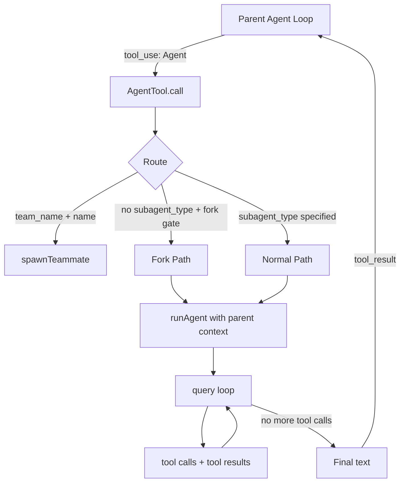
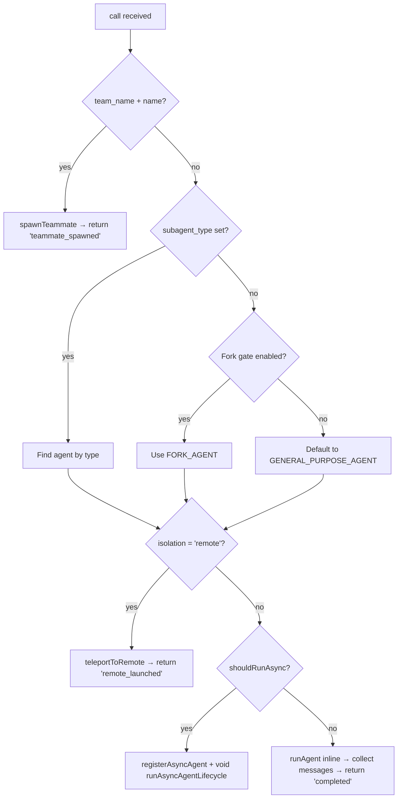

# Sub-Agent in Claude Code: Source Analysis

> **Prerequisite**: Read [doc 17 (Sub-Agent Design)](17-sub-agent-design.md) for the general concept. This doc is the source-level deep dive — how Claude Code actually implements sub-agents, with file paths and code references for every piece.

---

## Table of Contents

- [1. Architecture Overview](#1-architecture-overview)
- [2. The Agent Tool Definition](#2-the-agent-tool-definition)
- [3. Agent Types and Registry](#3-agent-types-and-registry)
- [4. The call() Method — Routing and Dispatching](#4-the-call-method--routing-and-dispatching)
- [5. The runAgent() Engine](#5-the-runagent-engine)
- [6. Tool Configuration — What Sub-Agents Can and Can't Do](#6-tool-configuration--what-sub-agents-can-and-cant-do)
- [7. System Prompt Construction](#7-system-prompt-construction)
- [8. Context Isolation — createSubagentContext()](#8-context-isolation--createsubagentcontext)
- [9. Sync vs Async Execution](#9-sync-vs-async-execution)
- [10. Fork Sub-Agent — Inheriting Parent Context](#10-fork-sub-agent--inheriting-parent-context)
- [11. Worktree Isolation](#11-worktree-isolation)
- [12. Recursion Guards and Depth Limits](#12-recursion-guards-and-depth-limits)
- [13. Result Flow — How Results Return to Parent](#13-result-flow--how-results-return-to-parent)
- [14. Lifecycle and Cleanup](#14-lifecycle-and-cleanup)
- [15. File Reference Table](#15-file-reference-table)

---

## 1. Architecture Overview

The sub-agent system is implemented as a single tool called `Agent`. When the LLM calls this tool, instead of running a simple function, Claude Code spins up a complete agent loop — the same `query()` function that powers the main REPL.



📁 **Entry point**: `src/tools/AgentTool/AgentTool.tsx`
📁 **Execution engine**: `src/tools/AgentTool/runAgent.ts`
📁 **Core query loop**: `src/query.ts` (same function used by main REPL)

---

## 2. The Agent Tool Definition

The Agent tool is defined using `buildTool()`, the same factory used for all Claude Code tools (Read, Bash, Grep, etc.). It's just another tool in the tool pool — the LLM sees it alongside all the others.

📁 `src/tools/AgentTool/AgentTool.tsx:196`

```typescript
export const AgentTool = buildTool({
  name: AGENT_TOOL_NAME,          // 'Agent'
  aliases: [LEGACY_AGENT_TOOL_NAME], // 'Task' (backward compat)
  searchHint: 'delegate work to a subagent',
  // ...
})
```

### Input Schema

📁 `src/tools/AgentTool/AgentTool.tsx:82-88`

The core input parameters:

| Parameter | Type | Required | Purpose |
|---|---|---|---|
| `description` | `string` | ✅ | Short 3–5 word description |
| `prompt` | `string` | ✅ | The task for the sub-agent |
| `subagent_type` | `string` | ❌ | Which agent type to use (e.g., `"Explore"`, `"Plan"`) |
| `model` | `enum` | ❌ | Override: `'sonnet'`, `'opus'`, or `'haiku'` |
| `run_in_background` | `boolean` | ❌ | Run asynchronously |

Additional parameters (feature-gated):

| Parameter | Type | Purpose |
|---|---|---|
| `name` | `string` | Makes agent addressable via `SendMessage` |
| `team_name` | `string` | For multi-agent swarm spawning |
| `mode` | `PermissionMode` | Permission mode for spawned teammate |
| `isolation` | `'worktree'` | Run in isolated git worktree |
| `cwd` | `string` | Override working directory |

### Output Schema

📁 `src/tools/AgentTool/AgentTool.tsx:141-155`

The tool returns a discriminated union:

```typescript
// Sync completion
{ status: 'completed', agentId, content, totalToolUseCount, totalDurationMs, ... }

// Async launch
{ status: 'async_launched', agentId, description, prompt, outputFile, ... }

// Teammate spawn (internal)
{ status: 'teammate_spawned', ... }
```

### Wire Names

📁 `src/tools/AgentTool/constants.ts:1-2`

```typescript
export const AGENT_TOOL_NAME = 'Agent'
export const LEGACY_AGENT_TOOL_NAME = 'Task'  // backward compat
```

The tool was originally named "Task" — the legacy name is kept as an alias for hooks, permission rules, and resumed sessions.

---

## 3. Agent Types and Registry

Claude Code has a registry of built-in agent types, plus support for user-defined custom agents.

### Built-in Agents

📁 `src/tools/AgentTool/builtInAgents.ts:22-72`

The `getBuiltInAgents()` function returns the active set:

```typescript
function getBuiltInAgents(): AgentDefinition[] {
  const agents = [
    GENERAL_PURPOSE_AGENT,   // always available
    STATUSLINE_SETUP_AGENT,  // always available
  ]
  if (areExplorePlanAgentsEnabled()) {
    agents.push(EXPLORE_AGENT, PLAN_AGENT)
  }
  if (isNonSdkEntrypoint) {
    agents.push(CLAUDE_CODE_GUIDE_AGENT)
  }
  if (/* verification feature gate */) {
    agents.push(VERIFICATION_AGENT)
  }
  return agents
}
```

### Agent Type Details

#### General Purpose Agent

📁 `src/tools/AgentTool/built-in/generalPurposeAgent.ts`

The default catch-all. Gets **all tools** (`tools: ['*']`). System prompt says: "Complete the task fully — don't gold-plate, but don't leave it half-done."

```typescript
export const GENERAL_PURPOSE_AGENT: BuiltInAgentDefinition = {
  agentType: 'general-purpose',
  tools: ['*'],                    // ← all tools
  source: 'built-in',
  // model intentionally omitted — uses getDefaultSubagentModel()
  getSystemPrompt: getGeneralPurposeSystemPrompt,
}
```

#### Explore Agent

📁 `src/tools/AgentTool/built-in/exploreAgent.ts`

Fast, read-only codebase searcher. **Cannot** write files, spawn agents, or edit notebooks. Uses Haiku model for speed (external users) or inherits parent model (internal).

```typescript
export const EXPLORE_AGENT: BuiltInAgentDefinition = {
  agentType: 'Explore',
  disallowedTools: [Agent, ExitPlanMode, FileEdit, FileWrite, NotebookEdit],
  model: 'haiku',       // external; 'inherit' for internal
  omitClaudeMd: true,   // ← saves tokens — doesn't need CLAUDE.md
  getSystemPrompt: () => getExploreSystemPrompt(),
}
```

Key design decision: the system prompt hammers home "READ-ONLY MODE" — it's mentioned **three times** in the prompt. The `omitClaudeMd: true` flag saves tokens since the Explore agent doesn't need commit/PR/lint rules from CLAUDE.md.

The Explore agent is classified as **one-shot** in `constants.ts:9-12`:

```typescript
export const ONE_SHOT_BUILTIN_AGENT_TYPES: ReadonlySet<string> = new Set([
  'Explore',
  'Plan',
])
```

This means the parent never `SendMessage`s back to continue them. Claude Code skips the `agentId`/`SendMessage`/usage trailer for these to save tokens.

#### Plan Agent

📁 `src/tools/AgentTool/built-in/planAgent.ts`

Read-only architect agent. Same tool restrictions as Explore. Uses `model: 'inherit'` (always uses parent's model). System prompt instructs it to explore code, design a solution, and return a step-by-step plan ending with "Critical Files for Implementation."

```typescript
export const PLAN_AGENT: BuiltInAgentDefinition = {
  agentType: 'Plan',
  disallowedTools: [Agent, ExitPlanMode, FileEdit, FileWrite, NotebookEdit],
  tools: EXPLORE_AGENT.tools,  // ← same tools as Explore
  model: 'inherit',
  omitClaudeMd: true,
  getSystemPrompt: () => getPlanV2SystemPrompt(),
}
```

#### Verification Agent

📁 `src/tools/AgentTool/built-in/verificationAgent.ts`

Adversarial QA agent. Its job is to **try to break** the implementation. Always runs in background (`background: true`). Has an extraordinary system prompt that explicitly lists the agent's own known failure patterns: "verification avoidance" and "being seduced by the first 80%."

```typescript
export const VERIFICATION_AGENT: BuiltInAgentDefinition = {
  agentType: 'verification',
  background: true,              // ← always async
  model: 'inherit',
  disallowedTools: [Agent, ExitPlanMode, FileEdit, FileWrite, NotebookEdit],
  // Has criticalSystemReminder_EXPERIMENTAL for re-injection at every turn
}
```

#### Claude Code Guide Agent

📁 `src/tools/AgentTool/built-in/claudeCodeGuideAgent.ts`

Documentation assistant. Uses Haiku model. Runs in `dontAsk` permission mode (no permission prompts). Fetches live docs from `code.claude.com` and `platform.claude.com`.

### Custom Agent Definition Schema

📁 `src/tools/AgentTool/loadAgentsDir.ts:73-99`

Users can define custom agents via JSON or Markdown files. The JSON schema:

```typescript
z.object({
  description: z.string(),
  tools: z.array(z.string()).optional(),
  disallowedTools: z.array(z.string()).optional(),
  prompt: z.string(),
  model: z.string().optional(),
  effort: z.union([z.enum(EFFORT_LEVELS), z.number()]).optional(),
  permissionMode: z.enum(PERMISSION_MODES).optional(),
  mcpServers: z.array(AgentMcpServerSpec).optional(),
  hooks: HooksSchema.optional(),
  maxTurns: z.number().int().positive().optional(),
  skills: z.array(z.string()).optional(),
  memory: z.enum(['user', 'project', 'local']).optional(),
  background: z.boolean().optional(),
  isolation: z.enum(['worktree']).optional(),
})
```

The `BaseAgentDefinition` type (line 106-133) contains all the fields that every agent — built-in or custom — can have.

---

## 4. The call() Method — Routing and Dispatching

The `call()` method in `AgentTool.tsx` is the entry point when the LLM invokes the Agent tool. It's a big function with several routing paths.

📁 `src/tools/AgentTool/AgentTool.tsx:239-250`

```typescript
async call({
  prompt, subagent_type, description, model, run_in_background,
  name, team_name, mode, isolation, cwd
}, toolUseContext, canUseTool, assistantMessage, onProgress?) {
```

### Routing Logic



**Step 1: Team/swarm path** (line 284-316)

If `team_name` and `name` are both set, it delegates to `spawnTeammate()` which either spawns a tmux pane or an in-process teammate. Returns immediately with `status: 'teammate_spawned'`.

**Step 2: Determine effective agent type** (line 322-356)

```typescript
const effectiveType = subagent_type
  ?? (isForkSubagentEnabled() ? undefined : GENERAL_PURPOSE_AGENT.agentType)
const isForkPath = effectiveType === undefined
```

Three cases:
- `subagent_type` explicitly set → use it
- `subagent_type` omitted + fork gate on → fork path (`undefined`)
- `subagent_type` omitted + fork gate off → default to `general-purpose`

**Step 3: Determine async/sync** (line 567)

```typescript
const shouldRunAsync = (
  run_in_background === true ||
  selectedAgent.background === true ||
  isCoordinator ||
  forceAsync ||
  assistantForceAsync
) && !isBackgroundTasksDisabled
```

**Step 4: Build system prompt and prompt messages** (line 483-541)

Fork path: inherits parent's system prompt (byte-exact for cache sharing). Normal path: builds the selected agent's own system prompt.

```typescript
if (isForkPath) {
  // Inherit parent's rendered system prompt for cache-identical prefix
  forkParentSystemPrompt = toolUseContext.renderedSystemPrompt
  promptMessages = buildForkedMessages(prompt, assistantMessage)
} else {
  enhancedSystemPrompt = await enhanceSystemPromptWithEnvDetails([agentPrompt], ...)
  promptMessages = [createUserMessage({ content: prompt })]
}
```

**Step 5: Execute** (line 686 for async, line 765 for sync)

---

## 5. The runAgent() Engine

This is the actual execution engine — where the sub-agent loop runs.

📁 `src/tools/AgentTool/runAgent.ts:248-860`

```typescript
export async function* runAgent({
  agentDefinition, promptMessages, toolUseContext, canUseTool,
  isAsync, forkContextMessages, querySource, override, model,
  maxTurns, availableTools, useExactTools, worktreePath, ...
}): AsyncGenerator<Message, void>
```

It's an **async generator** — it yields messages as they arrive from the query loop.

### Step-by-step execution:

**1. Resolve model**

📁 `runAgent.ts:340-345`

```typescript
const resolvedAgentModel = getAgentModel(
  agentDefinition.model,
  toolUseContext.options.mainLoopModel,
  model,
  permissionMode,
)
```

**2. Build initial messages**

📁 `runAgent.ts:370-373`

```typescript
const contextMessages = forkContextMessages
  ? filterIncompleteToolCalls(forkContextMessages) // fork: inherit parent messages
  : []                                               // normal: fresh start
const initialMessages = [...contextMessages, ...promptMessages]
```

**3. Handle CLAUDE.md and gitStatus omission**

📁 `runAgent.ts:388-409`

For Explore and Plan agents, both `claudeMd` and `gitStatus` are stripped from context to save tokens. These are read-only agents — if they need git info, they run `git status` themselves.

```typescript
const shouldOmitClaudeMd = agentDefinition.omitClaudeMd && !override?.userContext
const resolvedUserContext = shouldOmitClaudeMd ? userContextNoClaudeMd : baseUserContext
```

**4. Configure permissions**

📁 `runAgent.ts:415-498`

The agent can override the permission mode. However, parent modes `bypassPermissions` and `acceptEdits` always take precedence. Async agents automatically get `shouldAvoidPermissionPrompts: true` since they can't show UI.

**5. Resolve tools**

📁 `runAgent.ts:500-502`

```typescript
const resolvedTools = useExactTools
  ? availableTools                                           // fork: use parent's exact tools
  : resolveAgentTools(agentDefinition, availableTools, isAsync).resolvedTools  // normal: filter
```

**6. Build system prompt**

📁 `runAgent.ts:508-518`

```typescript
const agentSystemPrompt = override?.systemPrompt
  ? override.systemPrompt                                    // fork: parent's prompt
  : asSystemPrompt(await getAgentSystemPrompt(...))          // normal: agent's own prompt
```

**7. Execute SubagentStart hooks**

📁 `runAgent.ts:532-555`

Runs user-configured hooks that can inject additional context into the sub-agent.

**8. Register frontmatter hooks and preload skills**

📁 `runAgent.ts:557-646`

Agents can define their own hooks (scoped to their lifecycle) and reference skills that get preloaded as initial messages.

**9. Initialize agent-specific MCP servers**

📁 `runAgent.ts:649-664`

Agents can define their own MCP servers (additive to parent's). These are connected when the agent starts and cleaned up when it finishes.

**10. Disable thinking for non-fork agents**

📁 `runAgent.ts:682-684`

```typescript
thinkingConfig: useExactTools
  ? toolUseContext.options.thinkingConfig  // fork: inherit (cache sharing)
  : { type: 'disabled' as const },        // normal: disabled (cost control)
```

This is a significant design decision: regular sub-agents have thinking **disabled** to control output token costs. Fork agents inherit the parent's thinking config for prompt cache sharing.

**11. Create isolated context**

📁 `runAgent.ts:700-714`

```typescript
const agentToolUseContext = createSubagentContext(toolUseContext, {
  options: agentOptions,
  agentId,
  messages: initialMessages,
  readFileState: agentReadFileState,
  abortController: agentAbortController,
  getAppState: agentGetAppState,
  shareSetAppState: !isAsync,   // sync agents share, async don't
  shareSetResponseLength: true, // both contribute to response metrics
})
```

**12. Run the query loop**

📁 `runAgent.ts:748-806`

```typescript
for await (const message of query({
  messages: initialMessages,
  systemPrompt: agentSystemPrompt,
  userContext: resolvedUserContext,
  systemContext: resolvedSystemContext,
  canUseTool,
  toolUseContext: agentToolUseContext,
  querySource,
  maxTurns: maxTurns ?? agentDefinition.maxTurns,
})) {
  // Record transcript, yield message
  await recordSidechainTranscript([message], agentId, lastRecordedUuid)
  yield message
}
```

This is the key line: `query()` is the same function that runs the main REPL loop. The sub-agent is literally the same code path, just with different parameters.

---

## 6. Tool Configuration — What Sub-Agents Can and Can't Do

📁 `src/constants/tools.ts`

Three tool sets control what sub-agents can access:

### ALL_AGENT_DISALLOWED_TOOLS

📁 `src/constants/tools.ts:36-46`

Tools **no agent** can use:

```typescript
export const ALL_AGENT_DISALLOWED_TOOLS = new Set([
  TaskOutputTool,
  ExitPlanMode,
  EnterPlanMode,
  // Agent tool blocked for external users only!
  ...(process.env.USER_TYPE === 'ant' ? [] : [AGENT_TOOL_NAME]),
  AskUserQuestion,
  TaskStop,
  WorkflowTool,  // prevents recursive workflow execution
])
```

🔑 **Key insight**: The `Agent` tool itself is blocked for external users but **allowed for internal users** — this means nested sub-agents (agents spawning agents) are only available internally.

### ASYNC_AGENT_ALLOWED_TOOLS

📁 `src/constants/tools.ts:55-71`

**Explicit allowlist** for async agents (more restrictive):

```typescript
export const ASYNC_AGENT_ALLOWED_TOOLS = new Set([
  Read, WebSearch, TodoWrite, Grep, WebFetch, Glob,
  ...ShellTools,
  FileEdit, FileWrite, NotebookEdit,
  Skill, SyntheticOutput, ToolSearch,
  EnterWorktree, ExitWorktree,
])
```

### Tool Resolution Pipeline

📁 `src/tools/AgentTool/agentToolUtils.ts:70-116`

The `filterToolsForAgent()` function applies these filters in order:

```
All available tools
  → Remove ALL_AGENT_DISALLOWED_TOOLS
  → If custom agent: also remove CUSTOM_AGENT_DISALLOWED_TOOLS
  → If async: keep only ASYNC_AGENT_ALLOWED_TOOLS
  → Apply agent's own disallowedTools list
  → Result: tools the sub-agent can actually use
```

📁 `src/tools/AgentTool/agentToolUtils.ts:122-200`

The `resolveAgentTools()` function handles wildcard expansion (`['*']`), tool validation, and the `Agent(type1, type2)` syntax that restricts which agent types can be spawned.

---

## 7. System Prompt Construction

📁 `src/tools/AgentTool/runAgent.ts:906-932`

The `getAgentSystemPrompt()` function builds the sub-agent's system prompt:

```typescript
async function getAgentSystemPrompt(
  agentDefinition, toolUseContext, resolvedAgentModel,
  additionalWorkingDirectories, resolvedTools,
): Promise<string[]> {
  const agentPrompt = agentDefinition.getSystemPrompt({ toolUseContext })
  const prompts = [agentPrompt]
  return await enhanceSystemPromptWithEnvDetails(
    prompts, resolvedAgentModel, additionalWorkingDirectories, enabledToolNames,
  )
}
```

Two-step process:
1. **Get the agent's base prompt** — each agent type has a `getSystemPrompt()` function returning the core instructions
2. **Enhance with environment details** — `enhanceSystemPromptWithEnvDetails()` appends platform info (OS, shell, CWD, model name, etc.)

### The Prompt Shown to the Parent LLM

📁 `src/tools/AgentTool/prompt.ts`

The `getPrompt()` function builds the description that the **parent** LLM sees for the Agent tool. It lists all available agent types with their `whenToUse` descriptions, tools, and usage guidelines.

When the fork feature is enabled, it adds a "When to fork" section explaining the fork semantics.

---

## 8. Context Isolation — createSubagentContext()

📁 `src/utils/forkedAgent.ts:345-462`

This is one of the most critical functions. It creates an isolated `ToolUseContext` for the sub-agent, preventing it from interfering with the parent.

### What's Isolated (by default)

| State | Isolation method |
|---|---|
| `readFileState` | Cloned from parent |
| `abortController` | New child controller (linked to parent — parent abort propagates) |
| `setAppState` | No-op (unless `shareSetAppState: true`) |
| `setResponseLength` | No-op (unless `shareSetResponseLength: true`) |
| `nestedMemoryAttachmentTriggers` | Fresh empty set |
| `toolDecisions` | Cloned (for cache-sharing correctness) |
| UI callbacks (`setToolJSX`, etc.) | `undefined` (sub-agents can't control parent UI) |

### What's Shared

| State | Why shared |
|---|---|
| `setAppStateForTasks` | Task registration/kill must reach root store |
| `updateAttributionState` | Attribution is scoped and functional — safe to share |

### Depth Tracking

📁 `src/utils/forkedAgent.ts:452-455`

```typescript
queryTracking: {
  chainId: randomUUID(),
  depth: (parentContext.queryTracking?.depth ?? -1) + 1,
}
```

Each sub-agent gets a new chain ID and increments the depth counter. Used for telemetry, **not** enforced as a hard limit.

---

## 9. Sync vs Async Execution

### Sync (Foreground) Agents

📁 `src/tools/AgentTool/AgentTool.tsx:765-900` (the `else` branch)

- Block the parent's tool-use turn until complete
- Share `abortController` with parent (ESC cancels both)
- Can show permission prompts in the terminal
- Register as foreground task (can be backgrounded mid-run)
- Result returned directly as `tool_result`

```typescript
const agentIterator = runAgent({ ...runAgentParams, ... })
while (true) {
  const raceResult = await Promise.race([
    agentIterator.next(),        // next message from agent
    backgroundPromise,           // signal to background this agent
  ])
  if (raceResult.type === 'background') { /* transition to async */ }
  // ... collect messages
}
```

The race between `next()` and `backgroundPromise` enables **mid-run backgrounding**: the user can press a key to push a long-running sync agent to the background.

### Async (Background) Agents

📁 `src/tools/AgentTool/AgentTool.tsx:686-764`

- Return immediately with `status: 'async_launched'`
- Get their **own** `AbortController` (NOT linked to parent — survive ESC)
- `shouldAvoidPermissionPrompts: true` by default
- Run as a detached `void` promise
- Completion delivered as `<task-notification>` user message on the parent's next turn

```typescript
void runWithAgentContext(asyncAgentContext, () =>
  wrapWithCwd(() => runAsyncAgentLifecycle({
    taskId: agentBackgroundTask.agentId,
    abortController: agentBackgroundTask.abortController!,
    makeStream: onCacheSafeParams => runAgent({ ... }),
    // ...
  }))
)
```

The `void` keyword is key — it fires and forgets. The parent continues immediately.

### Auto-backgrounding

📁 `src/tools/AgentTool/AgentTool.tsx:72-77`

```typescript
function getAutoBackgroundMs(): number {
  if (isEnvTruthy(process.env.CLAUDE_AUTO_BACKGROUND_TASKS) || ...) {
    return 120_000  // 2 minutes
  }
  return 0
}
```

After 120 seconds, a sync agent can automatically transition to background.

---

## 10. Fork Sub-Agent — Inheriting Parent Context

📁 `src/tools/AgentTool/forkSubagent.ts`

The fork path is a special mode where the sub-agent **inherits the parent's entire conversation context** instead of starting fresh.

### Why Fork?

The fork agent shares the parent's prompt cache. When the parent has a 100K-token conversation, forking lets the child start with all that context **without paying for it again** — the API's prefix caching means the shared prefix is a cache hit.

### The FORK_AGENT Definition

📁 `src/tools/AgentTool/forkSubagent.ts:60-71`

```typescript
export const FORK_AGENT = {
  agentType: 'fork',
  tools: ['*'],
  maxTurns: 200,
  model: 'inherit',
  permissionMode: 'bubble',    // ← surfaces permission prompts to parent terminal
  getSystemPrompt: () => '',   // ← unused! Parent's prompt is inherited
}
```

### How Fork Messages Are Built

📁 `src/tools/AgentTool/forkSubagent.ts:107-168`

`buildForkedMessages()` creates the child's initial messages:

1. Clone the parent's last assistant message (all tool_use blocks)
2. Build tool_results for every tool_use using identical placeholder text
3. Append a per-child directive text block

```
[...parent_history, assistant(all_tool_uses), user(placeholder_results + directive)]
```

All fork children share byte-identical placeholders — only the final directive differs. This maximizes prompt cache hits.

### The Child Message

📁 `src/tools/AgentTool/forkSubagent.ts:171-198`

The child gets a stern message wrapped in `<fork-boilerplate>` tags:

```
STOP. READ THIS FIRST.

You are a forked worker process. You are NOT the main agent.

RULES (non-negotiable):
1. Your system prompt says "default to forking." IGNORE IT — that's for the parent.
   You ARE the fork. Do NOT spawn sub-agents; execute directly.
2. Do NOT converse, ask questions, or suggest next steps
3. Keep your report under 500 words
4. Your response MUST begin with "Scope:"
...
```

### Recursion Guard for Fork

📁 `src/tools/AgentTool/forkSubagent.ts:78-89`

```typescript
export function isInForkChild(messages: MessageType[]): boolean {
  return messages.some(m => {
    if (m.type !== 'user') return false
    return content.some(block =>
      block.type === 'text' && block.text.includes('<fork-boilerplate>')
    )
  })
}
```

Fork children keep the Agent tool in their pool (for cache-identical tool defs), but this guard prevents them from actually forking again. There's a dual guard: `querySource` check (compaction-resistant) + message scan (fallback).

---

## 11. Worktree Isolation

📁 `src/utils/worktree.ts`

When `isolation: 'worktree'` is set, the sub-agent runs in a separate git worktree — same repo, different working copy. Changes are isolated from the parent.

### Creation

📁 `src/tools/AgentTool/AgentTool.tsx:590-593`

```typescript
if (effectiveIsolation === 'worktree') {
  const slug = `agent-${earlyAgentId.slice(0, 8)}`
  worktreeInfo = await createAgentWorktree(slug)
}
```

The worktree is created at `.claude/worktrees/<slug>`.

### CWD Override

📁 `src/tools/AgentTool/AgentTool.tsx:640-641`

```typescript
const cwdOverridePath = cwd ?? worktreeInfo?.worktreePath
const wrapWithCwd = (fn) => cwdOverridePath ? runWithCwdOverride(cwdOverridePath, fn) : fn()
```

All sub-agent execution is wrapped in a CWD override — so `getCwd()` returns the worktree path.

### Cleanup

📁 `src/tools/AgentTool/AgentTool.tsx:644-685`

After the agent completes:
- If the worktree has **no new commits** → auto-removed (clean worktree)
- If the worktree has **changes** → kept, and path+branch returned in the result

```typescript
const changed = await hasWorktreeChanges(worktreePath, headCommit)
if (!changed) {
  await removeAgentWorktree(worktreePath, worktreeBranch, gitRoot)
  return {}  // worktree deleted
}
return { worktreePath, worktreeBranch }  // kept — user can merge
```

### Worktree Notice for Fork Children

📁 `src/tools/AgentTool/forkSubagent.ts:205-210`

When a fork child runs in a worktree, it gets a notice:

```
You've inherited the conversation context above from a parent agent working in /original/path.
You are operating in an isolated git worktree at /worktree/path — same repository, same relative
file structure, separate working copy. Paths in the inherited context refer to the parent's
working directory; translate them to your worktree root. Re-read files before editing if the
parent may have modified them since they appear in the context.
```

---

## 12. Recursion Guards and Depth Limits

### Tool-Based Block (External)

📁 `src/constants/tools.ts:40-41`

For external users, the `Agent` tool is in `ALL_AGENT_DISALLOWED_TOOLS` — sub-agents simply **cannot** call the Agent tool. No nesting possible.

```typescript
...(process.env.USER_TYPE === 'ant' ? [] : [AGENT_TOOL_NAME]),
```

### Fork Recursion Guard

📁 `src/tools/AgentTool/AgentTool.tsx:332-334`

Dual check prevents recursive forking:

```typescript
if (
  toolUseContext.options.querySource === `agent:builtin:${FORK_AGENT.agentType}` ||
  isInForkChild(toolUseContext.messages)
) {
  throw new Error('Fork is not available inside a forked worker.')
}
```

The `querySource` check is compaction-resistant (set on `context.options`, survives autocompact). The `isInForkChild` message scan is a fallback.

### maxTurns

Each agent can set a `maxTurns` limit. When exceeded, the query loop emits a `max_turns_reached` attachment and stops. The fork agent defaults to `maxTurns: 200`.

### Depth Tracking (Telemetry Only)

📁 `src/utils/forkedAgent.ts:452-455`

The depth counter is tracked for analytics (`queryDepth` in events) but **not enforced** as a hard limit.

---

## 13. Result Flow — How Results Return to Parent

### Sync Agents

The parent collects all yielded messages and `finalizeAgentTool()` extracts the last assistant message text:

📁 `src/tools/AgentTool/agentToolUtils.ts` — `finalizeAgentTool()`

Returns:

```typescript
{
  status: 'completed',
  agentId,
  agentType,
  content: lastAssistantText,
  totalToolUseCount,
  totalDurationMs,
  totalTokens,
  usage,
  prompt,
}
```

The parent LLM sees this as a normal `tool_result` — just text.

### Async Agents

Immediate return:

```typescript
{ status: 'async_launched', agentId, description, prompt, outputFile }
```

When the agent completes, `enqueueAgentNotification()` creates a `<task-notification>` XML message injected as a user-role message on the parent's next turn:

```xml
<task-notification>
  Agent "analyze X" completed.
  Result: [final text]
  Tokens: 15,234 | Tools used: 12 | Duration: 45s
</task-notification>
```

---

## 14. Lifecycle and Cleanup

📁 `src/tools/AgentTool/runAgent.ts:816-858`

The `finally` block in `runAgent()` handles cleanup when the agent finishes (normally, by abort, or by error):

```typescript
finally {
  await mcpCleanup()                           // disconnect agent-specific MCP servers
  clearSessionHooks(rootSetAppState, agentId)   // remove agent's session hooks
  cleanupAgentTracking(agentId)                 // release prompt cache tracking
  agentToolUseContext.readFileState.clear()      // release cloned file state cache
  initialMessages.length = 0                     // release cloned context messages
  unregisterPerfettoAgent(agentId)              // release perfetto trace entry
  clearAgentTranscriptSubdir(agentId)           // release transcript dir mapping
  // Remove orphaned todos entry
  rootSetAppState(prev => {
    const { [agentId]: _removed, ...todos } = prev.todos
    return { ...prev, todos }
  })
  // Kill background bash tasks this agent spawned
  killShellTasksForAgent(agentId, ...)
}
```

Every resource the sub-agent acquired is explicitly released. This is critical for long-running sessions that spawn hundreds of agents — without cleanup, each orphaned resource is a memory leak.

---

## 15. File Reference Table

| File | Role |
|------|------|
| `src/tools/AgentTool/AgentTool.tsx` | Tool definition, `call()` routing, sync/async dispatch |
| `src/tools/AgentTool/runAgent.ts` | Execution engine — builds context, runs `query()` loop |
| `src/tools/AgentTool/constants.ts` | Wire names (`Agent`, `Task`), one-shot agent set |
| `src/tools/AgentTool/agentToolUtils.ts` | `resolveAgentTools()`, `filterToolsForAgent()`, `finalizeAgentTool()`, `runAsyncAgentLifecycle()` |
| `src/tools/AgentTool/forkSubagent.ts` | Fork gate, `FORK_AGENT` definition, `buildForkedMessages()`, recursion guard |
| `src/tools/AgentTool/prompt.ts` | `getPrompt()` — the tool description shown to parent LLM |
| `src/tools/AgentTool/builtInAgents.ts` | Registry of built-in agents |
| `src/tools/AgentTool/loadAgentsDir.ts` | `AgentDefinition` types, custom agent parsing |
| `src/tools/AgentTool/built-in/generalPurposeAgent.ts` | General-purpose agent — tools: `['*']` |
| `src/tools/AgentTool/built-in/exploreAgent.ts` | Read-only explorer — model: `haiku` |
| `src/tools/AgentTool/built-in/planAgent.ts` | Read-only planner — model: `inherit` |
| `src/tools/AgentTool/built-in/verificationAgent.ts` | Adversarial QA — background: `true` |
| `src/tools/AgentTool/built-in/claudeCodeGuideAgent.ts` | Documentation assistant — model: `haiku` |
| `src/utils/forkedAgent.ts` | `createSubagentContext()`, `runForkedAgent()`, `CacheSafeParams` |
| `src/utils/worktree.ts` | `createAgentWorktree()`, `removeAgentWorktree()`, `hasWorktreeChanges()` |
| `src/constants/tools.ts` | `ALL_AGENT_DISALLOWED_TOOLS`, `ASYNC_AGENT_ALLOWED_TOOLS` |
| `src/query.ts` | The core agent loop — same function for main REPL and sub-agents |

---

## Key Design Lessons

1. **Same loop, different params** — Sub-agents use the exact same `query()` function as the main REPL. There's no special "sub-agent runtime." Agency is a property of the loop.

2. **Isolation by default, sharing by opt-in** — `createSubagentContext()` isolates everything by default. Callers explicitly opt in to share specific state (`shareSetAppState`, `shareAbortController`). This prevents subtle bugs from shared mutable state.

3. **Cache sharing drives architecture** — The fork path exists primarily for prompt cache sharing. The elaborate byte-identical placeholder scheme, inherited system prompt, and `useExactTools` flag all serve one goal: making the API request prefix identical so the cache hits.

4. **Token cost awareness** — Thinking is disabled for regular sub-agents. CLAUDE.md is omitted for read-only agents. `gitStatus` is stripped for Explore/Plan. The one-shot agent trailer is skipped. Every token counts at fleet scale (34M+ Explore spawns/week).

5. **Read-only agents are hammered with restrictions** — The Explore agent's prompt says "READ-ONLY" three times, lists prohibited tools explicitly, and has them in `disallowedTools`. Belt and suspenders.

6. **Cleanup is exhaustive** — The `finally` block in `runAgent()` releases every resource: MCP connections, hooks, file state caches, message arrays, perfetto entries, todo entries, background bash tasks. Long sessions spawn hundreds of agents; each leak adds up.
