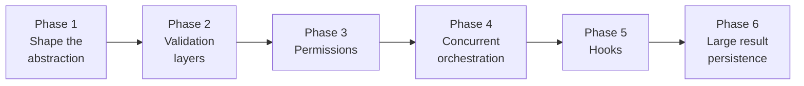

# Tool Execution — Python Rewrite Plan

> Companion to [`16-tool-execution-deep-dive.md`](./16-tool-execution-deep-dive.md).
> That doc explains **what Claude Code does**. This doc explains **how we port it to Python, incrementally, without getting lost**.

## Why this doc exists

Doc 16 is 2,100+ lines covering a 12-step pipeline plus orchestration, hooks, permissions, persistence, and telemetry. Reading it top-to-bottom and then trying to rewrite everything at once is a recipe for giving up.

The key insight that makes the rewrite tractable:

> **Every step in the pipeline is independently useful. We can add them one at a time, and after every phase the agent still runs end-to-end.**

This doc breaks the rewrite into **6 small phases**. Each phase is small enough to finish in one session, each leaves the agent runnable, and each corresponds to a specific section of doc 16 so you only re-read one chunk at a time.

## Current state (before we start)

Our tool abstraction is a plain dict:

```python
tool = {"name": ..., "schema": ..., "call": call}
```

`execute(name, args)` looks it up and calls it. Here's what's missing compared to Claude Code's 12-step pipeline:

| # | Claude Code step                          | We have it?               |
|---|-------------------------------------------|---------------------------|
| 1 | Lookup + alias fallback                   | ⚠️ partial (no aliases)   |
| 2 | Abort check                               | ❌                        |
| 3 | Schema validation (Zod)                   | ❌ (OpenAI validates loosely) |
| 4 | Semantic `validateInput()`                | ❌                        |
| 5 | Classifier                                | ❌                        |
| 6 | Security strip                            | ❌                        |
| 7 | `backfillObservableInput`                 | ❌                        |
| 8 | PreToolUse hooks                          | ❌                        |
| 9 | Permission resolution                     | ❌                        |
| 10| `tool.call()`                             | ✅                        |
| 11| Large-result persistence                  | ❌                        |
| 12| PostToolUse hooks                         | ❌                        |

Plus: no `ToolUseContext`, no serial/concurrent orchestration, no streaming, no structured errors.

## The phased roadmap



Each phase builds strictly on the previous one. The foundation (Phase 1) is the most important — it creates the seams where every later phase plugs in.

---

## Phase 1 — Shape the abstraction (no behavior change)

**Goal:** Turn the dict into a real class so there's somewhere to hang future features.

**Maps to doc 16 sections:** 2 (Tool type), 3 (full pipeline overview).

### Changes

- Replace `tool = {...}` dict with a `Tool` base class. Abstract `call()`, class attributes `name`, `description`, `input_schema`.
- Introduce `ToolUseContext` — a dataclass holding `messages`, `abort_signal`, `cwd`, `options`. Pass it to every `call()`.
- Introduce `ToolResult` — a dataclass with:
  - `for_assistant: str` — text sent back to the model
  - `for_user: str` — text shown in the terminal

  Today both are the same string, but the split is where Phase 6 (large-result persistence) and future rich rendering will land.
- Port the three existing tools (`bash`, `read_file`, `write_file`) onto the new base class.
- Create `src/tool_runner.py` with a skeleton `run_tool_use(tool_call, ctx)` that just does lookup → call. Future phases fill in the layers.
- `agent.py` calls `run_tool_use` instead of `execute`.

### Why this is worth its own phase

It's boring, but **every later phase becomes "add a method to `Tool`, wire it into `run_tool_use`"**. Without the seams, every later phase has to refactor the tool interface first, and refactors compound.

### Acceptance test

Agent runs the same conversations it ran before — read a file, write a file, run a bash command. Zero behavior change.

---

## Phase 2 — The validation layers (steps 1–4)

**Goal:** Every tool call is validated before it runs, and failures produce clean structured errors that flow back to the model.

**Maps to doc 16 sections:** 4 (lookup), 5 (abort), 6 (Zod validation), 7 (validateInput).

### Changes

Add four layers to `Tool`, each defaulting to pass. Wire them into `run_tool_use` in order.

#### 4.1 — Lookup with alias fallback

```python
def lookup_tool(name: str) -> Tool | None:
    ...
```

Mirror the `aliases` map from source (e.g. `str_replace_editor` → `Edit`). When not found, return an error tool-result that tells the model what tools *are* available — the same "did-you-mean" hint Claude Code uses.

#### 4.2 — Abort check

```python
def check_aborted(ctx: ToolUseContext) -> None:
    if ctx.abort_signal.is_set():
        raise AbortError(...)
```

Use `threading.Event` as `abort_signal`. Called before expensive work.

#### 4.3 — Schema validation (Pydantic instead of Zod)

Each tool declares:

```python
class InputModel(BaseModel):
    path: str
    content: str
```

`validate_schema(args)` calls `InputModel.model_validate(args)` and converts errors into the same shape doc 16 describes (`field: message` lines).

#### 4.4 — Semantic `validate_input`

```python
def validate_input(self, args, ctx) -> ValidationResult:
    ...  # default: ok
```

Overrides:
- `write_file`: parent directory must exist
- `read_file`: path must exist and be readable
- `bash`: command is non-empty

Each validation layer returns a structured error that `run_tool_use` converts into a tool result the model can act on.

### Acceptance test

Feed the agent:
1. A bad path (`"/does/not/exist"`) → clean "file not found" error, model retries with a valid path.
2. A malformed JSON arg → clean Pydantic error, model retries.
3. An unknown tool name → "unknown tool" error with the list of available tools.

---

## Phase 3 — Permissions (step 9)

**Goal:** The agent feels like Claude Code — it asks before writing, auto-allows reads, remembers "always allow" for the session.

**Maps to doc 16 sections:** 12 (permission resolution), 19 (permission system in detail).

### Changes

- Add a `PermissionMode` enum: `default`, `accept_edits`, `plan`, `bypass`.
- Add `Tool.needs_permission(args, ctx) -> bool`. Defaults: read tools → `False`, write tools → `True`.
- Add a simple rule store — a list of `(tool_name, arg_pattern, allow|deny)` tuples. In-memory only; file persistence later.
- Add `resolve_permission(tool, args, ctx) -> Decision` with this fallback chain:
  1. Check rules
  2. Check mode (`accept_edits` auto-allows writes, `bypass` allows everything, `plan` denies everything)
  3. Prompt the user via `input()`
- Wire it into `run_tool_use` between validation and `call()`.

### What we're skipping (and why)

| Skipped                              | Reason                                           |
|--------------------------------------|--------------------------------------------------|
| The 7-level rule hierarchy           | One flat list is enough for a learning project   |
| Hooks-based decisions                | Deferred to Phase 5                              |
| Auto-mode classifier                 | Only exists because of auto mode — we don't have it |
| Denial tracking / consecutive limits | Not needed without an adversarial setting        |

### Acceptance test

- Agent asks before writing a file.
- Agent auto-allows `read_file`.
- Responding "always" remembers the decision for the rest of the session.

---

## Phase 4 — Serial vs concurrent orchestration

**Goal:** Multiple read-only tool calls in one turn run in parallel instead of serially.

**Maps to doc 16 section:** 16 (tool orchestration).

### Changes

Right now `agent_loop` executes tool calls in a `for` loop. Claude Code partitions them:

- Add `Tool.is_concurrency_safe(args) -> bool`. Read-only tools return `True`; write/bash return `False`.
- Rewrite the loop: group **consecutive** concurrency-safe calls, run them with `ThreadPoolExecutor`, run the rest serially.
- Keep `Tool.call` synchronous. Thread pool is simpler than async and good enough for I/O-bound tools.

```python
# pseudocode
for group in partition(tool_calls, key=is_concurrency_safe):
    if group.concurrent:
        run_parallel(group.calls)
    else:
        for call in group.calls:
            run_serial(call)
```

### Acceptance test

Agent issues 3 `read_file` calls in one turn. They run in parallel (verify via timestamps or a deliberate `time.sleep` in a test tool). A `write_file` in the same turn still runs serially.

---

## Phase 5 — Hooks (steps 8 and 12)

**Goal:** External shell commands can inspect, block, or react to tool calls.

**Maps to doc 16 sections:** 11 (PreToolUse), 15 (PostToolUse), 20 (hooks in detail).

### Changes

- Define a `Hook` dataclass: `matcher` (tool name glob) + `command` (shell string).
- Add `pre_tool_use_hooks` and `post_tool_use_hooks` lists on `ToolUseContext`.
- In `run_tool_use`:
  - Before `call()` — run each matching pre-hook. Hook gets JSON on stdin (`{tool, args}`), returns JSON on stdout (`{decision: allow|deny|ask, reason}`). Deny short-circuits the call.
  - After `call()` — run each matching post-hook. Post-hooks are informational; they can't undo the call.
- Load hooks from `~/.vibe-flow/hooks.json`.

### Skipping

Async/background hooks, trust guard, timeout cascades, the failure-hook subtype. Just blocking synchronous shell hooks for now.

### Acceptance test

Write a hook that blocks `write_file` when `args.path` matches `*.env`. Agent is told "denied by hook: blocks env files" and recovers.

---

## Phase 6 — Large result persistence (step 11)

**Goal:** Large tool outputs don't blow up the context window — they get written to disk and replaced with a summary.

**Maps to doc 16 section:** 14 (large result persistence), 21 (tool result storage and budget).

### Changes

- Constants:
  - `MAX_INLINE_CHARS = 16_000` — per-result inline limit
  - `MAX_TOTAL_CHARS = 200_000` — aggregate per-turn budget
- After `call()`, if `result.for_assistant` exceeds `MAX_INLINE_CHARS`:
  - Write full content to `~/.vibe-flow/tool-results/<tool_use_id>.txt`
  - Replace `for_assistant` with: `<tool result truncated; full output at ~/.vibe-flow/tool-results/<id>.txt>`
- Track aggregate budget on `ToolUseContext`. Once exceeded, all further results for this turn get truncated even if individually small.

### Acceptance test

`read_file` on a 50 KB file. Model sees a short summary. Full content is on disk at the expected path.

---

## What we're leaving out entirely

These sections of doc 16 are **not worth porting** for a learning project:

| Skipped                            | Why                                             | Doc 16 §   |
|------------------------------------|-------------------------------------------------|------------|
| Streaming tool execution           | Our OpenAI loop isn't streaming anyway          | 17         |
| `backfillObservableInput`          | Only matters for specific edit tools            | 10         |
| Security strip of internal fields  | Artifact of their `_simulatedSedEdit` internals | 9          |
| Telemetry / OTel spans             | Pure observability overhead                     | 24         |
| Speculative classifier             | Only exists for auto permission mode            | 8          |
| 7-level permission rule hierarchy  | One flat list is enough                         | 19         |

Every one of these is easy to add later once the core pipeline exists. The goal is understanding the shape of the system, not 1:1 feature parity.

---

## Phase summary table

| Phase | Name                  | Adds                                   | Doc 16 §    | Effort |
|-------|-----------------------|----------------------------------------|-------------|--------|
| 1     | Shape abstraction     | `Tool` class, `ToolUseContext`, `ToolResult`, `run_tool_use` skeleton | 2, 3     | Small  |
| 2     | Validation layers     | Lookup, abort, Pydantic schema, semantic validation                   | 4, 5, 6, 7 | Medium |
| 3     | Permissions           | Modes, rules, user prompt                                             | 12, 19   | Medium |
| 4     | Concurrent execution  | Partitioning, thread pool                                             | 16       | Small  |
| 5     | Hooks                 | Pre/post shell hooks                                                  | 11, 15, 20 | Medium |
| 6     | Large-result storage  | On-disk persistence + aggregate budget                                | 14, 21   | Small  |

---

## Why this order

The order is chosen so that **each phase is valuable on its own** and **each phase depends only on the previous ones**:

- **Phase 1 before everything** — nothing else can land without the `Tool` class and `ToolUseContext`.
- **Phase 2 before Phase 3** — permissions resolve *after* validation, so validation has to exist first.
- **Phase 3 before Phase 4** — concurrent execution needs a permission resolver that's safe to call from multiple threads.
- **Phase 4 before Phase 5** — hooks run per-call; they need the orchestrator to be stable first.
- **Phase 6 last** — it's pure plumbing and doesn't change any of the control flow.

At every boundary, the agent **still works**. We never have a broken intermediate state.

---

## Next action

**Start with Phase 1.** Concretely:

1. Create `src/tool_base.py` — `Tool`, `ToolUseContext`, `ToolResult`.
2. Create `src/tool_runner.py` — `run_tool_use(tool_call, ctx)` (lookup + call only).
3. Port `bash`, `read_file`, `write_file` onto `Tool`.
4. Update `agent.py` to construct a `ToolUseContext` and call `run_tool_use`.
5. Smoke test: the agent runs the same conversations it did before.

Once Phase 1 lands, we re-read only doc 16 §§ 4–7 and start Phase 2. The 2,100-line deep dive becomes six 200-line chunks.
