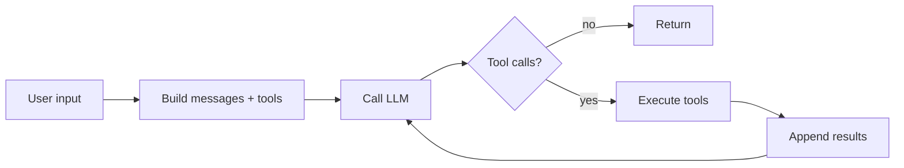
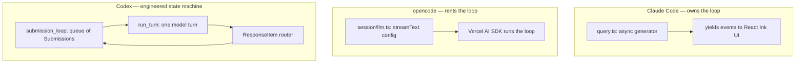

# Claude Code vs. opencode vs. Codex — A High-Level Comparison

Three production AI coding agents, three very different engineering
philosophies. This doc is a bird's-eye comparison of how each one is
put together — not a feature matrix for end users, but an architectural
side-by-side for someone trying to understand *how AI code agents are
built*.

All three solve the same fundamental problem: **turn a natural-language
request into a sequence of tool calls that edit code.** The interesting
thing is how differently they get there.

---

## 🥊 The Contenders

| Agent | Who ships it | One-line pitch |
| --- | --- | --- |
| **Claude Code** | Anthropic | The reference implementation. Handrolled loop, deep Claude integration, reliability over flexibility. |
| **opencode** | SST / anomalyco | Open-source, provider-agnostic, built on the Vercel AI SDK. Effect-based TS monorepo. |
| **Codex** | OpenAI | Native ground-up rewrite in Rust. Sandboxing and policy are first-class. Huge surface area. |

> [!NOTE]
> Source locations used for this comparison:
> - `~/git-repos/claude-code-source` (TS, 1,902 files, ~512K lines)
> - `~/git-repos/opencode` (TS monorepo, `packages/opencode/src` ≈ 42K lines)
> - `~/git-repos/codex` (dual: `codex-cli/` JS shim + `codex-rs/` Rust)

---

## 📊 At a Glance

| Dimension | Claude Code | opencode | Codex |
| --- | --- | --- | --- |
| **Primary language** | TypeScript | TypeScript (Bun) | Rust (+ JS shim) |
| **Build system** | tsc / bundled | Bun + Turbo | Cargo + Bazel |
| **Core loop style** | Handrolled async generator | Delegated to Vercel AI SDK `streamText` | Handrolled `run_turn` state machine |
| **Lines in "the loop" file** | ~1,729 (`query.ts`) | ~416 (`session/llm.ts`, thin) | ~7,939 (`core/src/codex.rs`) |
| **Provider model** | Anthropic-first, single-provider by design | Multi-provider via `ai` SDK (Anthropic, OpenAI, Gemini, Kimi, Groq, GitLab…) | OpenAI-first, uses OpenAI Responses API |
| **Sandboxing** | OS-level via Bash tool (macOS seatbelt, Linux bwrap, per-platform) | Permission rules, no process sandbox | Dedicated crates: `linux-sandbox`, `windows-sandbox-rs`, `execpolicy`, `process-hardening`, `network-proxy` |
| **Sub-agents** | `Task` / `Agent` tool, recursive loop, worktree isolation | "Agents" are named personas with permissions; `task.ts` tool spawns them | `agent_tool.rs` + `agent_job_tool.rs` — real concurrent sub-agents with spawn/wait/send-message |
| **Extensibility** | MCP + hooks + skills + sub-agents | MCP + plugins + custom agents + skills | MCP + skills + plugins + custom apps + connectors |
| **UI** | React Ink (terminal JSX) | React Ink + web console + desktop (Electron + native) | Rust TUI (`tui/`), app-server, IDE integrations |
| **Deployment modes** | CLI + IDE + desktop + web | CLI + web console + desktop + Slack + Electron | CLI + IDE + desktop + Codex Web (cloud) + app-server |

---

## 🧠 The Core Loop

This is where the three diverge most sharply. All of them do the same
thing in principle — **call LLM → if tool calls, execute → feed results
back → repeat** — but the implementation strategies are completely
different.



That diagram is *every* agent. The difference is **who owns the arrows.**

### Claude Code — handrolled async generator

`src/query.ts` is one function (`query`) that's an `async function*`.
It yields streaming events as it goes. The loop is written by hand:
the code literally calls `queryLLM`, iterates over the response, groups
tool uses, dispatches to `runToolUse`, and then recursively calls
itself with the appended messages. Generators let it stream partial
output while still retaining full control over compaction, abort,
permissions, and sub-agent forking.

**Why handrolled?** Because Claude Code bends the loop in weird ways:
auto-compaction when context fills up, fallback models when the primary
fails, sub-agent forking, hook injection, and streaming into a React
Ink UI. The SDK abstractions don't give you those knobs.

Roughly:

```ts
async function* query(messages, systemPrompt, tools, context) {
  while (true) {
    const response = yield* queryLLM(messages, systemPrompt, tools)
    if (!hasToolCalls(response)) return
    const results = yield* runToolUses(response.toolUses, context)
    messages = [...messages, response, ...results]
    // continue loop
  }
}
```

(Real version: 1,729 lines, because the knobs above.)

### opencode — outsource the loop to Vercel's AI SDK

`session/llm.ts:318` calls `streamText({...})` from the `ai` package
and hands it the tools, messages, and model. **The SDK runs the loop.**
opencode configures behavior by passing callbacks:

- `experimental_repairToolCall` — self-heals when the model picks a
  bad tool name (e.g. fixes casing)
- `tools: Record<string, Tool>` — each tool is just a Zod schema +
  async `execute` function
- Middleware for message transformation per provider

The whole "agent loop" in opencode is ~80 lines of config around one
`streamText` call. Everything else — streaming chunks, appending
tool results, loop termination — is the SDK's problem.

**Why delegate?** Because opencode is a *multi-provider* agent. If you
hand-roll the loop you inherit the job of reconciling every provider's
weird tool-call format. The `ai` SDK already solved that. opencode
reaps the savings and spends its complexity budget elsewhere —
primarily on its **Effect-based service graph** (dependency injection,
layers, services) and on the cross-package platform (web console,
desktop, Slack, Electron).

Funny detail: `packages/opencode/src/session/prompt/` contains
per-model system prompts including `anthropic.txt`, `gpt.txt`,
`gemini.txt`, `kimi.txt`, and — yes — **`codex.txt`**. It literally
ships a "be more like Codex" mode.

### Codex — explicit state machine, submissions & events

`codex-rs/core/src/codex.rs` is ~8K lines. The loop is modeled as a
**submission loop** (`submission_loop` at line 4624) that consumes a
`Submission` queue and emits `Event`s, plus an inner `run_turn`
(line 5979) that drives one model turn. The shape is:

```rust
loop {
    // 1. drain pending user input
    // 2. run pre-sampling compaction if needed
    // 3. collect MCP/plugin/skill/app context
    // 4. call run_sampling_request(...)
    // 5. process ResponseItems — route each to a tool handler
    // 6. break when model emits final answer or hits stop
}
```

It's closer to Claude Code's philosophy (own every arrow) than to
opencode's (hand it off), but scaled way up: turn context, turn
metadata, turn diff tracking, turn skills, turn timing, readiness
gates for tool calls, pre/post-sampling compaction, plugin-mentioned
skills resolution, session hooks, and so on — each is a distinct
concept in the type system.

**Why state machine?** Because Codex is trying to be robust in a way
the other two aren't. It supports **cancellation mid-turn**, **pending
input during a turn** (the user typed while the model was thinking),
**backgrounded sub-agents**, **sandbox escalation prompts**, and
**network-proxy-mediated HTTP**. You can't build that on top of an
opinionated SDK; you need the raw response stream.

### One diagram to rule them all



---

## 🛠️ The Tool System

| | Claude Code | opencode | Codex |
| --- | --- | --- | --- |
| **Definition format** | Class with `name`, `inputSchema`, `call()` async generator | `Tool.define(id, { parameters: ZodSchema, execute: Effect })` | Rust `ToolSpec` + `ToolDefinition` + `ToolHandlerKind` enum |
| **Schema** | Zod | Zod | JSON Schema structs in `json_schema.rs` |
| **Validation** | Zod parse → `validateInput()` semantic check | Zod parse in wrapper, custom error formatter | JSON schema parse + tool-specific validators |
| **Output truncation** | Per-tool soft cap, large results spilled to file | `Truncate.output()` per agent, results spilled to `outputPath` | Per-tool, `turn_diff_tracker` for diffs |
| **Number of built-ins** | ~15 (Bash, Read, Edit, Write, Glob, Grep, Task, WebFetch, …) | ~20 (edit, multiedit, read, write, grep, glob, ls, bash, webfetch, websearch, codesearch, lsp, todo, plan, question, task, skill, apply_patch, mcp-exa…) | ~25+ (apply_patch, shell/exec, js_repl, view_image, plan, agent spawn/wait/send, mcp_*, request_user_input, tool_search, tool_suggest…) |
| **Notable unique tools** | `Task` (sub-agent), `Skill` | `codesearch` (Exa-powered), `lsp` (language server protocol directly), `skill`, `plan` | `js_repl_tool`, `tool_search`/`tool_suggest` (meta-tools for dynamic tool discovery!), `code_mode` (tools-as-code) |

### The Codex "tools-as-code" trick

One of the most interesting ideas in Codex is `code_mode.rs`. Instead
of exposing N tools, it exposes *one* tool (`run_code`) and a **JS
runtime** (`js_repl_tool`) where each "tool" is actually a JS function
the model can call. The model writes JavaScript that calls these
functions and the runtime executes it. This collapses N round-trips
into 1.

Neither Claude Code nor opencode has an equivalent. (Though Claude
Code's sub-agents achieve a similar "collapse multiple steps" effect
through recursion rather than interpretation.)

### Dynamic tool discovery

Codex also ships `tool_search` and `tool_suggest` — **tools that let
the model ask which tools exist**. This is how it supports its massive
MCP/connector/plugin ecosystem without blowing up the system prompt.
The model gets a narrow default toolset; when it needs more, it calls
`tool_search("postgres connection")` and gets back matching tool
schemas to load on demand.

Claude Code and opencode currently send all tools up front.

---

## 🔒 Permissions & Safety

This is where Codex is dramatically more invested than the other two.

### Claude Code

Permission model is per-tool with four modes: `default`, `acceptEdits`,
`plan`, `bypassPermissions`. Hooks can veto. The Bash tool has its own
per-command pattern-matching approval list with a separate "session"
vs "always" memory. **Sandboxing is delegated to the OS through the
Bash tool** — it uses macOS seatbelt (`sandbox-exec`), Linux `bwrap`,
per-platform. Outside of Bash, there's no process-level isolation.

### opencode

Permission is a **first-class data type**: `Permission.Ruleset` lives
on every agent definition. Each built-in agent (`build`, `plan`,
`general`, `explore`, `compaction`, `title`, `summary`) ships with its
own ruleset:

- **`plan` agent**: edits denied except `.opencode/plans/*.md`
- **`explore` agent**: everything denied except read, grep, glob, list,
  bash, web stuff
- **`build` agent**: allow everything, with `.env` files set to `ask`

Rules merge: `defaults + agent-specific + user-config`. No OS
sandboxing — opencode trusts the permission check.

### Codex

Has **dedicated crates** for each layer of safety:

| Crate | What it does |
| --- | --- |
| `execpolicy` | Policy engine for shell commands — allow/deny/escalate rules |
| `linux-sandbox` | Linux seccomp + namespace sandbox |
| `windows-sandbox-rs` | Windows sandbox equivalent |
| `sandboxing` | Cross-platform wrapper |
| `process-hardening` | Drop privileges, restrict syscalls |
| `network-proxy` | Mediates outbound HTTP — the model can't just `curl` arbitrary URLs |
| `shell-escalation` | Prompts user to escalate when policy denies |

Codex is clearly built with the assumption that it will run untrusted
model output *unattended* (e.g. Codex Web, cloud tasks). The other
two assume a human is at the terminal.

---

## 👥 Sub-agents

All three support sub-agents, but in different shapes:

### Claude Code
`Task` tool → recursive `query()` call with a filtered toolset and
fresh context. Can launch in a git worktree for isolation. Results
come back as one message. Supports parallel sub-agents via multiple
`Task` calls in one response.

### opencode
"Agents" are named personas (`build`, `plan`, `explore`, `general`,
plus user-defined). The `task.ts` tool spawns a sub-agent that runs
the same session machinery recursively. Sub-agents are primarily a
**permissions** device — you switch to `explore` to get readonly
tools — not a concurrency device.

### Codex
The richest model. `tools/src/agent_tool.rs` exposes **eight**
sub-agent primitives:

- `spawn_agent` (v1 + v2)
- `wait_agent` (v1 + v2)
- `close_agent` (v1 + v2)
- `send_message` — send input to a running sub-agent
- `send_input`, `list_agents`, `resume_agent`, `followup_task`

Plus `agent_job_tool.rs` for **CSV-fanout**: spawn N agents, each on
one row of a CSV, collect results. Codex treats sub-agents as
long-lived concurrent workers the parent can talk to, not just
"call and wait."

---

## 🔌 Extensibility

| | Claude Code | opencode | Codex |
| --- | --- | --- | --- |
| **MCP** | ✅ | ✅ | ✅ (own crate `codex-mcp`) |
| **Plugins / Hooks** | Hooks in settings (shell callbacks) | `plugin/` package | `plugin/` + `hooks/` + `connectors/` crates |
| **Skills** | ✅ Anthropic skills system | `skill.ts` tool + skill dirs | ✅ `skills/` + `core-skills/` crates |
| **Custom agents** | Sub-agent definitions | First-class agent config with permissions | External agent config, agent registry |
| **Code interpreter** | ❌ | ❌ | ✅ `js_repl_tool`, `v8-poc` crate |

---

## 💻 UI & Distribution

### Claude Code
React Ink in the terminal (TSX that renders to ANSI). One app.
Also distributed as a VS Code / JetBrains extension and a desktop
app, but those are thin wrappers around the same core.

### opencode
The surface area is enormous for a single project:
- `packages/opencode` — CLI core
- `packages/console` — web console
- `packages/desktop-electron` — desktop app
- `packages/slack` — Slack integration
- `packages/extensions` — editor extensions
- `packages/ui`, `packages/storybook` — shared component library

This is why opencode rents the loop from Vercel — the loop isn't the
moat; the platform is.

### Codex
- `codex-rs/tui` — Rust-native terminal UI (ratatui?)
- `codex-rs/app-server` + `app-server-protocol` — daemon mode with a
  protocol for external frontends
- `codex-rs/exec` + `exec-server` — headless execution mode
- `codex-rs/mcp-server` + `mcp` — Codex as an MCP server itself
- `codex-rs/cli`, `codex-cli/` — JS bootstrap shim that exec's the
  Rust binary
- IDE integrations (VS Code, Cursor, Windsurf, JetBrains) via
  app-server protocol

---

## 🎯 What Each One Optimizes For

If you squint, the architectural choices tell you what each team cares
about most:

**Claude Code** optimizes for **reliability of the core agent loop
against one model family (Claude).** That's why the loop is handrolled,
why the tool catalog is small and curated, why caching and system-prompt
engineering are so carefully tuned. It's the reference implementation
for "how to use Claude well."

**opencode** optimizes for **reach.** Multi-provider, multi-surface
(CLI/web/desktop/Slack), multi-language prompt variants. The SDK
delegation keeps it cheap to support a new provider. The permission
system is the main safety story because there's no assumption about
who's running the model.

**Codex** optimizes for **unattended execution at scale.** Sandboxing,
policy, concurrent sub-agents, CSV fanout, network proxy, tool search,
code-mode — these only make sense if you're trying to run the model
*without a human watching every turn*. It's built for Codex Web and
cloud tasks, not just the CLI. The 80+-crate Rust monorepo is
industrial-strength infrastructure.

---

## 🧪 Implications for this project

Vibe-flow is rewriting Claude Code's tool execution pipeline in Python
(see [`docs/20-tool-execution-python-rewrite-plan.md`](20-tool-execution-python-rewrite-plan.md)).
Reading the other two suggests some things to steal or borrow later:

- **opencode's `Tool.define` wrapper** is the cleanest tool-definition
  ergonomics of the three — a good target when we design our Python
  tool API.
- **Codex's `execpolicy` crate** is a more principled approach to
  command-allowlisting than Claude Code's pattern list — something
  to look at when Phase 3 (permissions) needs a "write-ish" tool.
- **opencode's agent = named permission bundle** idea is simpler than
  Claude Code's ad-hoc sub-agent definitions. Worth considering when
  we get to sub-agents.
- **Codex's tool-as-code / js_repl** is a fundamentally different
  architecture — not a phase 1–6 concern, but worth a separate doc
  later because it changes the cost model of long tool sequences.

---

## 📂 Further reading inside this repo

- [`docs/01-entry-point-and-core-loop.md`](01-entry-point-and-core-loop.md)
  — Claude Code's loop
- [`docs/16-tool-execution-deep-dive.md`](16-tool-execution-deep-dive.md)
  — Claude Code's 12-step tool pipeline
- [`docs/17-sub-agent-design.md`](17-sub-agent-design.md) — Claude Code
  sub-agents general concept
- [`docs/18-sub-agent-source-analysis.md`](18-sub-agent-source-analysis.md)
  — Claude Code sub-agent source deep dive
