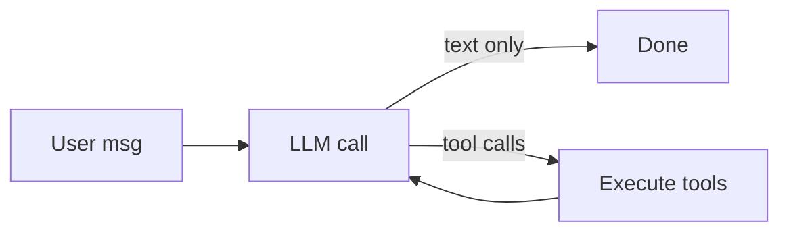
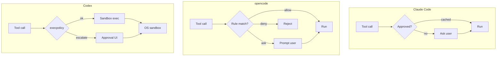

# Three AI Code Agents — Design Overview

> Claude Code • opencode • Codex

Every AI code agent has to solve the same set of problems: run a loop, call an LLM, dispatch tools, plug into MCP, spawn sub-agents, manage skills, handle context, persist sessions, gate permissions, and assemble a system prompt. What makes them *feel* different is how each team answers those questions.

This doc gives you a mental model of the three. No source code, no line numbers — just enough structure that when you later open any of their repos you already know what you're looking at.

---

## 🧭 The three contenders

| | **Claude Code** | **opencode** | **Codex** |
|---|---|---|---|
| **Who** | Anthropic (official) | SST / community | OpenAI (official) |
| **Vibe** | Reference implementation — "how we think an agent should work" | Provider-agnostic remix — "bring your own model" | Production Rust — "make it safe and fast" |
| **Primary language** | TypeScript | TypeScript (Bun) + Go (TUI) | Rust (+ thin JS shim) |
| **UI** | React Ink (terminal) | Go TUI ↔ TS server | Rust TUI (ratatui) |
| **Folder shape** | Single TS package, feature folders (`tools/`, `screens/`, `services/`) | Bun monorepo, namespaced modules (`tool/`, `agent/`, `session/`, `permission/`) | Cargo workspace, ~80 small crates (`core`, `tools`, `execpolicy`, `linux-sandbox`, ...) |

The folder structure already tells you a lot:
- Claude Code's flat TS layout says *"read top-to-bottom, one app"*
- opencode's namespaces say *"each concern is its own service with a clean boundary"*
- Codex's crate explosion says *"each concern is its own compiled unit, typed and sandboxed"*

---

## 🔁 Agent loop

The heart of any agent: **call LLM → run tools → feed results back → repeat**. All three implement this, but with very different philosophies.



| | **Claude Code** | **opencode** | **Codex** |
|---|---|---|---|
| **Core idea** | Own the loop | Rent the loop | Engineer the loop |
| **Pattern** | Hand-rolled async generator | SDK-driven event stream | Explicit state machine |
| **Shape** | `async function* query() { while(...) yield ... }` | Delegates to Vercel AI SDK's `streamText` | `submission_loop` consumes a queue; `run_turn` drives each round |
| **Concurrency** | Cooperative via generators | Reactive via Effect + streams | Actor-style — submissions, turns, sub-agents all independent |
| **Mid-turn input** | Queue-and-interrupt via React state | Handled by SDK stream abstraction | First-class: pending input drains into next turn |

**Takeaway:** Claude Code shows you the loop in a single file. opencode *hides* the loop — the real control flow lives inside an SDK. Codex *over-engineers* the loop because it has to coordinate cancellation, sub-agents, sandbox escalation, and multiple transports.

---

## 🧠 LLM model & provider abstraction

| | **Claude Code** | **opencode** | **Codex** |
|---|---|---|---|
| **Target model** | Claude (Anthropic) | Anything (Anthropic, OpenAI, Gemini, Groq, Ollama, ...) | GPT / Responses API |
| **Abstraction layer** | Thin — direct Anthropic SDK | Thick — Vercel AI SDK wraps every provider into `LanguageModel` | Purpose-built client per transport (Responses API, Chat Completions fallback) |
| **Multi-model strategy** | Big model for work, small model for titles/summaries | Per-agent model override, variants, mixed providers in one session | Prewarm/resume sessions on a client pool |
| **Streaming** | Native SSE | Abstracted `fullStream` events | Structured `ResponseItem` stream |

**Takeaway:** If you want to learn how Claude-flavored tool use *actually* works on the wire, read Claude Code. If you want one abstraction that hides five provider dialects, read opencode. If you want to see how a production Rust client handles a specific provider well, read Codex.

---

## 🔧 Tool calls

All three define tools as *schema + handler*, and the LLM drives dispatch. The difference is in ergonomics and the wrapper pipeline around each call.

| | **Claude Code** | **opencode** | **Codex** |
|---|---|---|---|
| **Definition** | Object literal with Zod schema + `call()` async generator | `Tool.define` with Zod schema + Effect-based `execute` | Rust struct + `ToolSpec` + async handler |
| **Validation** | Zod before call, retry on fail | Zod + custom `formatValidationError` | Serde + JSON schema + custom `validate_input` |
| **Execution wrapper** | Permission check → run → truncate → persist → return | Wrapper validates → executes → truncates per agent | Registry plan → permission → sandbox → execute |
| **Result** | `tool_result` content block | `ExecuteResult { title, metadata, output, attachments }` | `ResponseItem::FunctionCallOutput` |
| **Unique trick** | Async generators let tools **stream progress** back mid-call | Per-agent output truncation | **`code_mode`** — exposes tools as JS functions inside a JS REPL, so one LLM turn can chain N tool calls as code |

**Common pattern across all three:**
1. LLM returns tool call
2. Parse + validate args
3. Check permission
4. Execute
5. Truncate/normalize output
6. Feed back as tool result

Codex's `code_mode` is the most interesting deviation — instead of round-tripping the LLM for every tool call, it lets the model write JavaScript that calls multiple tools in one go. This can collapse a 10-step plan into a single LLM turn.

---

## 🔌 MCP (Model Context Protocol)

MCP is the standard way to plug *external* tools, prompts, and resources into an agent. All three support it as first-class citizens.

| | **Claude Code** | **opencode** | **Codex** |
|---|---|---|---|
| **Transport** | stdio + SSE | stdio + SSE + HTTP | stdio + SSE |
| **Tool integration** | MCP tools appear alongside built-ins, same dispatch path | MCP tools registered at session start, same `Tool.define` shape | MCP tools compiled into the registry plan; separate handler kind |
| **Resources** | Surfaced as `@mentions` in prompt | Surfaced via skill system | Dedicated `read_mcp_resource` tool |
| **Prompts** | Inlined as slash commands | Inlined as skills | Inlined as commands |

**Takeaway:** MCP integration is the most standardized part of all three. If you understand one, you understand the others. The only real difference is how external tools are *namespaced* and whether the agent supports MCP-over-HTTP (opencode does).

---

## 👥 Sub-agents

A sub-agent is "run another agent loop, with its own context and tools, and return a summary." All three do this, but they mean very different things by it.

| | **Claude Code** | **opencode** | **Codex** |
|---|---|---|---|
| **What it is** | A recursive `query()` call with a filtered toolset and isolated message history | A *named permission persona* (`build`, `plan`, `explore`, ...) — NOT a separate loop | A fully independent backgrounded turn, with 8 primitive tools to control it |
| **Launched by** | `AgentTool` — LLM calls it, parent waits for summary | User selects agent at session start; sub-agents run via `Task` tool | LLM calls `spawn_agent`; parent can `wait_agent`, `send_message`, `list_agents`, `close_agent`, `resume_agent` |
| **Isolation** | Fresh message history, no parent context | Shares session, different permissions | Separate session, separate client, separate sandbox |
| **Parallelism** | Multiple Task calls run concurrently | Parallel agents are just parallel `streamText` calls | Explicit — parent can spawn N, wait on any, collect results |

Three very different models for "sub-agent":
- **Claude Code**: recursion with tool filtering
- **opencode**: personas with permission bundles
- **Codex**: actor model with send/receive primitives

Codex's approach is the most flexible but also the most complex — it supports fanning sub-agents out across a CSV of tasks, which makes it feel more like a job scheduler than a chatbot.

---

## 🧩 Skills

Skills are *packaged expertise*: pre-written prompts, scripts, or workflows the agent can invoke on demand. Claude Code introduced the concept; the others have adopted variants.

| | **Claude Code** | **opencode** | **Codex** |
|---|---|---|---|
| **What** | Named markdown files with frontmatter, loaded into prompt on match | Named directories with scripts + metadata, registered as callable tools | Integrated via MCP prompts + tool registry |
| **Discovery** | Listed in system prompt, LLM picks by name | Auto-registered at session start, filtered by agent | Exposed via `tool_search` / `tool_suggest` meta-tools |
| **Execution** | Skill body gets inlined into context | Skill maps to an actual tool invocation | Varies — can be tool, prompt, or workflow |

Codex has the most novel take: **`tool_search`** and **`tool_suggest`** let the LLM dynamically discover and load tools on demand, so the base context doesn't have to carry every skill definition. The loaded tools then live in the session until it ends.

---

## 🧾 Context management

As conversations grow, context must be pruned, compacted, or offloaded. This is where long-lived agent quality gets made or broken.

| | **Claude Code** | **opencode** | **Codex** |
|---|---|---|---|
| **Compaction trigger** | Token threshold on every turn | Token threshold + user `/compact` | Pre-sampling check before each turn |
| **Who compacts** | Dedicated "compact" call with small model | A `compaction` agent persona (hidden, permission-denied, prompt-only) | Internal compaction module + optional external summarizer |
| **What survives** | Summary + last N turns + pinned artifacts | Summary + last N turns + attachments | Summary + structured `TurnContext` + pinned items |
| **Prompt caching** | Stable prefix, aggressive `cache_control` breakpoints | Transparent via Vercel AI SDK | Handled per provider |
| **Large results** | Persisted to disk, replaced with a path reference | Truncated per-agent with a "view more" path | Persisted with typed handles |

**Common pattern:** All three use the same trick — when output is too big, save it to disk and give the model a handle instead of the full blob. This keeps tokens down while letting the model request detail on demand.

---

## 💾 Session management

A session is one conversation + its state. Persistence lets you resume, fork, and share.

| | **Claude Code** | **opencode** | **Codex** |
|---|---|---|---|
| **Storage** | JSONL files under `~/.claude/projects/<hash>/` | Per-project SQLite + JSON | File-based + structured metadata |
| **Identifier** | Per-directory UUID | Session ID, agent-bound | Session ID with prewarmed client handle |
| **Resume** | Reload messages, rebuild state | Full state rehydrate via Effect layers | Explicit resume path with prewarm |
| **Fork** | New UUID, copy messages | New session, same project | New turn context, optional worktree |
| **Multi-session** | One per shell | Many in one daemon | Many concurrent with session affinity |

Claude Code is the simplest: files on disk, one session per directory. opencode's SQLite approach lets it query across sessions and power a UI. Codex treats sessions as stateful server objects with a lifecycle.

---

## 🔐 Permission management

This is where the three agents diverge the most — and where their different audiences become obvious.

| | **Claude Code** | **opencode** | **Codex** |
|---|---|---|---|
| **Core idea** | "Ask the user each time, cache approvals" | "Declare rules up front, enforce per tool" | "Sandbox everything, approve at OS boundary" |
| **Unit of control** | Tool name + arg pattern | `Permission.Ruleset` (wildcard patterns per tool/path) | Rust-native policies (`execpolicy`) + OS sandbox |
| **Approval flow** | Interactive prompt → remember for session | Rule lookup: `allow` / `ask` / `deny` | Policy match → sandbox exec → escalation on denial |
| **Scope examples** | File write, bash command, URL fetch | Per-agent permission bundles (`plan` denies edits; `explore` denies everything except read/search) | Per-binary, per-directory, per-network, per-syscall |
| **Fallback** | Ask user | Deny + explain | Drop into approval UI |
| **Enforcement layer** | Process-level + user prompt | Application-level wildcard matcher | **OS-level** — `linux-sandbox`, `windows-sandbox-rs`, `process-hardening`, `network-proxy` |



**Takeaway:** Claude Code trusts the user to approve. opencode trusts the config. Codex trusts the OS. The further right you go, the less you rely on the model being well-behaved.

---

## 📜 Pre-defined prompts

Every agent ships a system prompt. The interesting part is *how it's structured* for caching, agent variants, and provider quirks.

| | **Claude Code** | **opencode** | **Codex** |
|---|---|---|---|
| **Structure** | Stable prefix + dynamic suffix, tuned for prompt caching | Header + body pattern, 2-part cache split | Base + turn context, structured per provider |
| **Per-agent** | Main agent prompt + per-sub-agent prompts | Each named agent has its own prompt file (or none) | Base Codex prompt, mode-specific overlays |
| **Provider variants** | Claude-only | Ships separate prompts per provider (`anthropic.txt`, `gpt.txt`, `gemini.txt`, `kimi.txt`, even `codex.txt`) | OpenAI-only |
| **Dynamic sections** | Git status, todo, directory tree, system info | Git status, project context, skill list | Git status, sandbox info, tool list |
| **Injection points** | Cached static + dynamic reminders | Plugin-driven transforms | Middleware transforms |

opencode's `codex.txt` variant is a fun artifact: it's a system prompt that tells the LLM to "act like Codex," which tells you just how much prompt engineering matters for agent quality.

---

## 🏗️ Folder structure at a glance

**Claude Code** (flat TS):
```
src/
├── entrypoints/      — CLI dispatcher
├── screens/          — REPL, settings, etc.
├── services/         — LLM clients, file I/O
├── tools/            — 30+ built-in tools
├── commands/         — slash commands
└── query.ts          — THE agent loop
```

**opencode** (Bun monorepo, namespaced):
```
packages/opencode/src/
├── agent/            — agent personas + registry
├── session/          — loop, messages, processor
├── tool/             — Tool.define + built-ins
├── permission/       — ruleset engine
├── provider/         — multi-provider abstraction
├── skill/            — skill system
└── plugin/           — extension hooks
```

**Codex** (Cargo workspace, ~80 crates):
```
codex-rs/
├── core/             — submission_loop, run_turn
├── tools/            — tool registry + all tool defs
├── execpolicy/       — permission rules
├── linux-sandbox/    — seccomp + namespaces
├── windows-sandbox-rs/
├── process-hardening/
├── network-proxy/
├── mcp-client/
├── mcp-server/
├── tui/              — ratatui UI
└── [70+ more crates]
```

The folder shape is the architecture. Claude Code says "here's the feature, read it." opencode says "each concern is a module with a service boundary." Codex says "each concern is a *compilation unit* with its own dependencies, tests, and types."

---

## 🎯 What each one optimizes for

| | Optimizes for | At the cost of |
|---|---|---|
| **Claude Code** | Clarity + showing off Claude's capabilities | Multi-provider support, strict sandboxing |
| **opencode** | Provider flexibility + clean module boundaries | Loop transparency (it's inside an SDK) |
| **Codex** | Safety + performance + production hardening | Onboarding simplicity (80 crates is a lot) |

---

## 🧠 Mental model to carry with you

When you open any of these repos next, ask these questions in order:

1. **Who owns the loop?** — one file, an SDK, or a state machine?
2. **How are tools shaped?** — object literal, builder, or struct?
3. **Where does permission live?** — user prompt, config, or OS sandbox?
4. **What's a "sub-agent"?** — recursion, persona, or actor?
5. **How is the prompt structured?** — monolith, layered, or per-provider?

With those five axes, you can place almost any agent architecture on a map within minutes — including ones that haven't been written yet.

---

## 🔗 Related docs

- [`21-three-agents-compared.md`](./21-three-agents-compared.md) — prior high-level comparison with source references
- [`01-entry-point-and-core-loop.md`](./01-entry-point-and-core-loop.md) — Claude Code's loop in detail
- [`16-tool-execution-deep-dive.md`](./16-tool-execution-deep-dive.md) — Claude Code's tool pipeline
- [`18-sub-agent-source-analysis.md`](./18-sub-agent-source-analysis.md) — Claude Code's sub-agent internals
- [`20-tool-execution-python-rewrite-plan.md`](./20-tool-execution-python-rewrite-plan.md) — how we're porting this to Python
