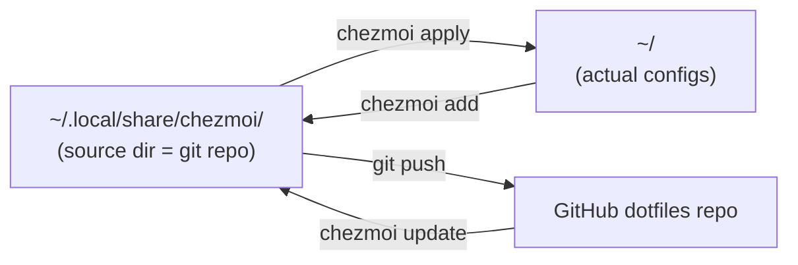

# chezmoi — Dotfiles Management

> **chezmoi** (French for "at my place") is the most popular dotfiles manager today. It manages personal configuration files across multiple machines using a Git-backed source directory with copy-based application, templating, and secret management.

---

## 🧠 Core Concept

Unlike symlink-based tools (e.g., GNU Stow), chezmoi keeps a **source directory** (`~/.local/share/chezmoi/`) as the single source of truth. It *copies* files to your home directory rather than symlinking them. This means your actual config files are real files, not symlinks.



### Why Copies Over Symlinks?

- A misbehaving program can't corrupt your source of truth
- Works on systems where symlinks are problematic (e.g., some Windows setups)
- No issues with tools that don't follow symlinks

---

## 📦 Installation

```bash
# One-liner (Linux/macOS)
sh -c "$(curl -fsLS get.chezmoi.io)"

# Package managers
brew install chezmoi        # macOS / Homebrew
sudo pacman -S chezmoi      # Arch
sudo apt install chezmoi    # Debian / Ubuntu
nix-env -i chezmoi          # Nix
snap install chezmoi        # Snap
```

---

## 🚀 Initial Setup (With an Existing GitHub Repo)

If you've already created an empty `dotfiles` repo on GitHub:

```bash
# 1. Initialize and link to your repo
chezmoi init https://github.com/USERNAME/dotfiles.git

# 2. Add files you want to manage
chezmoi add ~/.bashrc
chezmoi add ~/.gitconfig
chezmoi add ~/.tmux.conf

# 3. Push to GitHub
chezmoi cd
git add -A
git commit -m "Initial dotfiles"
git push
```

---

## 📂 Directory Mapping

Files in the source dir map to your home directory via naming conventions:

| Source (`~/.local/share/chezmoi/`) | Target (`~/`)              |
| ---------------------------------- | -------------------------- |
| `dot_bashrc`                       | `.bashrc`                  |
| `dot_gitconfig`                    | `.gitconfig`               |
| `dot_config/nvim/init.lua`         | `.config/nvim/init.lua`    |
| `private_dot_ssh/config`           | `.ssh/config` (mode 0600)  |

### Prefix Behaviors

| Prefix         | Effect                          |
| -------------- | ------------------------------- |
| `dot_`         | Becomes `.`                     |
| `private_`     | File permissions set to `0600`  |
| `executable_`  | File permissions set to `0755`  |
| `empty_`       | Allow empty files               |

The `.chezmoitemplate` suffix marks a file for Go template processing.

---

## ✏️ Editing Configs

### Option 1: Edit via chezmoi (recommended)

```bash
chezmoi edit ~/.bashrc    # opens the source copy in your editor
chezmoi apply             # copies it to ~/
```

### Option 2: Edit the file directly, then re-add

```bash
vim ~/.bashrc             # edit the actual file
chezmoi add ~/.bashrc     # update the source copy from the local file
```

Then push:

```bash
chezmoi cd
git add -A
git commit -m "Update bashrc"
git push
```

---

## 🔄 Multi-Machine Workflow

### Setting Up a New Machine

```bash
chezmoi init --apply https://github.com/USERNAME/dotfiles.git
```

This clones the repo **and** applies all configs in one step.

### Ongoing Sync

Every machine that has run `chezmoi init` has a full local clone of the repo. They are all equal — any machine can push and pull.

```bash
# On any machine: edit, apply, push
chezmoi edit ~/.bashrc
chezmoi apply
chezmoi cd && git add -A && git commit -m "Update" && git push

# On other machines: pull and apply
chezmoi update    # git pull + apply in one step
```

---

## ⚠️ Apply Behavior

`chezmoi apply` **overwrites** the target file with the source copy.

### Safety Commands

| Command             | Purpose                              |
| ------------------- | ------------------------------------ |
| `chezmoi diff`      | Preview what would change            |
| `chezmoi apply -n`  | Dry run — no actual changes          |
| `chezmoi apply -v`  | Verbose — shows what it's doing      |
| `chezmoi merge`     | Handle conflicts interactively       |
| `chezmoi add`       | Pull local changes back into source  |

---

## 🎯 Templates for Per-Machine Config

Use Go templates (`.chezmoitemplate` suffix) to vary configs by machine:

```bash
# dot_gitconfig.tmpl
[user]
    name = "My Name"
{{ if eq .chezmoi.hostname "work-laptop" }}
    email = "work@example.com"
{{ else }}
    email = "personal@example.com"
{{ end }}
```

---

## 🔑 Key Features

- **Templates** — Go templates for per-machine variation
- **Secrets** — integrates with 1Password, Bitwarden, pass, Vault, etc.
- **Encryption** — encrypt sensitive files with age or GPG
- **Merge** — handles conflicts when both local and source have changed
- **Cross-platform** — Linux, macOS, Windows, FreeBSD

---

## 🆚 Alternatives Comparison

| Tool         | Approach    | Popularity | Notes                                  |
| ------------ | ----------- | ---------- | -------------------------------------- |
| **chezmoi**  | Copy-based  | ⭐ Highest | Templates, secrets, encryption         |
| **GNU Stow** | Symlinks    | ⭐ High    | Simple, does one thing well            |
| **yadm**     | Bare repo   | Medium     | Thin Git wrapper, supports templates   |
| **dotbot**   | Symlinks    | Medium     | YAML-configured bootstrap workflow     |
