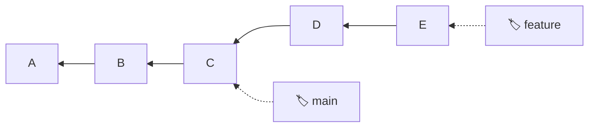
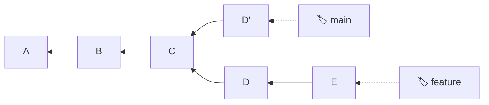

# Git Core Concepts

Concept notes distilled from a Q&A session covering Git's internal model, common operations, and how they relate to the underlying data structure.

---

## 🔗 Git Is a DAG

At its core, Git is a **Directed Acyclic Graph** (DAG):

- **Directed** — edges go one way (child → parent)
- **Acyclic** — no cycles; a commit can never be its own ancestor



**Branches are just named pointers** to nodes in this graph. This is why many Git operations can target any part of the graph regardless of which branch you're on — the graph structure makes any node reachable.

---

## 📤 git push

`git push` uploads local commits to a remote repository.

| Command | Effect |
|---|---|
| `git push` | Push current branch to its tracked remote |
| `git push origin main` | Push a specific branch to a specific remote |
| `git push -u origin my-branch` | Push and set upstream tracking |
| `git push --all origin` | Push all branches at once |

### Pushing another branch without switching

Because Git is a DAG, you don't need to be on a branch to push it:

```bash
# While on branch A, push branch B
git push origin branch-b
```

You're just telling Git which node to send — the graph structure makes it trivial to walk and transmit any part of it independently.

---

## 🍒 git cherry-pick

`git cherry-pick` copies a specific commit's **diff** and re-applies it on your current branch as a **new commit**.

### Before cherry-pick


### After `git checkout main && git cherry-pick D`



### Key insights

- `D'` is a **new commit** with the same changes but a **different hash** — it's a copy, not a move
- ⚠️ **`D'` and `D` have no structural relationship** in the DAG — there is no edge connecting them. They are completely independent nodes that happen to contain the same diff
- Because it's re-applying a diff (not copying a node), it **can fail with merge conflicts** if the target branch has diverged enough
- Git tools like GitLens **cannot determine** that `D'` came from `D` — it looks like any other commit. The only hints are informal: same commit message (copied by default) and same diff content

### Customizing the commit message

There is no direct `-m` flag on `cherry-pick`. To set a custom message:

```bash
git cherry-pick D --edit           # opens editor to modify the message
git cherry-pick D --no-commit      # stages changes without committing
git commit -m "your custom message"
```

---

## 🌿 Creating a Branch Without Switching

```bash
git branch new-branch main
```

Creates `new-branch` pointing to the tip of `main` without switching to it. Your current branch and working directory remain untouched.

---

## ⏪ git restore — File-Level State Recovery

`git restore` brings a single file to a specific state **without touching the DAG**.

```bash
git restore file.txt                    # discard working dir changes
git restore --staged file.txt           # unstage a file
git restore --source HEAD~1 file.txt    # restore file to a specific commit
git restore --source abc1234 file.txt   # restore file to a specific commit hash
```

### What it actually does

`git restore --source abc1234 file.txt` does exactly one thing: it finds `file.txt` inside commit `abc1234` and overwrites the working directory copy to match. That's all.

### What it does NOT do

- ❌ Does not create any new commit
- ❌ Does not modify the DAG
- ❌ Does not change history

History in Git is immutable — once a commit is in the DAG, it can't be changed. `git restore` only affects the **working directory** or **staging area** (index), never any commit.
