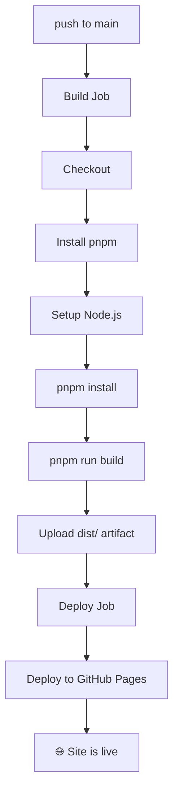

# GitHub Pages, CI/CD, Astro & GitHub Actions

Concept notes covering the modern GitHub Pages workflow — from CI/CD fundamentals to Astro as a static site generator, deployed via GitHub Actions.

---

## 📦 CI/CD Fundamentals

### What Is CI/CD?

- **Continuous Integration (CI):** Developers merge code into a shared branch frequently. Each merge triggers automated builds and tests to catch bugs early — avoiding "integration hell."
- **Continuous Delivery (CD):** After CI passes, code is automatically prepared for deployment, with a manual approval step before going live.
- **Continuous Deployment:** Every passing change is deployed automatically — no manual step.

### CI Pipeline in Detail

A typical CI pipeline runs these steps in order:


| Step | Purpose | Example Tools |
|------|---------|---------------|
| Lint | Code style, common mistakes | ESLint, Pylint, RuboCop |
| Build | Compile or bundle — catches syntax/type errors | — |
| Unit Tests | Test functions/classes in isolation | Jest, pytest, JUnit |
| Integration Tests | Test components working together | — |
| Coverage | Measure % of code tested, fail if below threshold | — |
| Security Scan | Check dependencies for known vulnerabilities | Snyk, Dependabot, Trivy |
| Artifact | Produce deployable output (Docker image, binary) | — |

### CI Principles

- ⚡ **Fast feedback** — pipeline should finish in under 10 minutes
- 🌳 **Single source of truth** — one main branch, everyone integrates to it
- 🚨 **Fix broken builds immediately** — red pipeline is top priority
- 🚫 **Don't merge broken code** — branch protection rules enforce this
- 🔁 **Reproducible builds** — same code = same output every time

### Most Popular CI/CD Tool (2025–2026)

**GitHub Actions** dominates (JetBrains State of CI/CD Survey 2025):

| Tool | Org Usage | Personal Use |
|------|-----------|--------------|
| GitHub Actions | 41% | 62% |
| Jenkins | 28% | 13% |
| GitLab CI/CD | 19% | 10% |

- Jenkins remains strong in legacy enterprise / self-hosted environments
- GitLab CI/CD is preferred for unified DevSecOps platforms

---

## 🚀 Astro — The Static Site Framework

### What Is Astro?

Astro is a web framework for building **content-focused sites** (blogs, portfolios, docs). It ships **zero JavaScript by default** — pages are rendered to static HTML at build time.

### Islands Architecture

Most of the page is static HTML. Only interactive components ("islands") load JavaScript:

```
┌─────────────────────────────┐
│  Static HTML (no JS)        │
│  ┌─────────┐  ┌──────────┐  │
│  │ React   │  │  Svelte  │  │  ← only islands load JS
│  │ island  │  │  island  │  │
│  └─────────┘  └──────────┘  │
└─────────────────────────────┘
```

### Key Features

| Feature | Detail |
|---------|--------|
| Templating | `.astro` files (HTML-like syntax) |
| Markdown | Built-in, GFM enabled by default |
| Routing | File-based (`src/pages/`) |
| Styling | Scoped CSS, Tailwind, anything |
| UI Frameworks | React, Vue, Svelte, Solid — mix and match |
| Output | Static site or server-rendered |

### The `.astro` File Format

Three sections, all optional:

```astro
---
// Frontmatter — runs at build time (Node.js)
const name = "World";
---

<!-- Template — HTML with expressions -->
<h1>Hello {name}</h1>

<style>
  /* Scoped to this component only */
  h1 { color: blue; }
</style>

<script>
  /* Client-side JS — only this runs in the browser */
  console.log("hi");
</script>
```

### Other Supported File Types

| File type | Usage |
|-----------|-------|
| `.md` | Pages or content, GFM supported |
| `.mdx` | Markdown + JSX components inside content |
| `.ts` / `.js` | Utilities, config, API endpoints |
| `.tsx` / `.jsx` | React components (with integration) |
| `.vue` / `.svelte` | Vue / Svelte components (with integration) |

### Markdown Handling

✅ Astro renders Markdown with **GFM** (GitHub Flavored Markdown) by default — tables, strikethrough, task lists, autolinks all work out of the box.

✅ **SmartyPants** is also enabled by default — straight quotes become curly, `--` becomes en-dash, `---` becomes em-dash.

Both can be disabled in `astro.config.mjs`:

```js
export default defineConfig({
  markdown: {
    gfm: false,
    smartypants: false,
  },
});
```

Adding custom remark/rehype plugins does **not** disable these defaults.

### Using Existing Markdown Files with Astro

Just add frontmatter to the top of each `.md` file — the GFM content below it renders unchanged:

```markdown
---
title: My Page
date: 2026-03-30
---

# Existing GFM content here...
```

Both **VS Code** and **GitHub** render Markdown with frontmatter correctly — they strip the `---` block and display the rest as normal. The frontmatter convention is widely understood (Jekyll popularized it).

### Markdown Placement

| Situation | Approach |
|-----------|----------|
| Few pages (about, contact) | Put `.md` files in `src/pages/` — auto-routed |
| Blog, docs, many files | Use `src/content/` with Content Collections |

Content Collections provide **type-safe frontmatter** — Astro errors at build time if a required field is missing.

### CSS in Astro

**Tailwind CSS** is the dominant choice — virtually every popular Astro template ships with it.

Most projects use a **hybrid approach**:
- Tailwind for layout, spacing, typography, colors
- Astro's scoped `<style>` blocks for component-specific edge cases

### Astro vs Other SSGs (2025–2026)

| Tool | Best For | Notes |
|------|----------|-------|
| **Astro** ⭐ | Content sites, blogs, docs | Highest dev satisfaction, fastest-growing |
| Hugo | Huge sites, non-JS teams | Fastest builds (Go binary) |
| Jekyll | GitHub Pages native (legacy) | No Actions needed, but slow, less active |
| Next.js | Full-stack apps | Overkill for static sites |

### Not Good For

- Heavy web apps (use Next.js)
- Real-time features (chat, live dashboards)

---

## 🎨 Building a GitHub Pages Site with Astro

### Setup

```bash
npm create astro@latest
cd my-site
npm run dev        # live at localhost:4321
```

### Template-First Is the Norm

Most developers **do not** start from scratch. They pick a theme and swap in their content.

| Template | Stars | Best For |
|----------|-------|----------|
| **AstroPaper** | ~4,200 | Minimal blog, dark/light mode, search |
| **Astrofy** | ~1,300 | Portfolio + blog + CV combined |
| **AstroWind** | High | Landing page + blog |
| **Astroship** | Moderate | SaaS / startup style |

### Typical Modern Stack

```
Astro 5 + Tailwind CSS v4 + Markdown/MDX + TypeScript + GitHub Actions
```

---

## ⚙️ GitHub Actions

### How It Works

Put `.yml` files in `.github/workflows/` — GitHub detects and runs them automatically. No registration or setup needed.

### Anatomy of a Workflow

```yaml
name: CI                          # display name in GitHub UI

on:                               # trigger conditions
  push:
    branches: [main]
  pull_request:

jobs:
  build:                          # job name
    runs-on: ubuntu-latest        # runner OS
    steps:
      - uses: actions/checkout@v4 # reusable action
      - run: npm install          # shell command
      - run: npm test
```

### Key Concepts

| Concept | What It Is |
|---------|------------|
| **Workflow** | The whole `.yml` file |
| **Trigger (`on`)** | What starts it (push, PR, schedule, manual) |
| **Job** | A group of steps, runs on one VM |
| **Step** | One action or shell command |
| **Action (`uses`)** | Reusable community/official building block |
| **Runner** | The VM that executes the job |

### Common Triggers

```yaml
on:
  push:
    branches: [main]        # push to main
  pull_request:              # any PR
  schedule:
    - cron: '0 9 * * *'     # daily at 9am UTC
  workflow_dispatch:          # manual trigger button in UI
```

### Multiple Workflow Files

Separate files for separate concerns:

```
.github/workflows/
  ci.yml        # every PR — lint, test
  deploy.yml    # push to main — build, deploy
  release.yml   # on git tag — create release
```

Benefits: different triggers, independent failures, parallel execution, easier to maintain.

### `ci.yml` vs `deploy.yml`


- `ci.yml` is the **gatekeeper** — blocks merging if checks fail
- `deploy.yml` only runs on `main` — publishes to GitHub Pages

### Deploy Workflow for GitHub Pages (Detailed)

A real-world Astro deploy workflow explained section by section:

**Triggers:**
```yaml
on:
  push:
    branches: [main]     # auto-deploy on push
  workflow_dispatch:      # manual trigger button
```

**Permissions — least privilege:**
```yaml
permissions:
  contents: read        # read repo files
  pages: write          # publish to Pages
  id-token: write       # identity verification for deploy
```

**Concurrency — prevent simultaneous deploys:**
```yaml
concurrency:
  group: pages
  cancel-in-progress: false   # don't cancel a running deploy
```

**Build job:**
1. Checkout repo
2. Install pnpm (pinned version for reproducibility)
3. Setup Node.js with pnpm cache (faster subsequent installs)
4. `pnpm install` — install dependencies
5. `pnpm run build` — Astro outputs to `dist/`
6. Upload `dist/` as a Pages artifact

**Deploy job:**
- `needs: build` — only runs if build succeeds
- Uses `actions/deploy-pages@v4` to publish the artifact
- Tied to the `github-pages` environment (visible in GitHub UI)
- Outputs the live URL



### Deployment Configuration

In `astro.config.mjs`:

```js
export default defineConfig({
  site: 'https://username.github.io',
  base: '/repo-name',  // omit if repo is username.github.io
});
```

Then in GitHub: **Settings → Pages → Source → GitHub Actions**.

---

## 🔗 Related Tools Mentioned

### pnpm

A Node.js package manager — same as npm but stores packages **once globally** and hard-links them. Saves disk space and installs faster.

```bash
npm install -g pnpm         # install
pnpm install                # same commands as npm
pnpm add react
pnpm run dev
```

### Symlinks

A file/directory that **points** to another file/directory — used heavily in dotfiles repos:

```bash
ln -s /path/to/real/file /path/to/symlink    # create
ln -sf /path/to/real/file /path/to/symlink   # force overwrite (files only)
```

- Target must not already exist (or use `-f` for files)
- Use absolute paths to avoid breakage
- For directories, `rm -rf` the existing dir first — `-f` doesn't work for dirs

### Dotfiles Repo

A Git repo storing personal config files (`.zshrc`, `.gitconfig`, `.tmux.conf`, etc.). Symlinks point from `~/` to the repo so tools find configs in their expected locations while git tracks them centrally.

Popular managers: **chezmoi** (most popular today), GNU Stow, yadm.
