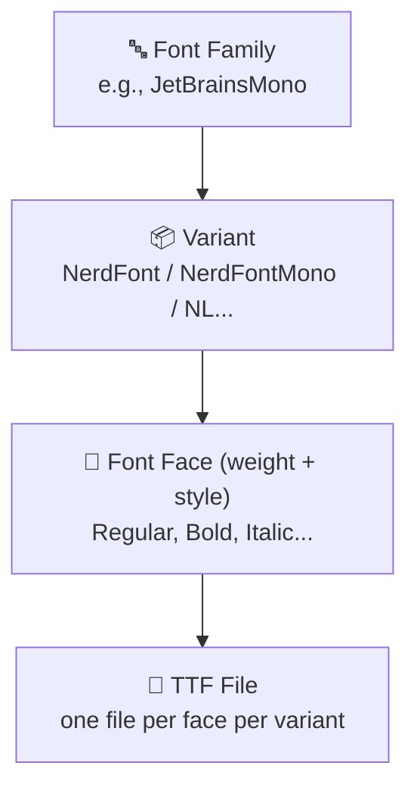
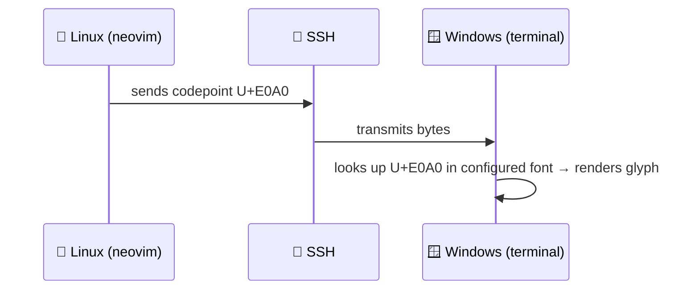

# Nerd Fonts, Unicode, and Terminal Icon Rendering

> Concept notes covering Nerd Fonts, Unicode fundamentals, font anatomy, remote rendering, and installation.

---

## Table of Contents

- [Unicode Fundamentals](#unicode-fundamentals)
- [What Is Nerd Font](#what-is-nerd-font)
- [Font Anatomy](#font-anatomy)
- [Remote Rendering (SSH)](#remote-rendering-ssh)
- [VS Code Icon Themes vs Nerd Fonts](#vs-code-icon-themes-vs-nerd-fonts)
- [Installation](#installation)
- [Verification](#verification)
- [Oh My Posh](#oh-my-posh)

---

## Unicode Fundamentals

### Character → Codepoint → Glyph

Three distinct layers are involved when a character appears on screen:

| Layer | Role | Example |
|-------|------|---------|
| **Character** | The abstract idea ("the letter A") | A |
| **Codepoint** | The numeric identity assigned by Unicode | U+0041 |
| **Font / Glyph** | The visual shape rendered on screen | Depends on the font |

```
Character  →  what it is       (abstract concept)
Codepoint  →  how it's stored  (a number)
Font/Glyph →  how it looks     (visual rendering)
```

A file stores the codepoint. The font provides the glyph. The character is the meaning. These three layers are independent — you can change the font without changing the codepoint, and the character remains the same.

### Codepoint Format

The notation `U+0041` means:

- **U+** — prefix meaning "Unicode codepoint"
- **0041** — hexadecimal (base-16) value (= decimal 65)

Hex digits are zero-padded to at least 4 digits:

- `U+0041` — 4 digits (Basic Latin, `A`)
- `U+20AC` — 4 digits (`€`)
- `U+1F600` — 5 digits (`😀`, outside the basic plane)

### Unicode Codespace

Unicode's total range is **U+0000 to U+10FFFF** — 1,114,112 possible slots, divided into 17 **planes** of 65,536 codepoints each:

| Plane | Range | Name |
|-------|-------|------|
| 0 | U+0000–U+FFFF | **Basic Multilingual Plane (BMP)** — most living languages, common symbols |
| 1 | U+10000–U+1FFFF | Supplementary Multilingual — emoji, historic scripts, music |
| 2 | U+20000–U+2FFFF | Supplementary Ideographic — rare CJK characters |
| 3–13 | U+30000–U+DFFFF | Mostly unassigned |
| 14 | U+E0000–U+EFFFF | Supplementary Special-purpose |
| 15–16 | U+F0000–U+10FFFF | **Private Use Areas** |

Of ~1.1 million slots, roughly 150,000 are currently assigned.

### Private Use Areas (PUA)

Ranges that Unicode intentionally leaves **undefined** — no official character is assigned. Anyone can map their own glyphs here.

| Range | Size | Plane |
|-------|------|-------|
| U+E000–U+F8FF | 6,400 codepoints | BMP (Plane 0) |
| U+F0000–U+FFFFD | ~65,534 codepoints | Plane 15 |
| U+100000–U+10FFFD | ~65,534 codepoints | Plane 16 |

Key properties:

- ✅ Unicode guarantees it will **never** assign official characters here
- ⚠️ No standard meaning — sender and receiver must agree on interpretation
- ✅ Valid Unicode — software won't reject them
- ⚠️ Without the right font, they render as blank boxes

This is where Nerd Fonts puts its icon glyphs.

---

## What Is Nerd Font

🔤 **Nerd Fonts** are patched versions of popular programming fonts that add ~3,600+ icon glyphs from multiple icon sets into the Unicode Private Use Areas.

Icon sources include:

- ⭐ Font Awesome — general-purpose icons
- 💻 Devicons — programming language/tool logos
- 🐙 Octicons — GitHub icons
- ⚡ Powerline — status line symbols (arrows, branch icons)
- 🎨 Material Design Icons
- and others

### Why They Exist

Terminal tools (starship, tmux themes, nvim file explorers, eza/lsd) use PUA codepoints to render icons. Standard fonts don't include these glyphs → you see boxes. Nerd Fonts patch them in.

### Development History

- **~2014–2015** — Created by Ryan L McIntyre (GitHub: ryanoasis) as part of his **VimDevIcons** plugin for Vim
- **Problem** — no single font had all the icons needed from Font Awesome, Devicons, Octicons, etc.
- **Solution** — began patching fonts to combine glyphs from multiple icon sets
- **Separation** — font patching work grew beyond Vim, split into standalone repo
- **Name evolution** — `nerd-filetype-glyphs-fonts-patcher` → `font-nerd-icons` → `nerd-fonts`
- **Current state** — 55,000+ GitHub stars, 200+ contributors, 50+ patched font families

### Icons Are Identical Across All Nerd Fonts

The patching process injects the **same icon glyphs** into every font. The git icon at a given PUA codepoint looks the same in JetBrainsMono, FiraCode, and Hack.

The difference between fonts is only in the **regular text characters** — letter shapes, ligatures, spacing, weight. You choose a Nerd Font for how your **code** looks, not for how the **icons** look.

---

## Font Anatomy

### Terminology Hierarchy



| Term | What it is | Example |
|------|-----------|---------|
| **Font family** | The shared design name | JetBrainsMono |
| **Variant** | Sub-version with different features | NerdFont, NerdFontMono, NLNerdFont |
| **Font face** | Specific weight + style | Bold, Italic, SemiBoldItalic |
| **TTF file** | One file = one variant + one weight/style | `JetBrainsMonoNerdFont-Bold.ttf` |

### Nerd Font Variants

| Variant name contains | Meaning |
|---|---|
| `NerdFont` | Standard — proportional icons, with ligatures |
| `NerdFontMono` | Icons constrained to monospace width, with ligatures |
| `NerdFontPropo` | Proportional font (not monospaced) |
| `NL` (e.g., `NLNerdFont`) | **No Ligatures** version |

### How the OS Sees It

The variant concept is a **Nerd Fonts packaging detail**. The OS registers each variant as its own independent font family:

```
92 TTF files installed from one zip
  → 6 font families visible in app font pickers
    (NerdFont, NerdFontMono, NerdFontPropo × with/without ligatures)
      → you pick 1
        → app selects the right TTF for Regular/Bold/Italic automatically
```

### How Apps Present Fonts

| App type | What you choose | How weight/style works |
|---|---|---|
| **Word, VS Code, browser** | Family name | Bold/Italic via toolbar buttons |
| **Terminal emulators** | Variant (appears as separate family) | Regular/Bold handled automatically |
| **Design tools, CSS** | Can pick exact face | `font-weight: 600; font-style: italic;` |

### For Terminal Use

You most likely want **`JetBrainsMonoNerdFont`** — just the files starting with `JetBrainsMonoNerdFont-` (no `Mono`, `Propo`, or `NL` in the name). Minimum needed: **Regular** and **Bold**.

---

## Remote Rendering (SSH)

When using SSH (e.g., PowerShell on Windows → Linux server), font rendering happens on the **client** (Windows), not the server (Linux).



**Implications:**

- ✅ Nerd Font must be installed on **Windows** (the machine doing the displaying)
- ❌ Linux does **not** need Nerd Fonts installed — it only sends codepoints
- ⚠️ The font must be **configured** in the Windows terminal emulator

---

## VS Code Icon Themes vs Nerd Fonts

These are two completely independent icon systems:

| | Nerd Fonts (terminal) | VS Code Icon Themes |
|---|---|---|
| **Mechanism** | Font glyphs at PUA codepoints | SVG/PNG image files |
| **Rendered by** | Terminal emulator | VS Code (Electron/browser engine) |
| **Colors** | Monochrome (usually) | Full color, any complexity |
| **Works in** | Any terminal app | Only inside VS Code |
| **Requires** | Nerd Font installed | Extension installed (e.g., Material Icon Theme) |

---

## Installation

### Windows (for SSH/remote use)

**Method 1 — Manual download** (most common):
1. Download zip from [nerdfonts.com](https://www.nerdfonts.com/font-downloads)
2. Extract
3. Select `.ttf` files → right-click → **Install for all users**

**Method 2 — Oh My Posh CLI:**
```powershell
oh-my-posh font install JetBrainsMono
```

**Method 3 — Scoop:**
```powershell
scoop bucket add nerd-fonts
scoop install nerd-fonts/JetBrainsMono-NF
```

**After installing — configure Windows Terminal:**
1. Settings (Ctrl+,) → Profile → Appearance → Font face
2. Select "JetBrainsMono Nerd Font"

### Ubuntu/Linux (for local use)

```bash
mkdir -p ~/.local/share/fonts
cd ~/.local/share/fonts
wget https://github.com/ryanoasis/nerd-fonts/releases/latest/download/JetBrainsMono.zip
unzip JetBrainsMono.zip
rm JetBrainsMono.zip
fc-cache -fv
```

---

## Verification

### Check font is installed (Windows)

**Settings:** Settings → Personalization → Fonts → search "Nerd"

**PowerShell:**
```powershell
[System.Drawing.Text.InstalledFontCollection]::new().Families | Where-Object { $_.Name -match 'Nerd' }
```

### Test glyph rendering

Output a Nerd Font codepoint and visually inspect — if you see an icon, it works; if you see a box, it doesn't.

**PowerShell 6+:**
```powershell
echo "`u{e0a0}"
```

**PowerShell 5.x** (built into Windows, does not support `` `u{} `` syntax):
```powershell
[char]::ConvertFromUtf32(0xE0A0)
```

### Sample Nerd Font codepoints

| Codepoint | Icon | PowerShell 5.x command |
|-----------|------|----------------------|
| `0xE0A0` | git branch | `[char]::ConvertFromUtf32(0xE0A0)` |
| `0xE0A2` | lock | `[char]::ConvertFromUtf32(0xE0A2)` |
| `0xE0B0` | powerline arrow → | `[char]::ConvertFromUtf32(0xE0B0)` |
| `0xE0B2` | powerline arrow ← | `[char]::ConvertFromUtf32(0xE0B2)` |
| `0xE73C` | Python logo | `[char]::ConvertFromUtf32(0xE73C)` |
| `0xE711` | Docker logo | `[char]::ConvertFromUtf32(0xE711)` |
| `0xE702` | Git logo | `[char]::ConvertFromUtf32(0xE702)` |

> ⚠️ There is no programmatic way to verify "did this render correctly." You must visually inspect the output.

### PowerShell version note

Windows ships with **PowerShell 5.1** (`powershell.exe`) — the `` `u{} `` escape syntax requires **PowerShell 7+** (`pwsh.exe`), which is a separate install:

```powershell
winget install Microsoft.PowerShell
```

They coexist — installing 7 does not remove 5.1.

---

## Oh My Posh

🎨 **Oh My Posh** is a prompt theme engine that customizes the shell prompt with colors, icons, git status, language versions, and more.

- **Cross-platform** — Windows, Linux, macOS
- **Cross-shell** — PowerShell, bash, zsh, fish, cmd
- **Requires a Nerd Font** — uses Nerd Font codepoints for icons and powerline arrows
- Similar to **Starship** (Rust-based) and **Powerlevel10k** (zsh only)
- Particularly popular in the Windows/PowerShell ecosystem

---

## Most Popular Nerd Fonts

| Rank | Font | Notes |
|------|------|-------|
| 1 | **JetBrainsMono** | Current default choice, clean, great ligatures |
| 2 | **FiraCode** | Was #1 before JetBrainsMono, popular for ligatures |
| 3 | **Meslo** | Recommended by powerlevel10k / oh-my-posh |
| 4 | **Hack** | No ligatures, very legible at small sizes |
| 5 | **CascadiaCode** | Microsoft's font, bundled with Windows Terminal |

> 💡 If unsure, pick **JetBrainsMono** — it's the safest default.

---

## References

- [Nerd Fonts Official Site](https://www.nerdfonts.com/)
- [Nerd Fonts GitHub Repository](https://github.com/ryanoasis/nerd-fonts)
- [Nerd Fonts Downloads](https://www.nerdfonts.com/font-downloads)
- [Oh My Posh — Font Installation](https://ohmyposh.dev/docs/installation/fonts)
- [Windows Terminal Custom Prompt Setup — Microsoft Learn](https://learn.microsoft.com/en-us/windows/terminal/tutorials/custom-prompt-setup)
