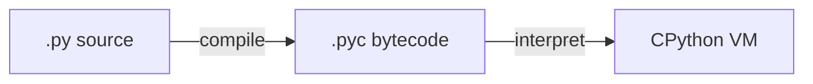
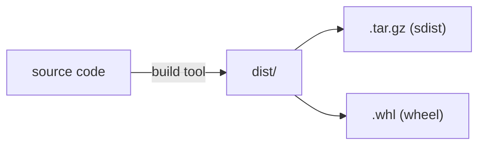

# Python Ecosystem and Import System

Concept notes covering CPython internals, the packaging ecosystem, the import/module system, and modern project tooling.

---

## 🐍 CPython

**CPython** is the reference (and most widely used) implementation of Python, written in C.

- Maintained by the **Python Software Foundation (PSF)** and a community of **core developers** (~100+), governed by a 5-member elected **Steering Council** (established via PEP 13).
- Created by **Guido van Rossum** (stepped down as BDFL in 2018).
- Corporate sponsors (Google, Microsoft, Meta, Bloomberg) employ some core developers full-time.
- Development happens openly on GitHub at `python/cpython`.

### Execution Model

CPython uses a two-step process:



1. **Compile** source code (`.py`) to **bytecode** (`.pyc`) — cached in `__pycache__/` directories.
2. **Interpret** the bytecode on the CPython VM — this is *not* native machine code.

Recompilation happens automatically when the source file changes (checked via timestamp/hash).

> ⚠️ This is different from a true compiler (like `gcc`) which produces native machine code. CPython's "compilation" is just parsing and translating to bytecode.

You can inspect bytecode with the `dis` module:

```python
import dis
dis.dis(lambda x: x + 1)
```

### Comparison with JVM

|  | **CPython** | **JVM** |
|---|---|---|
| Source | `.py` | `.java` |
| Bytecode | `.pyc` | `.class` |
| Executed by | CPython VM | Java Virtual Machine |
| JIT compilation | ❌ No (pure interpreter) | ✅ Yes (hot paths → native code) |

The JVM's JIT compiler makes Java significantly faster for long-running programs. **PyPy** is a Python implementation *with* a JIT, similar to how the JVM works.

---

## 📜 PEP (Python Enhancement Proposal)

The formal process for proposing changes to Python.

- **Types:**
  - **Standards Track** — language/stdlib changes (e.g., PEP 484: Type Hints)
  - **Informational** — guidelines or design descriptions
  - **Process** — community governance changes (e.g., PEP 13: Python Governance)
- **Lifecycle:** Draft → Accepted / Rejected / Withdrawn
- **Notable PEPs:**
  - PEP 8 — style guide
  - PEP 20 — The Zen of Python (`import this`)
  - PEP 484 — type hints
  - PEP 518 / PEP 621 — `pyproject.toml`
  - PEP 572 — walrus operator (`:=`)

All PEPs: [peps.python.org][peps]

---

## 📦 Packaging Ecosystem

### pip

Python's default **package manager**. Installs third-party packages from PyPI.

- Bundled with Python since 3.4 (via the `ensurepip` module — pip comes *with* Python but is *not part of* CPython).
- Maintained separately by **PyPA** (Python Packaging Authority) at `pypa/pip` on GitHub.
- Upgraded independently: `pip install --upgrade pip`
- Name: recursive acronym — "pip installs packages"

Common commands:

```bash
pip install <package>
pip uninstall <package>
pip list
pip freeze > requirements.txt
pip install -r requirements.txt
```

### PyPI (Python Package Index)

The official repository of third-party Python packages at [pypi.org][pypi].

- Contains **500,000+** packages
- Maintained by PyPA, funded by the PSF
- Anyone can publish packages using tools like `twine` or `flit`
- **TestPyPI** ([test.pypi.org][testpypi]) exists for testing uploads

Equivalent to npm (JavaScript), crates.io (Rust), or RubyGems (Ruby).

### Terminology

| Term | Meaning |
|---|---|
| **Module** | A single `.py` file |
| **Package** | A directory with `__init__.py` (language level) |
| **Distribution / Project** | What gets uploaded to PyPI and installed by pip |
| **Library** | Informal term for a reusable distribution |

> ⚠️ "Package" does double duty — it means both a directory of modules (language level) and a distributable unit on PyPI.

---

## 🔍 Import System and `sys.path`

When you `import` something, Python searches directories in `sys.path` order:

1. **Script's directory** or **cwd** (depends on how Python was invoked — see below)
2. **`PYTHONPATH`** env var (if set)
3. **Standard library** directories
4. **`site-packages`** — where pip installs third-party packages

### `sys.path[0]` — the critical first entry

| How you run Python | `sys.path[0]` |
|---|---|
| `python script.py` | 📁 **Script's directory** |
| `python -m module` | 📁 **Current working directory** |
| `python -c "..."` | `''` (= current working directory) |
| `python` (interactive) | `''` (= current working directory) |

Official docs: [The initialization of the sys.path module search path][sys-path-init]

### Verified behavior

When both cwd and script dir contain a file with the same name:

- **`python script.py`** — imports from script's directory, cwd is *not* searched
- **`python -m package`** — imports from cwd, script dir requires relative imports

### `site-packages`

The directory where third-party packages (installed via pip) are placed.

```python
import site
print(site.getsitepackages())
```

- Each Python installation has its own `site-packages`
- Virtual environments get their own — that's the whole point of venvs
- The `site` module is auto-imported at startup and adds `site-packages` to `sys.path`

### Relative vs Absolute Imports

Modern Python (PEP 8) **prefers absolute imports**:

```python
# ✅ absolute — preferred
from mypackage.utils import helper

# ✅ relative — acceptable within large packages
from .utils import helper
```

Relative imports are needed when importing sibling files inside a package run with `-m`, since the package directory isn't on `sys.path`.

---

## 📂 Working Directory vs Script Directory

These are **different concepts** that are often confused:

```python
import os
from pathlib import Path

os.getcwd()                        # working directory (where you ran python)
Path(__file__).parent.resolve()    # script directory (where the file lives)
```

- **Relative file paths** (e.g., `open("data.txt")`) resolve against **cwd**, not script dir.
- **Imports** resolve against **`sys.path[0]`**, which depends on invocation method (see above).
- `os.chdir()` changes cwd at runtime, but script dir never changes.

```python
# Reliable way to reference files relative to the script
script_dir = Path(__file__).parent.resolve()
data_file = script_dir / "data.txt"
```

---

## 🏗️ Running Packages

A package with `__main__.py` can be run directly:

```bash
python -m mypackage
```

**Execution order:**

1. `__init__.py` runs first (initializes the package)
2. `__main__.py` runs second (entry point)

---

## ⚙️ Modern Project Structure

### `pyproject.toml`

The standard configuration file for Python projects (PEP 518, PEP 621). Replaces `setup.py`, `setup.cfg`, and `requirements.txt`.

Three sections:

```toml
# 1. Build system
[build-system]
requires = ["hatchling"]
build-backend = "hatchling.build"

# 2. Project metadata & dependencies
[project]
name = "my-project"
version = "0.1.0"
dependencies = ["requests"]

# 3. Tool configuration
[tool.ruff]
line-length = 88
```

### `[project.scripts]` — CLI Entry Points

Maps a **command name** to a **Python function**:

```toml
[project.scripts]
vibe-flow = "vibe_flow.cli:main"
```

When the package is installed, a wrapper script is generated in the environment's `bin/` directory that calls `from vibe_flow.cli import main` and runs it. So you can type `vibe-flow` instead of `python -m vibe_flow`.

### Building a Package

"Building" means turning source code into a **distributable format**:



- **sdist** — source distribution, built on the user's machine
- **wheel** — pre-built, ready to install (faster)

For pure Python packages, it's basically packaging `.py` files with metadata. For C extensions (numpy), the build step compiles C code.

### What is a Python Project?

A directory with a `pyproject.toml`. It can be a library, an application, or both. A project *contains* one or more packages.

```
my-project/           ← project
├── pyproject.toml
├── src/
│   └── my_package/   ← package
│       └── __init__.py
└── tests/
```

---

## 🚀 uv

A fast Python package and project manager written in **Rust**, by **Astral** (the ruff team).

Replaces multiple tools:

| What | Traditional | uv |
|---|---|---|
| Install packages | `pip` | `uv pip install` |
| Manage venvs | `python -m venv` | `uv venv` |
| Manage deps | `pip-tools` / `poetry` | `uv add` / `uv lock` |
| Run scripts | `python` | `uv run` |
| Install Python | `pyenv` | `uv python install` |

Key benefits: 10-100x faster than pip, single tool, lockfile (`uv.lock`) for reproducibility.

---

[peps]: https://peps.python.org
[pypi]: https://pypi.org
[testpypi]: https://test.pypi.org
[sys-path-init]: https://docs.python.org/3/library/sys_path_init.html
