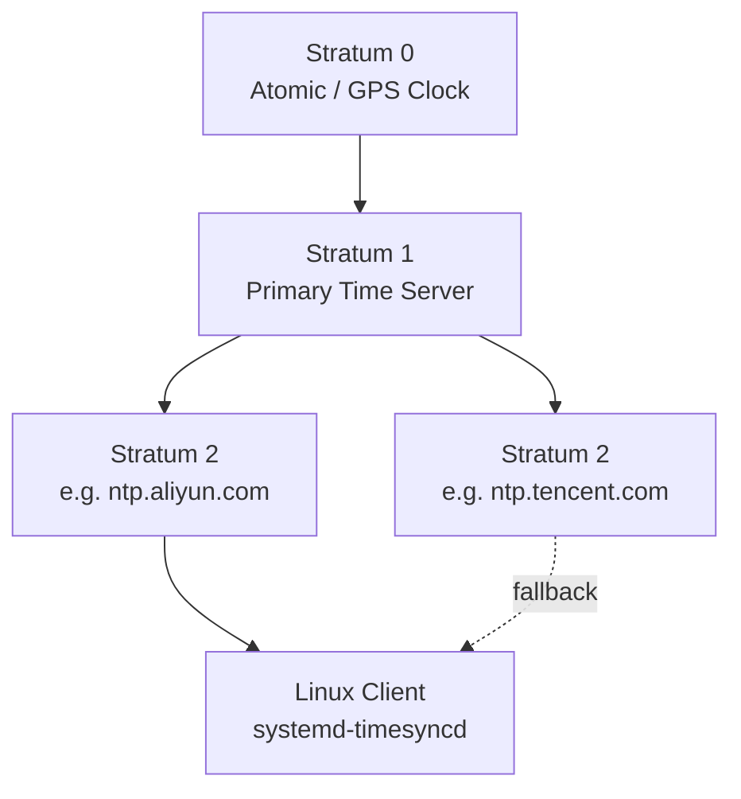

# systemd, NTP & Journal Logging on Ubuntu

> Concept notes covering systemd fundamentals, NTP time synchronization with `systemd-timesyncd`, journal-based logging, and practical configuration on Ubuntu 24.04 LTS.

---

## Table of Contents

- [systemd Overview](#systemd-overview)
- [Units](#units)
- [NTP Time Synchronization](#ntp-time-synchronization)
- [systemd-timesyncd](#systemd-timesyncd)
- [Journal Logging](#journal-logging)
- [Configuration Guide](#configuration-guide)
- [Useful Commands Reference](#useful-commands-reference)

---

## systemd Overview

**systemd** is the init system and service manager used by most modern Linux distributions. It is **not** part of the Linux kernel — it runs in **userspace** as the first process (PID 1) launched by the kernel after boot. From there, it takes over managing everything else in userspace.

Key responsibilities:

- 🚀 **Booting** — starting services in the correct order with dependency management
- ⚙️ **Service management** — starting, stopping, restarting, and monitoring daemons
- ⚡ **Parallel startup** — launching independent services simultaneously for faster boot
- 📜 **Logging** — centralized journal via `journalctl`
- 🔧 **System tasks** — managing mounts, timers, network, login sessions, and more

### systemctl

`systemctl` is the **primary command-line tool** for interacting with systemd. All service management goes through it.

```bash
systemctl start <service>       # start a service
systemctl stop <service>        # stop a service
systemctl restart <service>     # restart a service
systemctl status <service>      # check status
systemctl enable <service>      # auto-start on boot
systemctl disable <service>     # don't start on boot
systemctl list-units            # list active units
```

---

## Units

A **unit** is the basic object systemd manages. Unit types are identified by their file suffix:

| Suffix | Purpose |
|--------|---------|
| `.service` | Daemons/processes (most common) |
| `.socket` | Socket-based activation |
| `.timer` | Scheduled tasks (cron alternative) |
| `.mount` / `.automount` | Filesystem mounts |
| `.target` | Groups of units (like runlevels) |
| `.device` | Hardware devices |
| `.path` | Filesystem path monitoring |
| `.slice` | Resource management (cgroups) |
| `.scope` | Externally created processes |
| `.swap` | Swap space |

Unit file locations:

- `/etc/systemd/system/` — admin-defined (higher priority)
- `/usr/lib/systemd/system/` — package-provided

---

## NTP Time Synchronization

**NTP** (Network Time Protocol) synchronizes clocks between computers over a network.

- Uses **UDP port 123**
- Achieves millisecond-level accuracy over the internet
- Hierarchical model using **strata**:
  - Stratum 0 — atomic/GPS clocks
  - Stratum 1 — directly connected to stratum 0
  - Stratum 2 — sync from stratum 1, and so on



Common NTP server implementations: `ntpd` (classic), `chrony`, `systemd-timesyncd`.

---

## systemd-timesyncd

On Ubuntu 24.04 LTS, the default NTP client is **`systemd-timesyncd`** — a lightweight NTP client built into systemd. It runs as a daemon managed by systemd.

### Key Characteristics

- ✅ Simple, lightweight NTP **client** (not a server)
- 1️⃣ Connects to **one server at a time** — if it fails, falls back to the next
- ❌ Does **not** query multiple servers simultaneously (use `chrony` for that)
- Sufficient for most systems; for sub-millisecond accuracy, consider `chrony`[^1]

### Multiple NTP Servers

You can configure multiple servers separated by spaces. `systemd-timesyncd` tries them **in order** and falls back to the next on failure — it does not query them simultaneously.

### Poll Interval

The sync interval is **dynamic**, not fixed:

| Setting | Default | Description |
|---------|---------|-------------|
| `PollIntervalMinSec` | 32s | Minimum poll interval |
| `PollIntervalMaxSec` | 2048s (~34 min) | Maximum poll interval |

The daemon starts with short intervals and increases as the clock stabilizes, up to the max.

> 💡 **For time-sensitive systems**, reduce `PollIntervalMaxSec` (e.g., to 64 seconds). Polling every 64 seconds is well within acceptable NTP server limits — anything faster than 16 seconds is generally considered abusive.[^2]

### Config File

`/etc/systemd/timesyncd.conf`

```ini
[Time]
NTP=ntp.aliyun.com ntp.tencent.com ntp.ntsc.ac.cn
#FallbackNTP=ntp.ubuntu.com
#RootDistanceMaxSec=5
#PollIntervalMinSec=32
PollIntervalMaxSec=64
#ConnectionRetrySec=30
#SaveIntervalSec=60
```

⚠️ After changing the config file, **restart the service** to apply:

```bash
sudo systemctl restart systemd-timesyncd
```

> Note: `daemon-reload` is only needed when the **unit file** itself changes, not when a service's config file changes.

---

## Journal Logging

### How It Works

`systemd-timesyncd` (and all systemd services) does **not** manage its own log files. The logging flow is:


1. The service writes plain text to stdout/stderr
2. `systemd-journald` captures that output
3. `journald` stores it in **binary format** with metadata
4. You read it back with `journalctl`

### Why Binary?

- 🔍 **Indexed searching** — fast filtering by unit, time, priority
- 🏷️ **Structured metadata** — PID, unit name, timestamp per entry
- 🛡️ **Integrity** — tamper detection via sealing
- 📦 **Compression** — saves disk space

### Journal Storage Location

- `/var/log/journal/` — persistent logs (survives reboot)
- `/run/log/journal/` — volatile logs (lost on reboot)

### Quiet Logging Behavior

`systemd-timesyncd` does **not** log every successful sync. It only logs notable events:

- Initial server contact
- Timeouts or errors
- Server changes

No log entries in recent minutes typically means syncing is working fine. Verify with `timedatectl timesync-status` to see the packet count increasing.

### Exporting Logs for Analysis

Since journal logs are binary, export them for external analysis:

```bash
# Plain text
journalctl -u systemd-timesyncd --no-pager > timesyncd.log

# Structured JSON
journalctl -u systemd-timesyncd -o json --no-pager > timesyncd.json
```

Filtering options:

```bash
journalctl -u systemd-timesyncd --since "2026-03-27" --until "2026-03-28"
journalctl -u systemd-timesyncd -p err           # errors only
journalctl -u systemd-timesyncd -o short-iso     # ISO timestamps
journalctl -u systemd-timesyncd -n 30            # last 30 entries
```

---

## Configuration Guide

### Changing NTP Servers

There is no single command to set the NTP server — you must edit the config file:

```bash
sudo sed -i 's/^#NTP=.*/NTP=ntp.aliyun.com ntp.tencent.com ntp.ntsc.ac.cn/' /etc/systemd/timesyncd.conf
sudo systemctl restart systemd-timesyncd
```

#### The `sed` command explained

| Part | Meaning |
|------|---------|
| `sudo` | Run as root |
| `sed -i` | Edit file in-place |
| `s/` | Substitution command |
| `^#NTP=` | Match lines starting with `#NTP=` |
| `.*` | Followed by anything |
| `NTP=ntp.aliyun.com ...` | Replacement text (uncommented, with servers) |

### Reducing Poll Interval

For time-sensitive systems:

```bash
sudo sed -i 's/^#PollIntervalMaxSec=.*/PollIntervalMaxSec=64/' /etc/systemd/timesyncd.conf
sudo systemctl restart systemd-timesyncd
```

### Verifying Changes

```bash
# Check sync status and current poll interval
timedatectl timesync-status

# Check recent logs
journalctl -u systemd-timesyncd -n 10

# Check service status
systemctl status systemd-timesyncd
```

---

## Useful Commands Reference

| Command | Purpose |
|---------|---------|
| `systemctl status systemd-timesyncd` | Check service status |
| `systemctl restart systemd-timesyncd` | Apply config changes |
| `timedatectl status` | Overall time/NTP status |
| `timedatectl timesync-status` | Detailed sync info (server, poll, offset) |
| `journalctl -u systemd-timesyncd -n 30` | Recent NTP logs |
| `systemd-analyze cat-config systemd/timesyncd.conf` | Show full effective config |
| `lsb_release -a` | Check OS version |

---

[^1]: `chrony` supports simultaneous multi-server querying, faster initial sync, and hardware timestamping — better suited for high-precision requirements.
[^2]: The [pool.ntp.org][ntp-pool] project considers polling faster than 16 seconds to be abusive behavior.

[ntp-pool]: https://www.pool.ntp.org/
