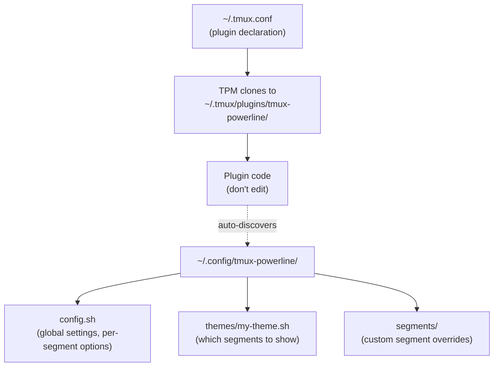
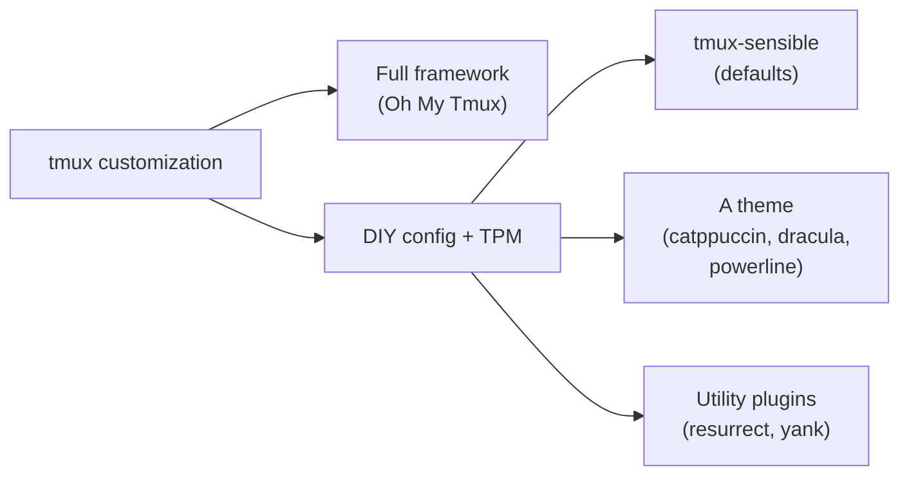

# tmux: Configuration, Plugins & Ecosystem

## What Is a Terminal Multiplexer?

A **terminal multiplexer** is a category of software that lets you run multiple terminal sessions inside a single terminal window, with the ability to split, switch, detach, and reattach.

| Multiplexer | Year | Language | Notes |
|---|---|---|---|
| **GNU Screen** | 1987 | C | The original, still pre-installed on many servers |
| **tmux** | 2007 | C | Most widely used today, cleaner design than Screen |
| **Zellij** | 2021 | Rust | Modern, beginner-friendly with on-screen hints |
| **byobu** | 2009 | Python/Shell | Wrapper around tmux or Screen |
| **dvtm** | 2007 | C | Minimal, tiling window manager style |

"tmux" literally stands for **t**erminal **mu**ltiple**x**er — the name *is* the category. Today, tmux is the dominant terminal multiplexer.

---

## Configuration Design Philosophy

### 🎯 tmux's Approach: Simple and Clean

tmux uses a single plain-text config file: `~/.tmux.conf`. Edit it, reload, done. No special format like JSON or YAML — just directives.

This pattern is common across Unix tools:

| Tool | Config file |
|---|---|
| tmux | `~/.tmux.conf` |
| Vim | `~/.vimrc` |
| Bash | `~/.bashrc` |
| Git | `~/.gitconfig` |
| SSH | `~/.ssh/config` |

A system-wide config is also available at `/etc/tmux.conf`, but the user-level file takes precedence.

### ⚖️ Simple Config vs. Complex Config

Some tools make configuration unnecessarily complex with multiple files, directories, and CLI tools:

| Tool | Config complexity |
|---|---|
| **NetworkManager** | Multiple dirs, `nmcli`, `nmtui`, GUI |
| **systemd** | Unit files in multiple dirs, overrides, `systemctl edit` |
| **Apache** | `apache2.conf`, `sites-available/`, `sites-enabled/`, `a2ensite` |

tmux's single-file approach is easier to understand, back up, debug, and version-control.

### 🧠 Config Language: Declarative vs. Turing-Complete

| Approach | Pros | Cons |
|---|---|---|
| Declarative (JSON, TOML, YAML) | Easy to learn, easy to parse | Can't express logic |
| Custom DSL (Vimscript, Emacs Lisp) | Powerful, tailored | Another language to learn, small ecosystem |
| General-purpose language (Lua, Python) | Powerful, already known, great tooling | Slightly more overhead |

For tools with simple config needs (like tmux), declarative key-value is fine. For tools needing logic (conditionals, dynamic keybindings), a **general-purpose language** is best — users already know it and can apply that knowledge elsewhere.

Neovim choosing **Lua** over Vimscript is a good example. Compare:

| Editor | Config language |
|---|---|
| Vim | Vimscript (custom DSL) |
| Neovim | Lua (general-purpose) |
| Emacs | Emacs Lisp (custom DSL) |
| tmux | Simple key-value directives |

### Reloading Config Without Quitting

Two ways to reload `~/.tmux.conf` without killing the session:

1. **Inside tmux:** `prefix + :` then type `source-file ~/.tmux.conf`
2. **From shell:** `tmux source-file ~/.tmux.conf`

---

## Oh My Tmux

[Oh My Tmux][oh-my-tmux] (gpakosz/.tmux) is the most popular pre-built tmux config framework — a batteries-included setup with a Powerline-inspired theme, sensible defaults, and easy customization.

### Installation

```bash
cd ~
git clone https://github.com/gpakosz/.tmux.git
ln -s -f .tmux/.tmux.conf
cp .tmux/.tmux.conf.local .
```

- `.tmux/.tmux.conf` — the framework (don't edit)
- `~/.tmux.conf.local` — your personal customizations (edit this)

### Uninstallation

```bash
rm -rf ~/.tmux
rm ~/.tmux.conf.local
rm ~/.tmux.conf
touch ~/.tmux.conf    # clean slate
```

---

## TPM (Tmux Plugin Manager)

### How TPM Works

tmux's config is just key-value settings — it has no built-in plugin system. TPM works via a clever hack:

1. You add `set -g @plugin 'owner/repo'` lines to your config — these are **user-defined variables** (the `@` prefix means custom, not built-in)
2. The `run '~/.tmux/plugins/tpm/tpm'` directive at the bottom executes TPM's shell script
3. TPM **parses your config file as text** (greps for `@plugin` lines), clones each repo to `~/.tmux/plugins/`, and sources the plugin config files
4. Everything still becomes regular tmux key-value settings in the end

> ⚠️ Multiple `set -g @plugin` lines would normally overwrite each other. TPM works around this by text-parsing the file rather than reading tmux variables at runtime.

### Installation

```bash
git clone https://github.com/tmux-plugins/tpm ~/.tmux/plugins/tpm
```

Add to `~/.tmux.conf`:

```bash
# Plugins
set -g @plugin 'tmux-plugins/tpm'

# Initialize TPM (keep this at the very bottom)
run '~/.tmux/plugins/tpm/tpm'
```

### TPM Keybindings

| Binding | Action |
|---|---|
| `prefix + I` | Install new plugins |
| `prefix + U` | Update all plugins |
| `prefix + alt + u` | Uninstall plugins not in config |

### Adding Plugins

Add a line before the `run` directive:

```bash
set -g @plugin 'tmux-plugins/tpm'
set -g @plugin 'tmux-plugins/tmux-sensible'
set -g @plugin 'erikw/tmux-powerline'

run '~/.tmux/plugins/tpm/tpm'
```

Then press `prefix + I` to install.

### TPM Maintenance Note

TPM's last commit was several years ago. It still works fine (it's a simple tool), but actively maintained alternatives exist:

| Manager | Language | Notes |
|---|---|---|
| **TPM** | Shell | Original, 14k+ stars, stable but unmaintained |
| **tpack** | Go | Drop-in replacement, backward compatible |
| **Tmux Plugin Panel** | Rust | Modern TUI for browsing/installing plugins |

[tpack][tpack] is a drop-in swap — just replace the last line:

```bash
run 'tpack init'
```

---

## Popular Plugins

### 📦 Most Popular by Stars

**Session management:**

| Plugin | Stars | What it does |
|---|---|---|
| **tmux-resurrect** | ~12.6k | Save/restore sessions across restarts |
| **tmux-continuum** | ~3.8k | Auto-save sessions, auto-restore on start |
| **sesh** | ~1.8k | Smart session manager with fuzzy finding |

**Themes:**

| Plugin | What it does |
|---|---|
| **catppuccin/tmux** | Clean, modular theme with widgets |
| **dracula/tmux** | Dracula theme with widgets |
| **tmux-powerline** | Powerline-style status bar |

**Utilities:**

| Plugin | Stars | What it does |
|---|---|---|
| **tmux-yank** | ~3k | Copy to system clipboard |
| **tmux-sensible** | — | Sane default settings |

### tmux-sensible: What It Changes

tmux-sensible overrides several tmux defaults that are widely considered improvements:

| Option | tmux default | sensible sets |
|---|---|---|
| `escape-time` | 500ms | 0 (no Escape delay) |
| `history-limit` | 2000 lines | 50000 lines |
| `display-time` | 750ms | 4000ms |
| `status-interval` | 15s | 5s |
| `default-terminal` | `screen` | `screen-256color` |
| `focus-events` | off | on |
| `aggressive-resize` | off | on |

Added keybindings: `prefix + C-p` (previous window), `prefix + C-n` (next window), `prefix + R` (reload config).

---

## tmux-powerline: Status Bar Framework

[tmux-powerline][tmux-powerline] is a hackable status bar with dynamic segments, written purely in bash.

### Architecture



The plugin code (`~/.tmux/plugins/`) and user config (`~/.config/tmux-powerline/`) are intentionally separated — TPM can update the plugin without overwriting your config.

### Setup Steps

**1. Generate default config:**

```bash
~/.tmux/plugins/tmux-powerline/generate_config.sh
mv ~/.config/tmux-powerline/config.sh.default ~/.config/tmux-powerline/config.sh
```

**2. Create a custom theme:**

```bash
mkdir -p ~/.config/tmux-powerline/themes
cp ~/.tmux/plugins/tmux-powerline/themes/default.sh ~/.config/tmux-powerline/themes/my-theme.sh
```

**3. Point config to your theme** — edit `config.sh`:

```bash
export TMUX_POWERLINE_THEME="my-theme"
```

**4. Edit your theme** to keep only the segments you want.

### Default Segments

The default theme includes many segments. Most users trim it down significantly:

**Left side:**

| Segment | Shows |
|---|---|
| `tmux_session_info` | Session name (format: `#S:#I.#P`) |
| `hostname` | Machine hostname |
| `mode_indicator` | Current tmux mode (normal/prefix/copy) |
| `lan_ip` | Local IP address |
| `wan_ip` | Public IP address |
| `vcs_branch` | Git branch |

**Right side:**

| Segment | Shows |
|---|---|
| `pwd` | Current directory |
| `ifstat` / `ifstat_sys` | Network download/upload speed |
| `load` | System load average (from `uptime`) |
| `battery` | Battery status |
| `weather` | Weather (calls external API) |
| `date_day` / `date` / `time` | Date and time |

### Theme File Format

Each segment in the theme is a string with positional parameters:

```bash
"segment_name background_color foreground_color [separator] [sep_bg] [sep_fg] [spacing] [sep_disable]"
```

Colors are 256-color palette numbers. Run `~/.tmux/plugins/tmux-powerline/color_palette.sh` to see all colors.

To disable a segment, comment it out with `#`. Example minimal theme:

```bash
TMUX_POWERLINE_LEFT_STATUS_SEGMENTS=(
    "tmux_session_info 148 234"
    "mode_indicator 165 0"
    "vcs_branch 29 88"
)

TMUX_POWERLINE_RIGHT_STATUS_SEGMENTS=(
    "ifstat_sys 30 255"
    "pwd 89 211"
    "date 235 136 ${TMUX_POWERLINE_SEPARATOR_LEFT_THIN}"
    "time 235 136 ${TMUX_POWERLINE_SEPARATOR_LEFT_THIN}"
)
```

### Network Speed Segments

Two options for showing network speed:

| Segment | How it works | Dependency |
|---|---|---|
| `ifstat_sys` | Reads `/sys/class/net/` kernel stats directly | `bc` |
| `ifstat` | Uses the `ifstat` CLI tool | `ifstat` |

Both produce the same result. `bc` (basic calculator) is the more practical dependency since it's a general-purpose tool useful elsewhere.

> ⚠️ `ifstat_sys` will show zero if `bc` is not installed — install with `sudo apt install bc`.

### Custom Segments

**Create a new segment** — add a script to `~/.config/tmux-powerline/segments/`:

```bash
# ~/.config/tmux-powerline/segments/disk.sh
run_segment() {
    df -h / | awk 'NR==2 {print "💾 "$5}'
}
```

Then reference it in your theme: `"disk 235 136"`

**Override an existing segment** — copy from plugin to user dir:

```bash
cp ~/.tmux/plugins/tmux-powerline/segments/hostname.sh \
   ~/.config/tmux-powerline/segments/hostname.sh
```

tmux-powerline checks `~/.config/tmux-powerline/segments/` first and uses your version over the built-in.

**Configure without copying** — some segments support config.sh options. For example, changing session info format:

```bash
export TMUX_POWERLINE_SEG_TMUX_SESSION_INFO_FORMAT="#S"
```

---

## Nerd Fonts

[Nerd Fonts][nerd-fonts] is a project that patches popular programming fonts by adding thousands of extra icons (git symbols, file type icons, powerline separators, etc.).

These icons use Unicode's **Private Use Area** (E000–F8FF) — code points that Unicode intentionally leaves empty for custom use. They are valid Unicode code points but not part of the official standard.

| Symbol | Unicode standard? | Requires Nerd Font? |
|---|---|---|
| `⇊` (download arrow) | ✅ Yes | No |
| `` (git branch) | ❌ Private Use Area | Yes |
| `` (powerline separator) | ❌ Private Use Area | Yes |

tmux-powerline's theme file checks for patched fonts and falls back to standard Unicode symbols if none is detected.

---

## Two Approaches to tmux Customization



| Approach | Pros | Cons |
|---|---|---|
| **Oh My Tmux** | Everything works out of the box | Harder to understand what's happening |
| **DIY + TPM + theme** | Full understanding and control | More setup effort |

The DIY approach is the most popular overall — write your own minimal `~/.tmux.conf`, add plugins via TPM as needed, and swap themes with a single line change.

### Status Bar: Plugin vs. Built-in

For the status bar specifically:

| Approach | Complexity |
|---|---|
| tmux built-in `set -g status-right` | One line in `~/.tmux.conf` |
| catppuccin/dracula theme plugin | A few `set -g` lines |
| tmux-powerline | `config.sh` + theme file + segment files |

If you just need colors and text, the built-in is enough. Plugins save time when you want polished themes and dynamic widgets.

---

## Quick Reference

| Action | Command |
|---|---|
| Reload config | `prefix + :` then `source-file ~/.tmux.conf` |
| Install plugins (TPM) | `prefix + I` |
| Update plugins (TPM) | `prefix + U` |
| Rename session | `prefix + $` |

[oh-my-tmux]: https://github.com/gpakosz/.tmux
[tpack]: https://github.com/tmuxpack/tpack
[tmux-powerline]: https://github.com/erikw/tmux-powerline
[nerd-fonts]: https://www.nerdfonts.com/
