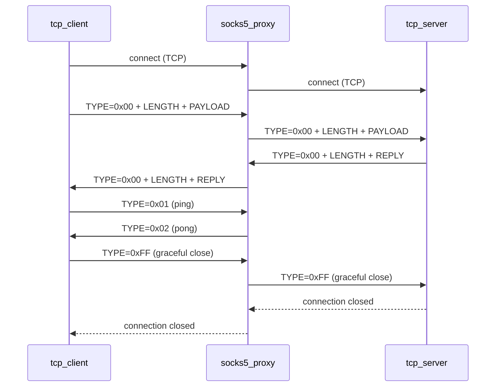

# Application Layer Protocol

## Overview

This is a simple custom protocol designed for this project to test the SOCKS5 proxy without the complexity of HTTP. It runs over TCP.

The goal is to be as simple as possible while solving the core TCP problem: **knowing where one message ends and the next begins**.

---

## The Problem with Raw TCP

TCP is a byte stream — it has no concept of message boundaries. If a client sends "hello" and "world" as two separate messages, the server might receive:

- `"hello"` and `"world"` separately — ideal but not guaranteed
- `"helloworld"` merged — one read, two messages
- `"hel"` then `"loworld"` — split mid-message

The protocol must define how to detect message boundaries.

---

## Protocol Design

Every message has three fields: **TYPE + LENGTH + PAYLOAD**

```
+------+--------+----------+
| TYPE | LENGTH |  PAYLOAD |
+------+--------+----------+
|  1   |   4    | variable |
+------+--------+----------+
```

- `TYPE` — 1 byte, identifies the message type
- `LENGTH` — 4 bytes, unsigned 32-bit integer, big-endian, number of payload bytes
- `PAYLOAD` — N bytes of UTF-8 encoded text (N = LENGTH, can be 0)

---

## Message Types

| TYPE | Value | LENGTH | PAYLOAD | Meaning |
|---|---|---|---|---|
| Normal message | `0x00` | N (> 0) | N bytes of text | regular data |
| Ping | `0x01` | `0x00000000` | none | heartbeat request |
| Pong | `0x02` | `0x00000000` | none | heartbeat reply |
| Graceful close | `0xFF` | `0x00000000` | none | I am done, closing |

---

## How to Read a Message

1. Read exactly **1 byte** → parse as TYPE
2. Read exactly **4 bytes** → parse as u32 big-endian → this is LENGTH `N`
3. Read exactly **N bytes** → decode as UTF-8 → this is PAYLOAD (skip if N = 0)

One consistent parsing logic handles all message types.

---

## How to Write a Message

1. Write TYPE (1 byte)
2. Encode payload as UTF-8 bytes → get length `N`
3. Write `N` as 4 bytes big-endian
4. Write the payload bytes (skip if N = 0)

---

## Example — Normal Message

Sending `"hello"` (5 bytes):

```
00 00 00 00 05 68 65 6c 6c 6f
│  └─────────┘ └─────────────┘
│   length=5      "hello"
└── TYPE=0x00 (normal message)
```

---

## Example — Ping

```
01 00 00 00 00
│  └─────────┘
│   length=0 (no payload)
└── TYPE=0x01 (ping)
```

---

## Example — Graceful Close

```
FF 00 00 00 00
│  └─────────┘
│   length=0 (no payload)
└── TYPE=0xFF (graceful close)
```

---

## Why Big-Endian?

Multi-byte numbers can be stored in two ways:

- **Big-endian** — most significant byte first: `00 00 00 05`
- **Little-endian** — least significant byte first: `05 00 00 00`

Network protocols (TCP/IP, HTTP, SOCKS5) universally use **big-endian**, also called **network byte order**. We follow the same convention.

---

## Limits

- Maximum message size: 2^32 - 1 bytes (~4 GB) — more than enough for testing
- Payload must be valid UTF-8 text

---

## Graceful Close

When one side wants to stop, it sends a TYPE `0xFF` message with LENGTH = 0:

```
FF 00 00 00 00   ← graceful close signal
```

The receiver sees TYPE = `0xFF`, does its own cleanup, and closes the connection.

---

## Heartbeat (Ping / Pong)

For long-lived connections, one side periodically sends a **ping** to confirm the other side is still alive:

```
client → server: 01 00 00 00 00   (ping)
server → client: 02 00 00 00 00   (pong)
```

If no pong is received within a timeout → assume connection dead → close.
If no ping received within a timeout → assume client dead → close.

---

## Unexpected Disconnect

If the connection drops (network failure, crash), no close signal is sent. Detection:

- `read()` returns 0 → TCP `FIN` received → connection closed
- `read()` / `write()` returns error → connection dropped
- No ping received within timeout → connection dead

---

## Summary of Connection States

```
Normal message:    TYPE=0x00 + LENGTH (> 0) + PAYLOAD
Ping:              TYPE=0x01 + LENGTH=0
Pong:              TYPE=0x02 + LENGTH=0
Graceful close:    TYPE=0xFF + LENGTH=0
Unexpected drop:   read() returns 0 or error
```

---

## Usage in This Project

This protocol is used by:
- `tcp_server` — listens, receives messages, replies, responds to ping with pong
- `tcp_client` — connects through the SOCKS5 proxy, sends messages, sends ping periodically

The SOCKS5 proxy sits in between and forwards the raw bytes without knowing or caring about this protocol.

```
tcp_client ──[this protocol]──→ socks5_proxy ──[this protocol]──→ tcp_server
```

---

## Communication Flow


