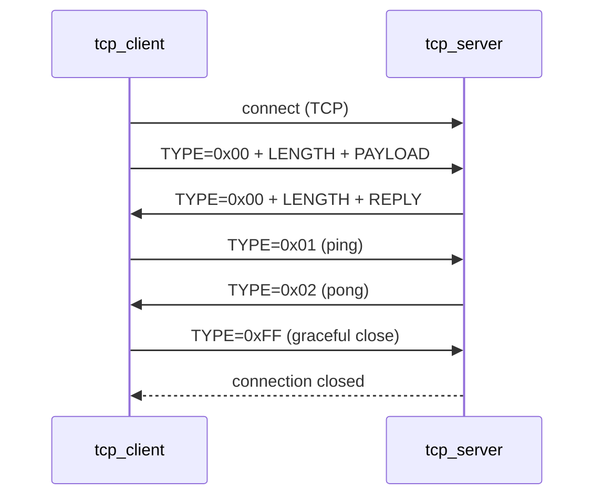

# Application Layer Protocol

## Overview

A simple custom protocol designed for this project to test the SOCKS5 proxy. It runs over TCP.

---

## Message Format

Every message has three fields: **TYPE + LENGTH + PAYLOAD**

```
+------+--------+----------+
| TYPE | LENGTH |  PAYLOAD |
+------+--------+----------+
|  1   |   4    | variable |
+------+--------+----------+
```

- `TYPE` — 1 byte, identifies the message type
- `LENGTH` — 4 bytes, unsigned 32-bit integer, big-endian, number of payload bytes
- `PAYLOAD` — N bytes of UTF-8 encoded text (N = LENGTH, can be 0)
- Maximum payload size: 2^32 - 1 bytes (~4 GB)

---

## Message Types

| TYPE | Value | LENGTH | PAYLOAD | Meaning |
|---|---|---|---|---|
| Normal message | `0x00` | N (> 0) | N bytes of text | regular data |
| Ping | `0x01` | `0x00000000` | none | heartbeat request |
| Pong | `0x02` | `0x00000000` | none | heartbeat reply |
| Graceful close | `0xFF` | `0x00000000` | none | I am done, closing |

---

## How to Read

1. Read exactly **1 byte** → TYPE
2. Read exactly **4 bytes** → u32 big-endian → LENGTH `N`
3. If N > 0, read exactly **N bytes** → PAYLOAD

---

## How to Write

1. Write TYPE (1 byte)
2. Write payload length as 4 bytes big-endian
3. If payload exists, write payload bytes

---

## Byte Examples

**Normal message** — sending `"hello"` (5 bytes):
```
00 00 00 00 05 68 65 6c 6c 6f
│  └─────────┘ └─────────────┘
│   length=5      "hello"
└── TYPE=0x00 (normal message)
```

**Ping:**
```
01 00 00 00 00
│  └─────────┘
│   length=0
└── TYPE=0x01 (ping)
```

**Pong:**
```
02 00 00 00 00
│  └─────────┘
│   length=0
└── TYPE=0x02 (pong)
```

**Graceful close:**
```
FF 00 00 00 00
│  └─────────┘
│   length=0
└── TYPE=0xFF (close)
```

---

## Heartbeat

Client sends **ping** every N seconds. Server replies **pong** immediately.

- Client receives no pong within timeout → server is dead → close
- Server receives no ping within timeout → client is dead → close

---

## Connection Lifecycle

```
Normal message:    TYPE=0x00 + LENGTH (> 0) + PAYLOAD
Ping:              TYPE=0x01 + LENGTH=0
Pong:              TYPE=0x02 + LENGTH=0
Graceful close:    TYPE=0xFF + LENGTH=0
Unexpected drop:   read() returns 0 or error
```

---

## Communication Flow


