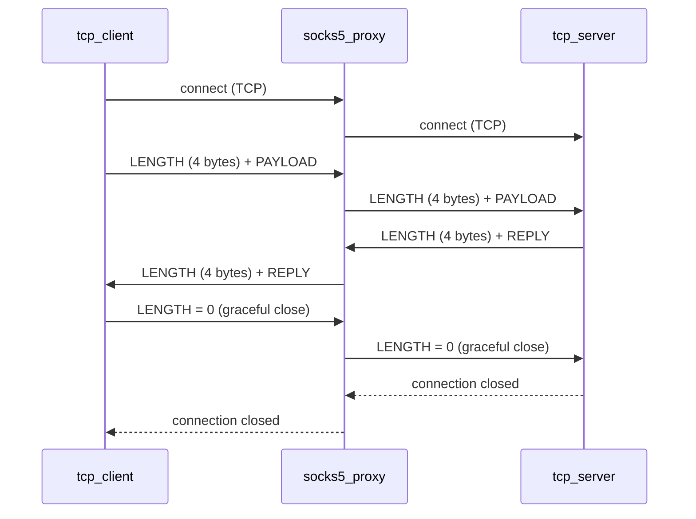

# Application Layer Protocol

## Overview

This is a simple custom protocol designed for this project to test the SOCKS5 proxy without the complexity of HTTP. It runs over TCP.

The goal is to be as simple as possible while solving the core TCP problem: **knowing where one message ends and the next begins**.

---

## The Problem with Raw TCP

TCP is a byte stream — it has no concept of message boundaries. If a client sends "hello" and "world" as two separate messages, the server might receive:

- `"hello"` and `"world"` separately — ideal but not guaranteed
- `"helloworld"` merged — one read, two messages
- `"hel"` then `"loworld"` — split mid-message

The protocol must define how to detect message boundaries.

---

## Protocol Design

**Length-prefixed messages** — the simplest and most reliable solution.

```
+--------+----------+
| LENGTH |  PAYLOAD |
+--------+----------+
|   4    | variable |
+--------+----------+
```

- `LENGTH` — 4 bytes, unsigned 32-bit integer, big-endian
  - Indicates how many bytes the payload contains
- `PAYLOAD` — N bytes of UTF-8 encoded text
  - N is exactly the value of LENGTH

---

## How to Read a Message

1. Read exactly **4 bytes** → parse as u32 big-endian → this is the payload length `N`
2. Read exactly **N bytes** → decode as UTF-8 → this is the message

No scanning for special characters. No ambiguity. Always two steps.

---

## How to Write a Message

1. Encode the text as UTF-8 bytes → get length `N`
2. Write `N` as 4 bytes big-endian
3. Write the payload bytes

---

## Example

Sending the message `"hello"` (5 bytes):

```
00 00 00 05 68 65 6c 6c 6f
└─────────┘ └─────────────┘
  length=5     "hello"
```

Sending the message `"hi"` (2 bytes):

```
00 00 00 02 68 69
└─────────┘ └───┘
  length=2   "hi"
```

---

## Why Big-Endian?

Multi-byte numbers can be stored in two ways:

- **Big-endian** — most significant byte first: `00 00 00 05`
- **Little-endian** — least significant byte first: `05 00 00 00`

Network protocols (TCP/IP, HTTP, SOCKS5) universally use **big-endian**, also called **network byte order**. We follow the same convention.

---

## Limits

- Maximum message size: 2^32 - 1 bytes (~4 GB) — more than enough for testing
- Payload must be valid UTF-8 text

---

## Graceful Close

When one side wants to stop communicating, it sends a **zero-length message** — a LENGTH of `00 00 00 00` with no payload:

```
00 00 00 00
└─────────┘
  length=0  ← signals "I am done, close the connection"
```

The receiver sees length = 0, knows it is an intentional close signal, does its own cleanup, and closes the connection.

This is better than just closing the TCP socket abruptly because:
- The other side knows the close was **intentional**, not a crash
- Both sides get a chance to clean up before closing

**Flow:**
```
client → server: 00 00 00 00     (I'm done)
server sees length=0, closes connection
```

---

## Unexpected Disconnect

If the connection drops mid-communication (network failure, crash, power loss), no close signal is sent. The other side detects this through:

**`read()` returning 0 bytes** — TCP sends a `FIN` when the OS closes the socket (e.g. process crash). The receiver's next `read()` returns 0, signaling the connection is gone.

**`read()` or `write()` returning an error** — if the network drops entirely, eventually the OS returns an I/O error on the socket.

**Timeout** — if neither happens quickly (network silently drops packets), the receiver may block on `read()` forever. The solution is a **timeout** — if no data arrives within N seconds, assume the connection is dead and close it.

**Heartbeat (ping/pong)** — for long-lived connections, periodically send a small message to confirm the other side is still alive. If no reply within a timeout, disconnect. This project does not implement heartbeat for simplicity.

**How we handle it in this project:**
- Treat `read()` returning 0 as disconnection → close and exit
- Treat `read()`/`write()` errors as disconnection → close and exit
- No timeout or heartbeat for now — this is a local test tool

---

## Summary of Connection States

```
Normal message:    LENGTH (4 bytes, > 0) + PAYLOAD (N bytes)
Graceful close:    LENGTH (4 bytes, = 0) — no payload follows
Unexpected drop:   read() returns 0 or error
```

---

## Usage in This Project

This protocol is used by:
- `tcp_server` — listens, receives a message, prints it, sends a reply
- `tcp_client` — connects through the SOCKS5 proxy, sends a message, receives the reply

The SOCKS5 proxy sits in between and forwards the raw bytes without knowing or caring about this protocol.

```
tcp_client ──[this protocol]──→ socks5_proxy ──[this protocol]──→ tcp_server
```

---

## Communication Flow


