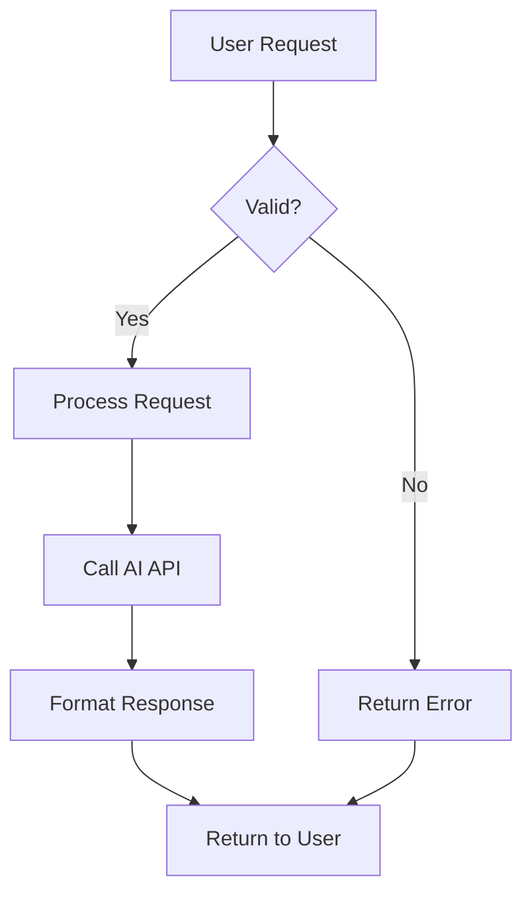
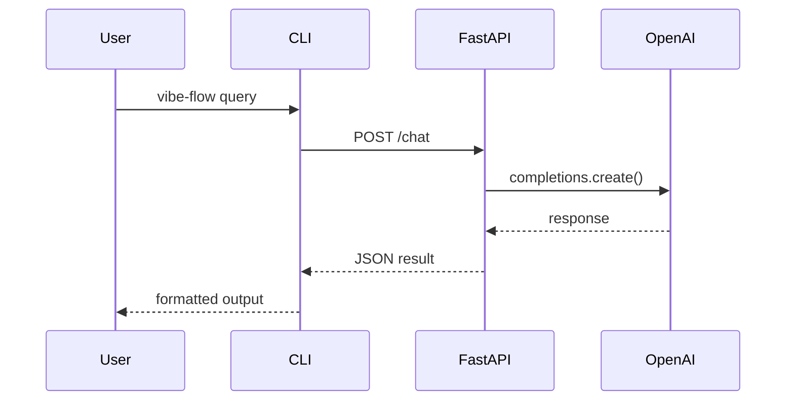
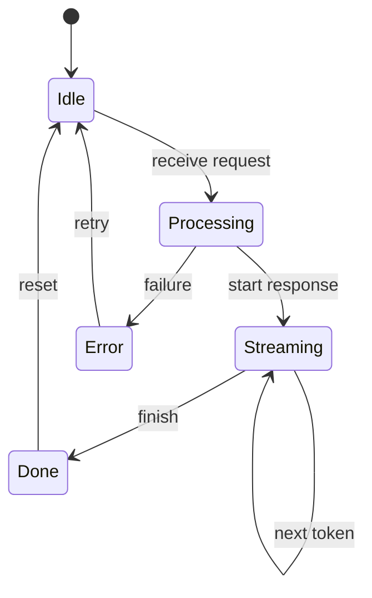
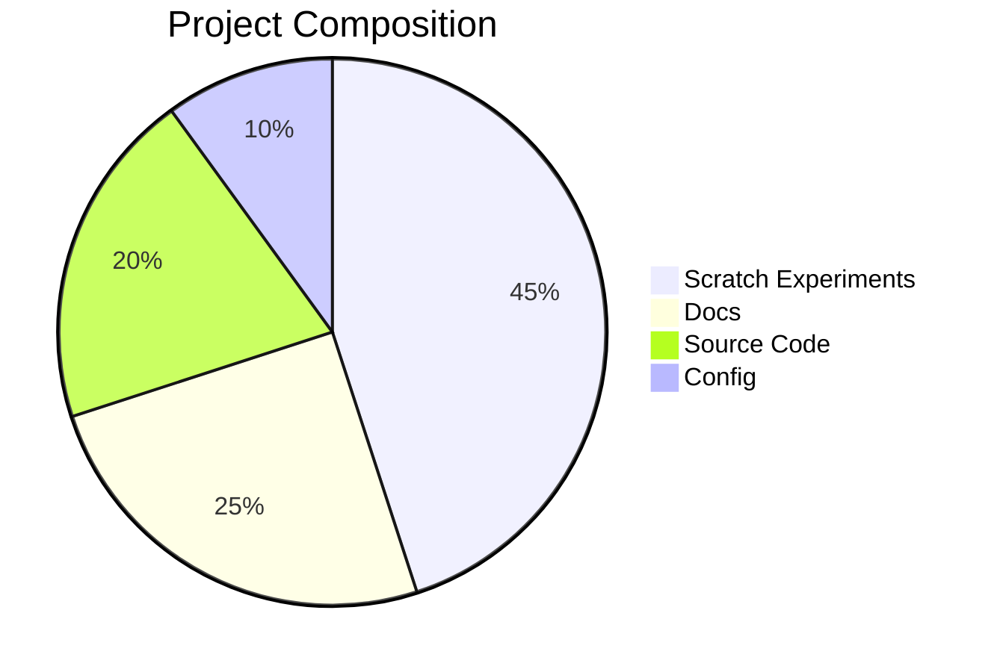

# Mermaid Test

## Flowchart

```mermaid
graph TD
    A[User Request] --> B{Valid?}
    B -->|Yes| C[Process Request]
    B -->|No| D[Return Error]
    C --> E[Call AI API]
    E --> F[Format Response]
    F --> G[Return to User]
    D --> G
```

## Sequence Diagram

```mermaid
sequenceDiagram
    participant User
    participant CLI
    participant FastAPI
    participant OpenAI

    User->>CLI: vibe-flow query
    CLI->>FastAPI: POST /chat
    FastAPI->>OpenAI: completions.create()
    OpenAI-->>FastAPI: response
    FastAPI-->>CLI: JSON result
    CLI-->>User: formatted output
```

## State Diagram

```mermaid
stateDiagram-v2
    [*] --> Idle
    Idle --> Processing: receive request
    Processing --> Streaming: start response
    Streaming --> Streaming: next token
    Streaming --> Done: finish
    Done --> Idle: reset
    Processing --> Error: failure
    Error --> Idle: retry
```

## Pie Chart

```mermaid
pie title Project Composition
    "Scratch Experiments" : 45
    "Docs" : 25
    "Source Code" : 20
    "Config" : 10
```
