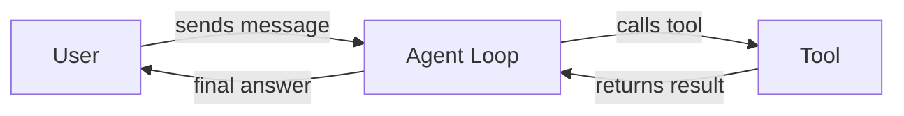

# GitHub Markdown Demo

A demo to verify VS Code renders Markdown the same as GitHub.

---

## Text Formatting

**bold**, _italic_, ~~strikethrough~~, `inline code`, **_bold italic_**

> Blockquote line one
> Blockquote line two

---

## Lists

Unordered:
- Item A
  - Nested A1
  - Nested A2
- Item B

Ordered:
1. First
2. Second
3. Third

Task list:
- [x] Done
- [ ] Not done
- [ ] Also not done

---

## Code Block

```python
def greet(name: str) -> str:
    return f"Hello, {name}!"

print(greet("world"))
```

---

## Table

| Name    | Type    | Required |
|---------|---------|----------|
| `topic` | string  | yes      |
| `draft` | boolean | no       |
| `tags`  | array   | no       |

---

## Emojis

Unicode: 🚀 ✅ ⚠️ 🔥 💡 🐍

---

## Mermaid Diagram



---

## Links & Images

[Anthropic](https://www.anthropic.com) — external link

Footnote reference[^1]

[^1]: This is the footnote content.

---

## Collapsible Section

<details>
<summary>Click to expand</summary>

Hidden content here. GitHub renders this natively.

</details>
